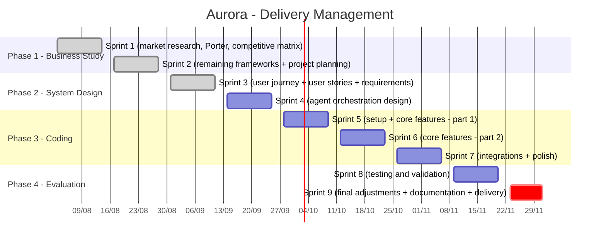

# Aurora

## Project Objective
Creator media infrastructure for the mid-market: Aurora treats a curated pool of nano and micro creators as one media unit that a brand can plan and buy, with an advantage built on the supply side by treating creators as customers instead of anonymous supply.

<p align="center">


</p>

## What is Aurora

Brands already know that nano and micro creators convert better than big influencers, but running a campaign through hundreds of small creators at once is more coordination than most teams can handle. Existing platforms solved this for enterprise brands, but left the mid-market and the creators themselves underserved.

Aurora is a technology platform that lets a brand define a budget, an audience, and a message once, then handles matching creators to the campaign, running it day to day, checking brand safety with AI assistance, and paying every creator in the pool, built specifically for the underserved middle of the market.

## Project Status

This project is in the system design phase. There is no codebase yet — the repository holds the business analysis, the product specification, and the architecture that will be built against.

- ✅ **Sprint 1** — Initial market research and business analysis (industry context, the problem, the solution, and the competitive landscape)
- ✅ **Sprint 2** — Business analysis complete (Competitive Matrix, Porter's Five Forces, Gap Analysis, SWOT, Risk Matrix, Personas, Value Proposition Canvas, and Revenue and Cost Structure)
- ✅ **Sprint 3** — Product requirements complete (user journeys, 47 user stories, 60 functional and 36 non-functional requirements, with full traceability)
- ✅ **System design** — Architecture complete (modular monolith with async workers, ATAM evaluation, information security and LGPD, DevOps and CI/CD)
- ⏳ **Next** — Technical setup and core feature implementation

## Project Roadmap

The Aurora project is organized into four phases (business study, system design, coding, and evaluation) with deliverables broken down into roughly two-week sprints, running from August 3 to December 1, 2026.

- Phase 1 (business study) is already complete, covered in Sprints 1 and 2, spanning market research, Porter's Five Forces, the competitive matrix, gap analysis, SWOT, the risk matrix, and initial personas.
- Phase 2 (system design) begins, with two sprints dedicated to mapping the user journey and user stories, followed by defining the functional and non-functional requirements.
- Phase 3 (coding) is the longest stretch, with three sprints set aside for technical setup, building out the core features, and finally integrations and polish.
- Phase 4 (evaluation) closes out the schedule with a sprint for testing and validation, followed by a shorter final sprint for last adjustments, documentation, and delivery, keeping everything on track for the December 1 deadline.



## Repository Structure

```
.
├── docs/
│   ├── business-analysis.md      # Market research and strategic frameworks
│   ├── product-requirements.md   # Journeys, user stories, FRs and NFRs
│   ├── architecture.md           # System design, ATAM, security, DevOps
│   └── images/                   # Diagrams and screenshots used in the docs
└── README.md
```

## Business Analysis

The full analysis lives in [docs/business-analysis.md](docs/business-analysis.md), organized into two parts:

**1. Research and Context** — industry context, the problem, the solution, and a map of the main market players (Creator Ads, Squid, Sandwiche, CreatorIQ, BR Media Group).

**2. Frameworks** — Competitive Matrix, Porter's Five Forces, Gap Analysis, SWOT, Risk Matrix, Personas, Value Proposition Canvas, and Revenue and Cost Structure.

## Product Requirements

The specification lives in [docs/product-requirements.md](docs/product-requirements.md). It converts the market gaps and customer pains from the business analysis into something buildable, as an unbroken chain: a journey phase exposes friction, a user story describes the behavior that removes it, and a requirement states it precisely enough to build and test.

**User Journeys** — the current experience of Marina (the brand), Duda (the creator), and Renata (the agency), phase by phase, with the friction points that justify every feature that follows.

**User Stories** — 47 stories across nine epics, prioritized with MoSCoW, with expanded Given/When/Then acceptance criteria for the six that carry the most weight.

**Functional Requirements** — 60 requirements across nine modules, each traced to the story it comes from.

**Non-Functional Requirements** — 36 requirements organized by quality attribute, each with a measurable target. These become the quality attribute scenarios evaluated in the architecture.

## Architecture

The system design lives in [docs/architecture.md](docs/architecture.md). Aurora is a modular monolith with asynchronous workers and externalized model inference — a decision driven by the mid-market economics rather than by preference, since an architecture that costs enterprise money to run would reproduce the very gap Aurora exists to close.

**Architecture Overview** — the style and why microservices were rejected, context and container views, the data model, and the technology stack with its rationale.

**ATAM** — the architecture stress-tested against eight quality attribute scenarios, producing the tradeoffs the design actually makes: integrity over cost on the payment path, cost over accuracy headroom on brand safety, and shared-schema tenancy over per-tenant isolation.

**Information Security** — STRIDE threat modeling, the security controls, and LGPD compliance, including the constraints that govern building profiles for creators who never registered.

**DevOps and CI/CD** — environments, pipeline, deployment and rollback, and the observability that makes every measurable requirement visible in production.

## Institution

This project is developed as part of the undergraduate program at [Inteli](https://www.inteli.edu.br/).
