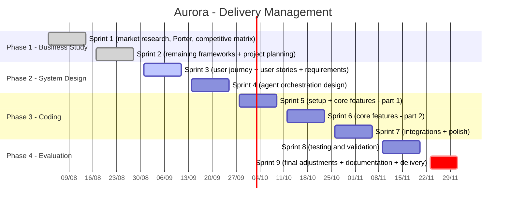

# Aurora

## Project Objective
Creator media infrastructure for the mid-market: Aurora treats a curated pool of nano and micro creators as one media unit that a brand can plan and buy, with an advantage built on the supply side by treating creators as customers instead of anonymous supply.

<p align="center">


</p>

## What is Aurora

Brands already know that nano and micro creators convert better than big influencers, but running a campaign through hundreds of small creators at once is more coordination than most teams can handle. Existing platforms solved this for enterprise brands, but left the mid-market and the creators themselves underserved.

Aurora is a technology platform that lets a brand define a budget, an audience, and a message once, then handles matching creators to the campaign, running it day to day, checking brand safety with AI assistance, and paying every creator in the pool, built specifically for the underserved middle of the market.

## Project Status

This project is currently in the research and strategy phase. There is no product or codebase yet — the repository holds the business analysis that grounds the product decisions to come.

- ✅ **Sprint 1** — Initial market research and business analysis (industry context, the problem, the solution, and the competitive landscape)
- ✅ **Sprint 2** — Business analysis complete (Competitive Matrix, Porter's Five Forces, Gap Analysis, SWOT, Risk Matrix, Personas, Value Proposition Canvas, and Revenue and Cost Structure)
- ⏳ **Next** — Product definition and prototyping

## Project Roadmap

The Aurora project is organized into four phases (business study, system design, coding, and evaluation) with deliverables broken down into roughly two-week sprints, running from August 3 to December 1, 2026.

- Phase 1 (business study) is already complete, covered in Sprints 1 and 2, spanning market research, Porter's Five Forces, the competitive matrix, gap analysis, SWOT, the risk matrix, and initial personas.
- Phase 2 (system design) begins, with two sprints dedicated to mapping the user journey and user stories, followed by defining the functional and non-functional requirements.
- Phase 3 (coding) is the longest stretch, with three sprints set aside for technical setup, building out the core features, and finally integrations and polish.
- Phase 4 (evaluation) closes out the schedule with a sprint for testing and validation, followed by a shorter final sprint for last adjustments, documentation, and delivery, keeping everything on track for the December 1 deadline.



## Repository Structure

```
.
├── docs/
│   ├── business-analysis.md   # Full business analysis
│   └── images/                # Diagrams and screenshots used in the analysis
└── README.md
```

## Business Analysis

The full analysis lives in [docs/business-analysis.md](docs/business-analysis.md), organized into two parts:

**1. Research and Context** — industry context, the problem, the solution, and a map of the main market players (Creator Ads, Squid, Sandwiche, CreatorIQ, BR Media Group).

**2. Frameworks** — Competitive Matrix, Porter's Five Forces, Gap Analysis, SWOT, Risk Matrix, Personas, Value Proposition Canvas, and Revenue and Cost Structure.

## Institution

This project is developed as part of the undergraduate program at [Inteli](https://www.inteli.edu.br/).
