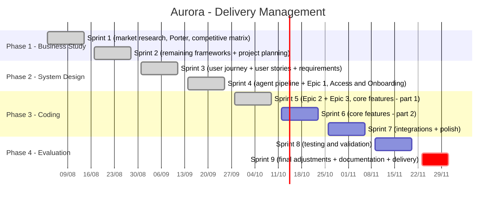

# Aurora

## Project Objective
Creator media infrastructure for the mid-market: Aurora treats a curated pool of nano and micro creators as one media unit that a brand can plan and buy, with an advantage built on the supply side by treating creators as customers instead of anonymous supply.

<p align="center">


</p>

## What is Aurora

Brands already know that nano and micro creators convert better than big influencers, but running a campaign through hundreds of small creators at once is more coordination than most teams can handle. Existing platforms solved this for enterprise brands, but left the mid-market and the creators themselves underserved.

Aurora is a technology platform that lets a brand define a budget, an audience, and a message once, then handles matching creators to the campaign, running it day to day, checking brand safety with AI assistance, and paying every creator in the pool, built specifically for the underserved middle of the market.

## Project Status

The project is now in the coding phase. Three epics are implemented end to end (backend, frontend, and database): Epic 1 (Access and Onboarding, merged to `main`) and Epic 2 (Campaign Planning and Pool Buying) and Epic 3 (Creator Matching and Curation), both built in Sprint 5 and currently awaiting merge review on stacked feature branches. See [docs/sprint-4-delivery.md](docs/sprint-4-delivery.md) for Epic 1 and [docs/sprint-5-delivery.md](docs/sprint-5-delivery.md) for Epic 2 and Epic 3.

- ✅ **Sprint 1** — Initial market research and business analysis (industry context, the problem, the solution, and the competitive landscape)
- ✅ **Sprint 2** — Business analysis complete (Competitive Matrix, Porter's Five Forces, Gap Analysis, SWOT, Risk Matrix, Personas, Value Proposition Canvas, and Revenue and Cost Structure)
- ✅ **Sprint 3** — Product requirements complete (user journeys, 47 user stories, 60 functional and 36 non-functional requirements, with full traceability)
- ✅ **Sprint 4** — System design finalized, the agent pipeline that builds every epic from here on defined, and Epic 1 (Access and Onboarding) built end to end ahead of schedule: authentication, tenant isolation, RBAC, brand profile, team invitations, and agency client management, backend and frontend, with live API docs and a passing backend test suite (see the reviewer's summary for known gaps, including the frontend test environment and tenant isolation enforcement)
- ✅ **Sprint 5** — Epic 2 (Campaign Planning and Pool Buying) and Epic 3 (Creator Matching and Curation) built end to end with the same pipeline, ahead of the original one-epic-per-sprint pace: async quoting and budget reallocation for E2, a real creator-matching engine (replacing E2's stub) and shortlist/exclusion/opportunity flows for E3. Both pass their full automated test suites (107 backend + 31 frontend tests combined) and are documented in [docs/sprint-5-delivery.md](docs/sprint-5-delivery.md); pending human review and merge to `main`.
- ⏳ **Next** — Sprint 6, continuing into the remaining epics (Brand Safety, Briefing and Content Workflow, and onward) with the same pipeline

## Project Roadmap

The Aurora project is organized into four phases (business study, system design, coding, and evaluation) with deliverables broken down into roughly two-week sprints, running from August 3 to December 1, 2026.

- Phase 1 (business study) is already complete, covered in Sprints 1 and 2, spanning market research, Porter's Five Forces, the competitive matrix, gap analysis, SWOT, the risk matrix, and initial personas.
- Phase 2 (system design) begins, with two sprints dedicated to mapping the user journey and user stories, followed by defining the functional and non-functional requirements.
- Phase 3 (coding) is the longest stretch, with three sprints set aside for technical setup, building out the core features, and finally integrations and polish.
- Phase 4 (evaluation) closes out the schedule with a sprint for testing and validation, followed by a shorter final sprint for last adjustments, documentation, and delivery, keeping everything on track for the December 1 deadline.


```mermaid
gantt
    title Aurora - Delivery Management
    dateFormat  YYYY-MM-DD
    axisFormat  %d/%m

    section Phase 1 - Business Study
    Sprint 1 (market research, Porter, competitive matrix)       :done, s1, 2026-08-03, 2026-08-14
    Sprint 2 (remaining frameworks + project planning)           :done, s2, 2026-08-17, 2026-08-28

    section Phase 2 - System Design
    Sprint 3 (user journey + user stories + requirements)        :done, s3, 2026-08-31, 2026-09-11
    Sprint 4 (agent pipeline + Epic 1, Access and Onboarding)     :done, s4, 2026-09-14, 2026-09-25

    section Phase 3 - Coding
    Sprint 5 (Epic 2 + Epic 3, core features - part 1)            :done, s5, 2026-09-28, 2026-10-09
    Sprint 6 (core features - part 2)                            :s6, 2026-10-12, 2026-10-23
    Sprint 7 (integrations + polish)                             :s7, 2026-10-26, 2026-11-06

    section Phase 4 - Evaluation
    Sprint 8 (testing and validation)                            :s8, 2026-11-09, 2026-11-20
    Sprint 9 (final adjustments + documentation + delivery)      :crit, s9, 2026-11-23, 2026-12-01
```

## Repository Structure

```
.
├── .claude/agents/                    # One file per pipeline agent (see Agent Pipeline below)
├── backend/                           # NestJS API (auth, pricing, brand-profile, invitation, workspace, agency, campaign, matching, audit, jobs)
├── frontend/                          # React/Vite app consuming the API (public pages, protected app pages, creator-portal)
├── docker-compose.yml                 # PostgreSQL 16 + Redis 7 for local development
├── docs/
│   ├── business-analysis.md          # Market research and strategic frameworks
│   ├── product-requirements.md       # Journeys, user stories, FRs and NFRs
│   ├── architecture.md               # System design, ATAM, security, DevOps
│   ├── sprint-4-delivery.md          # How Epic 1 was built, how to run and test it
│   ├── sprint-5-delivery.md          # How Epic 2 and Epic 3 were built, how to run and test them
│   ├── aurora-E1-setup-guide.md      # Step-by-step local setup for Epic 1
│   ├── adr/                          # Architecture Decision Records, one per epic decision
│   ├── architecture/                 # Per-epic architecture docs (data model, API contracts)
│   ├── epics/                        # Per-epic stories and the reviewer's summary
│   └── images/                       # Diagrams and screenshots used in the docs
└── README.md
```

## Business Analysis

The full analysis lives in [docs/business-analysis.md](docs/business-analysis.md), organized into two parts:

**1. Research and Context** — industry context, the problem, the solution, and a map of the main market players (Creator Ads, Squid, Sandwiche, CreatorIQ, BR Media Group).

**2. Frameworks** — Competitive Matrix, Porter's Five Forces, Gap Analysis, SWOT, Risk Matrix, Personas, Value Proposition Canvas, and Revenue and Cost Structure.

## Product Requirements

The specification lives in [docs/product-requirements.md](docs/product-requirements.md). It converts the market gaps and customer pains from the business analysis into something buildable, as an unbroken chain: a journey phase exposes friction, a user story describes the behavior that removes it, and a requirement states it precisely enough to build and test.

**User Journeys** — the current experience of Marina (the brand), Duda (the creator), and Renata (the agency), phase by phase, with the friction points that justify every feature that follows.

**User Stories** — 47 stories across nine epics, prioritized with MoSCoW, with expanded Given/When/Then acceptance criteria for the six that carry the most weight.

**Functional Requirements** — 60 requirements across nine modules, each traced to the story it comes from.

**Non-Functional Requirements** — 36 requirements organized by quality attribute, each with a measurable target. These become the quality attribute scenarios evaluated in the architecture.

## Architecture

The system design lives in [docs/architecture.md](docs/architecture.md). Aurora is a modular monolith with asynchronous workers and externalized model inference — a decision driven by the mid-market economics rather than by preference, since an architecture that costs enterprise money to run would reproduce the very gap Aurora exists to close.

**Architecture Overview** — the style and why microservices were rejected, context and container views, the data model, and the technology stack with its rationale.

**ATAM** — the architecture stress-tested against eight quality attribute scenarios, producing the tradeoffs the design actually makes: integrity over cost on the payment path, cost over accuracy headroom on brand safety, and shared-schema tenancy over per-tenant isolation.

**Information Security** — STRIDE threat modeling, the security controls, and LGPD compliance, including the constraints that govern building profiles for creators who never registered.

**DevOps and CI/CD** — environments, pipeline, deployment and rollback, and the observability that makes every measurable requirement visible in production.

## Agent Pipeline

Starting in Sprint 4, every epic is built by a fixed sequence of specialized Claude Code agents rather than one agent doing everything end to end. Each agent has a narrow role, a fixed set of tools, and one kind of output, and each stage is auditable on its own before the next one starts.

| Stage | Agent | Output |
|---|---|---|
| 1 | `product-analyst` | User stories with Given/When/Then acceptance criteria, from an approved epic |
| 2 | `architect` | Stack, data model, API contracts, and one ADR per nontrivial decision |
| 3 | `backend-dev` / `frontend-dev` | The API, database schema, and UI implementing the approved contracts |
| 4 | `qa` | Automated tests per acceptance criterion, reported back to the owning dev |
| 5 | `reviewer` | The epic summary, checked against the ADRs and contracts, as the final gate before merge |

Stories and architecture each require human approval before the next stage proceeds, and nothing merges without the reviewer's summary. The full instructions for each agent are in `.claude/agents/`. The pipeline itself, and how it produced Epic 1, is documented in [docs/sprint-4-delivery.md](docs/sprint-4-delivery.md); how it produced Epic 2 and Epic 3 is documented in [docs/sprint-5-delivery.md](docs/sprint-5-delivery.md).

## Epic 1: Access and Onboarding

The first epic removes the enterprise sales cycle from onboarding: a brand or agency can sign up, verify their email, configure a workspace, invite teammates, and (for agencies) manage client accounts, all without a sales call. Built with NestJS and PostgreSQL on the backend and React on the frontend.

- **Stories:** [docs/epics/e1-access-onboarding/stories.md](docs/epics/e1-access-onboarding/stories.md)
- **Architecture and API contracts:** [docs/architecture/e1-access-onboarding.md](docs/architecture/e1-access-onboarding.md)
- **Decisions:** authentication strategy, tenant isolation via PostgreSQL row-level security, workspace-scoped RBAC, and the brand profile draft lifecycle, each in its own ADR under [docs/adr/](docs/adr)
- **What was built, tested, and any deviations from the design:** [docs/epics/e1-access-onboarding/summary.md](docs/epics/e1-access-onboarding/summary.md)
- **Run it locally and test it:** [docs/sprint-4-delivery.md](docs/sprint-4-delivery.md) or the detailed [setup guide](docs/aurora-E1-setup-guide.md)

Alongside the build, three market validation interviews were conducted in the Brazilian creator economy (Creator Ads, from both a go-to-market and an operations perspective, and PlayNest) to check Aurora's pricing, segmentation, and agency-role hypotheses against practitioners. See [docs/sprint-4-delivery.md](docs/sprint-4-delivery.md#6-field-research-conducted-alongside-this-sprint) for the interview guide and analyses.

## Epic 2: Campaign Planning and Pool Buying

The second epic lets a brand define a campaign's budget, audience, and message once, see the matched creator pool's projected reach and price before committing, and buy that pool at one locked price instead of negotiating per creator. Built on the same NestJS/PostgreSQL backend and React frontend, on top of Epic 1. **Status: implemented and tested, pending merge** — see the branches note below.

- **Stories:** [docs/epics/e2-campaign-planning-pool-buying/stories.md](docs/epics/e2-campaign-planning-pool-buying/stories.md)
- **Architecture and API contracts:** [docs/architecture/e2-campaign-planning-pool-buying.md](docs/architecture/e2-campaign-planning-pool-buying.md)
- **Decisions:** pool allocation model, campaign state machine, budget reallocation bounds, pool-shortfall resolution criteria, minimum campaign budget, and template library scope, each in its own ADR under [docs/adr/](docs/adr) (0005-0010)
- **What was built, tested, and any deviations from the design:** [docs/epics/e2-campaign-planning-pool-buying/summary.md](docs/epics/e2-campaign-planning-pool-buying/summary.md)
- **Run it locally and test it:** [docs/sprint-5-delivery.md](docs/sprint-5-delivery.md)

## Epic 3: Creator Matching and Curation

The third epic replaces Epic 2's placeholder matching engine with a real one, ranking creators by audience fit, authenticity, engagement, and historical reliability, and lets a brand approve or reject individual creators, exclude specific creators or competitor-associated ones, and lets an agency override the shortlist with its own network. It also gives the creator (Duda) a minimal portal to accept or decline a campaign opportunity. **Status: implemented and tested, pending merge** — see the branches note below.

- **Stories:** [docs/epics/e3-creator-matching-curation/stories.md](docs/epics/e3-creator-matching-curation/stories.md)
- **Architecture and API contracts:** [docs/architecture/e3-creator-matching-curation.md](docs/architecture/e3-creator-matching-curation.md)
- **Decisions:** real matching engine scoring model, shortlist locking, the minimal creator entity, exclusion precedence, override sequencing, guaranteed-minimum advisory, authenticity-score policy, and additional-candidates top-up, each in its own ADR under [docs/adr/](docs/adr) (0011-0018)
- **What was built, tested, and any deviations from the design:** [docs/epics/e3-creator-matching-curation/summary.md](docs/epics/e3-creator-matching-curation/summary.md)
- **Run it locally and test it:** [docs/sprint-5-delivery.md](docs/sprint-5-delivery.md)

**Branches:** Epic 1 is merged to `main`. Epic 2 and Epic 3 are on stacked feature branches awaiting review (`feature/e2-campaign-planning-pool-buying`, with Epic 3 built on top of it as `feature/e3-creator-matching-curation`, since E3's matching module depends directly on E2's campaign module). Check out `feature/e3-creator-matching-curation` to run everything built so far.

## Institution

This project is developed as part of the undergraduate program at [Inteli](https://www.inteli.edu.br/).
