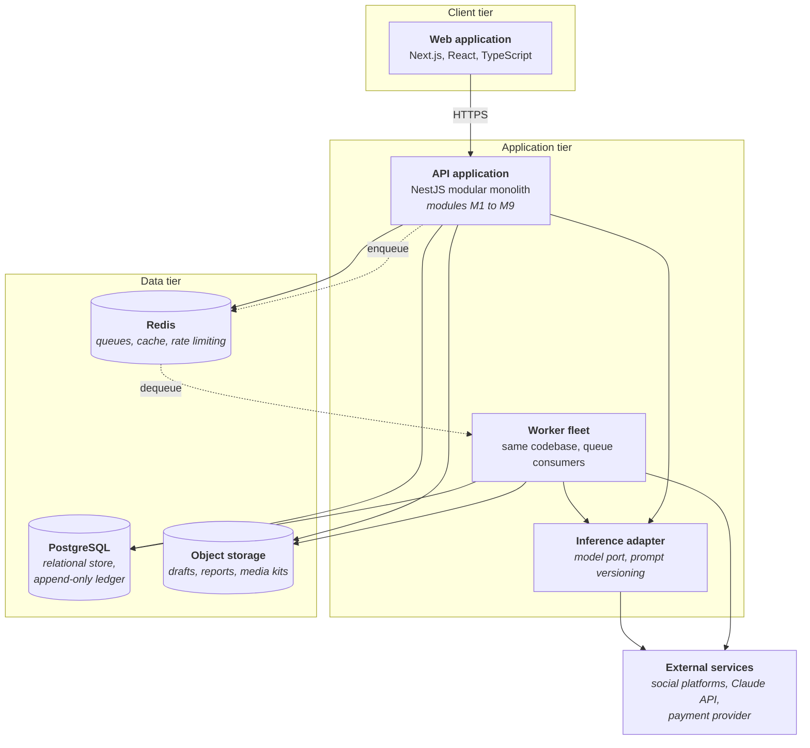
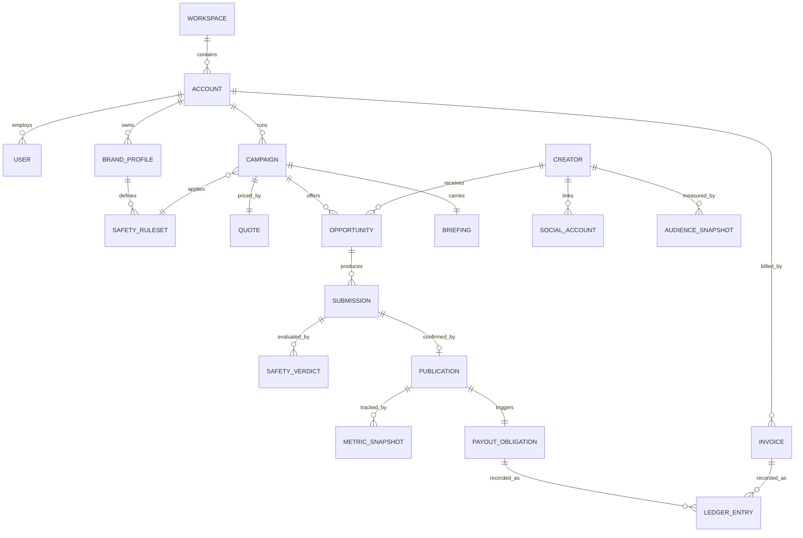
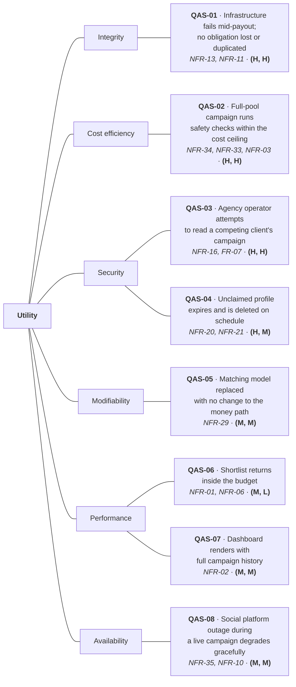
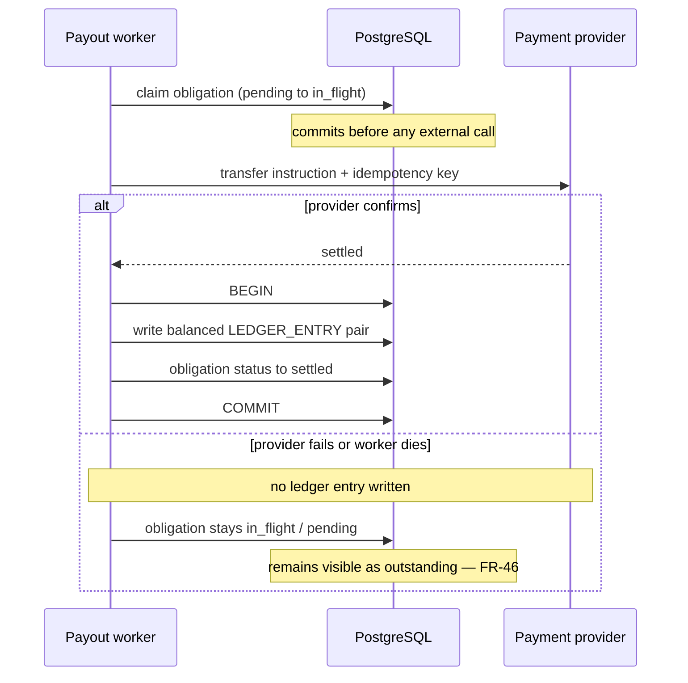
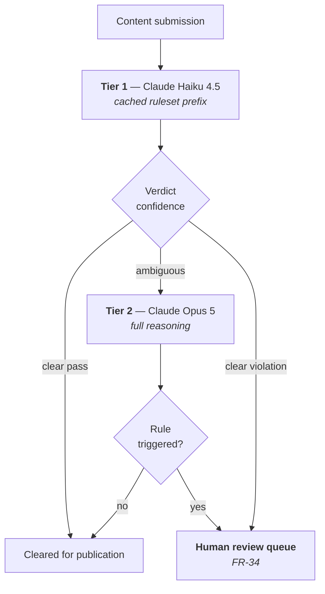

# Aurora's Architecture

# Table of Contents
1. [Introduction](#1-introduction)
   - 1.1 [Purpose and Scope](#11-purpose-and-scope)
   - 1.2 [Architectural Drivers](#12-architectural-drivers)
2. [Architecture Overview](#2-architecture-overview)
   - 2.1 [Style and Rationale](#21-style-and-rationale)
   - 2.2 [Context View](#22-context-view)
   - 2.3 [Container View](#23-container-view)
   - 2.4 [Data Model](#24-data-model)
   - 2.5 [Technology Stack](#25-technology-stack)
3. [Architecture Tradeoff Analysis Method](#3-architecture-tradeoff-analysis-method)
   - 3.1 [Business Drivers and Utility Tree](#31-business-drivers-and-utility-tree)
   - 3.2 [Scenario Analysis](#32-scenario-analysis)
   - 3.3 [Sensitivity Points, Tradeoffs, Risks, and Non-Risks](#33-sensitivity-points-tradeoffs-risks-and-non-risks)
   - 3.4 [Conclusions](#34-conclusions)
4. [Information Security](#4-information-security)
   - 4.1 [Threat Modeling](#41-threat-modeling)
   - 4.2 [Security Controls](#42-security-controls)
   - 4.3 [Data Privacy and Compliance](#43-data-privacy-and-compliance)
5. [DevOps and CI/CD](#5-devops-and-cicd)
   - 5.1 [Environments and Branching](#51-environments-and-branching)
   - 5.2 [Continuous Integration](#52-continuous-integration)
   - 5.3 [Continuous Delivery and Observability](#53-continuous-delivery-and-observability)
6. [References](#6-references)

---

## 1. Introduction

### 1.1 Purpose and Scope

This document decides **how** Aurora is built. It takes [Aurora's Product Requirements](./product-requirements.md) as input and answers for meeting it: architectural style, component and data structure, the tradeoffs those choices force, security posture, and delivery pipeline. It does not restate what the system must do, and where a choice is genuinely open it says so rather than inventing a decision the evidence doesn't yet support.

The organizing method is the **Architecture Tradeoff Analysis Method (ATAM)** in section 3. Sections 2, 4, and 5 describe decisions; section 3 stress-tests them against the non-functional requirements they exist to satisfy, including where satisfying one costs another.

**Scope note.** The requirements this document builds against were sized for a **first release**: a pilot with a handful of brand and agency accounts and a creator base in the low hundreds, built and operated by a small team — not the volumes Aurora expects once the model is validated. Several targets below trade automation for a manual fallback the team can actually staff, without relaxing the promise made to the customer.

### 1.2 Architectural Drivers

<strong>Table 1</strong> — <em>The Non-Functional Requirements That Drive Architectural Decisions</em>

| ID | Attribute | Target | Why it drives the architecture |
|---|---|---|---|
| NFR-13 | Integrity | Zero lost, duplicated, or altered financial obligations; append-only, reconcilable ledger | Forces a single transactional store for the money path; rules out eventual consistency there |
| NFR-34 | Cost efficiency | Marginal infrastructure cost per additional creator falls as pool size grows | The hardest requirement here. Per-creator work (safety checks, payouts) must be sublinear or the mid-market model doesn't close |
| NFR-33 | Cost efficiency | Infrastructure cost tracked toward ≤ 3% of campaign gross value | Rules out high fixed cost per environment, which is most microservice topologies at this scale |
| NFR-16 | Authorization | Zero successful cross-tenant reads; every denial logged | Agency workspaces hold competing brands. Isolation must be enforced by a mechanism that can't be forgotten in a query |
| NFR-29 | Modifiability | Matching and safety models replaceable without touching campaign or payment code | The fastest-changing components sit next to the ones that must never break |
| NFR-06, NFR-08 | Scalability | Up to 150 creators per campaign; 20,000 performance events/day | Sets the load a pilot-scale design must absorb |
| NFR-03 | Performance | Brand safety verdict p95 ≤ 5 minutes | Loose enough to permit asynchronous processing, which is what makes NFR-34 achievable |
| NFR-10, NFR-12 | Availability | ≥ 95% monthly (business hours); RPO/RTO ≤ 24 h | Achievable with managed infrastructure and daily backups — a pilot target, not a production SLA |

Most remaining NFRs are satisfied by controls in sections 4 and 5 rather than by structural decisions, and are traced there. NFR-05, NFR-24, NFR-26, and NFR-27 are interface and content obligations met by frontend practice and design review, not by anything decided here.

Two drivers pull in opposite directions and set up this document's central tension: **NFR-13 wants the money path conservative and slow to change; NFR-34 wants per-creator work cheap and aggressively optimized.** They meet in the same request path, because a payout is per-creator work. Section 3 examines how the design holds both.

---

## 2. Architecture Overview

### 2.1 Style and Rationale

**Aurora is built as a modular monolith with asynchronous workers and externalized AI inference.** One deployable application containing the nine functional modules from the requirements document, a worker fleet running the same codebase against job queues, and model inference behind an adapter so it can be replaced independently.

<strong>Table 2</strong> — <em>Architectural Style Options Evaluated Against Aurora's Drivers</em>

| Style | Fit with NFR-33/34 | Fit with NFR-13 | Fit with NFR-29 | Verdict |
|---|---|---|---|---|
| Single-process monolith | Best fixed cost | Best — one transaction boundary | Poor — model code compiled into the payment deployable | Rejected. Fails NFR-29 |
| **Modular monolith + async workers** | Strong — one app to run, workers scale independently | Strong — money path stays in one ACID transaction | Adequate — module boundaries plus an inference adapter isolate volatile parts | **Selected** |
| Microservices | Weak at this scale — per-service infra multiplies fixed cost | Weak — a payout spanning services needs sagas or distributed transactions | Best in principle | Rejected — buys modifiability not yet needed at a cost NFR-33 forbids |

Microservices are rejected not because they are wrong in general, but because Aurora's constraint is the opposite of what microservices solve: a small team with a hard cost ceiling gains little from independent deployability and pays for it in fixed infrastructure cost. Better to start monolithic and extract services once boundaries are known from experience than to guess them in advance (Fowler, 2015).

Three refinements make the monolith viable against the drivers it doesn't naturally satisfy:

- **Asynchronous workers** move expensive work — brand safety analysis, payout execution, metric ingestion, media kit generation — off the request path. This is what NFR-03's five-minute budget buys, and it is the mechanism that makes per-creator cost sublinear.
- **An inference adapter** isolates matching and brand safety behind an internal port, never a provider SDK directly. Replacing a model or a prompt touches the adapter, never the campaign or payment modules — NFR-29 stated as structure.
- **A dedicated ledger module** is the only module permitted to write financial records; every other module reaches it through a narrow interface. NFR-13's zero-tolerance target is enforced by keeping that surface as small as possible.

### 2.2 Context View

At the coarsest zoom (Brown, n.d.), Aurora sits between three customer actors — Marina, Duda, and Renata, each interacting through the surfaces in section 2.3 — and a fourth, **Aurora operations**, the staff who run active recruitment (US-23) and human safety review (US-17). These are processes the system supports, not features it automates away, which is why they appear as an actor rather than staying invisible. Aurora integrates four external systems: **social platforms** (OAuth, audience and performance metrics), the **Claude API** (message-level safety analysis), a **payment provider** (Pix and bank transfer payouts), and a **notification provider** (briefings, verdicts, payment notices).

### 2.3 Container View

<strong>Figure 1</strong> — <em>Aurora's Deployable Units and Data Stores</em>

*Note.* The API and worker fleet share one codebase and image, differing only in entrypoint — a single domain model, with the API scaling on concurrent users and workers on campaign volume.

The nine functional modules map onto the API as internal module boundaries with explicit interfaces, not separate deployables, enforced by static analysis in CI rather than by network calls: a module may only import another's public interface, and a violation fails the build. Three boundaries carry the most weight:

- **The ledger boundary** — only the payments module writes financial tables.
- **The tenancy boundary** — every tenant-scoped query goes through a repository layer that injects the tenant context; section 4 describes the database-level backstop.
- **The inference boundary** — matching and safety depend on the adapter's interface, never a provider SDK.

### 2.4 Data Model

<strong>Figure 2</strong> — <em>Principal Entities and Relationships</em>

*Note.* `WORKSPACE` is the tenancy root: a brand workspace holds one account, an agency workspace holds many (FR-06). Every tenant-scoped table carries the account identifier the isolation mechanism in section 4 keys on.

Two decisions carry the most architectural weight. **`LEDGER_ENTRY` is append-only and double-entry** — nothing is updated or deleted, a correction is a compensating entry — which is what makes NFR-13's reconcilability mechanical rather than aspirational. **`PAYOUT_OBLIGATION` is separated from its ledger entries**: the obligation records what is owed and by when, the ledger records what moved, and keeping them distinct is what lets FR-46 hold a failed payout visibly outstanding. `SAFETY_VERDICT` is likewise its own entity, not a column on `SUBMISSION`, because a submission can be evaluated more than once and by more than one tier — the structure the cascade in section 3.2 depends on.

### 2.5 Technology Stack

<strong>Table 3</strong> — <em>Technology Choices and Their Rationale</em>

| Layer | Choice | Rationale | Driver |
|---|---|---|---|
| Frontend | Next.js, React, TypeScript | Server-side rendering meets the dashboard budget; one framework serves all three user types | NFR-02, NFR-25 |
| Backend | NestJS, TypeScript | Module system maps onto the nine functional modules and makes boundary violations statically detectable | NFR-29, NFR-33 |
| Primary datastore | PostgreSQL | ACID transactions for the ledger; row-level security for tenancy; JSONB absorbs semi-structured payloads without a second database | NFR-13, NFR-16 |
| Queue and cache | Redis + a job library | One dependency serves queues, caching, and rate limiting | NFR-33, NFR-03 |
| Object storage | S3-compatible | Drafts, reports, and media kits are large and rarely read; kept out of the database and the recovery window | NFR-12 |
| Content analysis | Claude API via the inference adapter | Multimodal, strong instruction-following; a two-tier cascade makes it affordable at pool scale (3.2) | FR-32, NFR-34 |
| Payments | Provider abstraction over a Brazilian PSP supporting Pix | Pix settles in seconds at near-zero cost, making fast payment affordable; the abstraction keeps the provider replaceable | NFR-36, FR-45 |
| Infrastructure | Containers on a managed platform, Terraform | Managed services carry availability without a dedicated ops team; infra as code keeps environments reproducible | NFR-10, NFR-30 |
| CI/CD | GitHub Actions | Native to where the code lives; no extra service to operate | NFR-33 |

*Note.* The stack is deliberately conventional. Aurora's differentiation is commercial and operational, not technical, so novelty is spent on structure and tradeoffs, not on tools.

---

## 3. Architecture Tradeoff Analysis Method

### 3.1 Business Drivers and Utility Tree

ATAM is a structured technique for evaluating an architecture against concrete scenarios rather than in the abstract, developed at the Software Engineering Institute (Kazman, Klein, & Clements, 2000; Bass, Clements, & Kazman, 2021). Its value is not a score but the **discovery of where satisfying one quality attribute costs another** — an evaluation that finds no tradeoffs has not been performed honestly.

<strong>Table 4</strong> — <em>Business Drivers and the Quality Attributes They Demand</em>

| Business driver | Source | Quality attribute | Priority |
|---|---|---|---|
| Serve the mid-market profitably | Gap Analysis: the segment is open because serving it is hard | Cost efficiency | High |
| Become the platform creators prefer, on reliable payment | Gap Analysis: the only advantage Aurora builds from scratch | Reliability, integrity | High |
| Hold creator data lawfully while recruiting outside self-registration | The active recruitment bet, constrained by the LGPD | Security, privacy | High |
| Match table-stakes capability | Competitive Matrix: pool buying, optimization, safety are baseline | Performance, scalability | Medium |
| Open agencies as a distribution channel | Gap Analysis: agencies buy infrastructure, aren't cut out | Security (multi-tenancy) | Medium |
| Improve matching and safety continuously | Both are model-driven and will iterate | Modifiability | Medium |

Each utility-tree leaf is tagged **(business value, architectural risk)**; **(H, H)** leaves are analyzed first.

<strong>Figure 3</strong> — <em>Quality Attribute Utility Tree for Aurora</em>

*Note.* The three **(H, H)** scenarios coincide exactly with the three drivers the business analysis flagged as load-bearing: profitable mid-market economics, reliable creator payment, and lawful multi-tenant handling of creator data.

### 3.2 Scenario Analysis

Each **(H, H)** scenario below is analyzed in full: stimulus, response measure, the decisions that produce it, and the sensitivity or tradeoff those decisions expose. The remaining scenarios are summarized in Table 6.

#### QAS-01 — Financial integrity under infrastructure failure

**Scenario.** A worker executing a batch of payouts is terminated mid-batch. Some transfers were instructed, some weren't, one is in flight with unknown status.

**Response measure.** Zero obligations lost or duplicated; ledger-to-campaign reconciliation returns no discrepancy (NFR-13). ≥ 95% of obligations settle by their deadline, automatically or via an operator (NFR-11).

<strong>Figure 4</strong> — <em>The Payout Path and Its Transaction Boundary</em>

*Note.* A worker that dies after instructing the provider leaves the obligation `in_flight`, not `pending`. A reconciliation job periodically queries the provider for every `in_flight` obligation past a threshold and resolves it — which is why the idempotency key matters, since the reconciler may re-instruct a transfer that already succeeded.

**Decisions.** Append-only, double-entry ledger, so a partially-applied batch leaves a consistent prefix. Idempotency keys derived from the obligation ID. Payouts individually queued rather than batched into one transaction, so a worker failure loses at most one in-flight job. Ledger write and obligation transition share one database transaction.

**Sensitivity.** The append-only ledger and idempotency propagation (S-01, S-02); removing either breaks the response entirely.

**Tradeoff (T-01).** Individually queued payouts trade **cost against integrity**. Batching would be cheaper per request, but a partial batch failure would leave settlement status undeterminable. Integrity wins — NFR-13 is the specification's one zero-tolerance target.

#### QAS-02 — Brand safety cost at pool scale

**Scenario.** A campaign at the pilot's pool ceiling — 150 creators — requires message-level analysis (caption, on-screen text, audio) of every submission before publication.

**Response measure.** p95 verdict latency ≤ 5 minutes (NFR-03); total cost tracked toward NFR-33's ceiling; marginal cost per additional creator falls as the pool grows (NFR-34).

**1. A two-tier model cascade.** A fast, cheap model screens every submission; only ambiguous or likely-violating content escalates to a stronger model.

<strong>Figure 5</strong> — <em>The Two-Tier Brand Safety Cascade</em>

*Note.* Both tiers route flagged content to human review (FR-34); the cascade changes what a model decides, never who gets the final call on a flag.

**2. Prompt caching on the shared ruleset prefix.** Every check within a campaign evaluates a different submission against the same ruleset — a stable prefix cached after the first request and read at a fraction of the cost thereafter, which is what makes cost fall as the pool grows. **3. Asynchronous execution** lets checks queue, rate-shape, and retry within the five-minute budget.

<strong>Table 5</strong> — <em>Illustrative Cost for a 150-Check Campaign, the Pilot's Pool Ceiling</em>

| Approach | Per-check cost | Campaign total | Relative |
|---|---|---|---|
| Single strong model, no caching | ≈ US$0.0325 | ≈ US$4.88 | 1.0× |
| Single strong model, cached prefix | ≈ US$0.0100 | ≈ US$1.50 | 0.31× |
| **Two-tier cascade with cached prefix** | ≈ US$0.0035 blended | **≈ US$0.53** | **0.11×** |

*Note.* Order-of-magnitude figures, not a budget, assuming a 15% escalation rate and Anthropic's published rates (Anthropic, n.d.). The saving grows further once Aurora serves pools larger than this pilot's ceiling, since the cached prefix is paid once per campaign regardless of pool size.

**Sensitivity.** The escalation rate (S-03) is the number that decides whether this scenario passes — blended cost is linear in it. The cacheable prefix's minimum size (S-04) is the second: below the screening tier's cache threshold, the saving disappears where most volume runs.

**Tradeoff (T-02).** The cascade trades **cost against safety accuracy** — deliberately uncomfortable, since brand safety is table-stakes Aurora can't do poorly. The response is to make the screening tier's job triage, not judgment: it is tuned to escalate on uncertainty, so an accuracy regression surfaces as a higher bill, not as unsafe content going live.

**Risk (R-01).** The escalation rate is unvalidated. Mitigation: a labeled evaluation set before launch, and the rate instrumented in production (NFR-31) rather than assumed.

#### QAS-03 — Tenant isolation in an agency workspace

**Scenario.** An operator authorized for client A issues a request referencing client B's campaign — a competing brand in the same workspace.

**Response measure.** Zero data returned for client B; the attempt logged with the acting user (NFR-16, NFR-17), with no exception.

**Decisions.** **PostgreSQL row-level security** on every tenant-scoped table, keyed on the account ID, set per connection from the session — isolation enforced by the database, not by an application remembering to filter. A repository layer sets the tenant context at connection checkout, so a handle without one cannot be obtained. Denied attempts write to the audit log.

**Sensitivity (S-05).** Row-level security policy coverage. The guarantee holds exactly as far as the policies do.

**Tradeoff (T-04).** Shared-schema multi-tenancy trades **cost against isolation strength**. A database per tenant would make cross-tenant reads structurally impossible, but NFR-09 anticipates up to 10 client accounts per agency and per-tenant databases would multiply fixed cost against NFR-33 — the same economics that ruled out microservices. Mitigation: a CI check enumerates tenant-scoped tables and fails the build if any lacks a policy (R-02).

<strong>Table 6</strong> — <em>Remaining Scenarios (M/L Priority)</em>

| ID | Scenario | Response measure | Key decision |
|---|---|---|---|
| QAS-04 | Unclaimed profile expires unclaimed after 90 days | Deleted automatically; never matched or brand-visible in the interim (NFR-20); a claim request instead completes in 15 days (NFR-21) | Distinct lifecycle state with an expiry timestamp; repository-layer visibility filter, not per-query; scheduled hard deletion, logged (S-06) |
| QAS-05 | Matching model replaced six months post-launch | No change to campaign/payment code, no migration, zero-downtime deploy (NFR-29) | Adapter interface, versioned prompts, model selection as config (S-07) |
| QAS-06 | Shortlist generation for a 100-creator campaign | p95 ≤ 60 s, each match reasoned (NFR-01, FR-26) | Matching as an async job over a pre-indexed audience projection, not a live traversal |
| QAS-07 | Dashboard opened with full campaign history | First render p95 ≤ 3 s (NFR-02) | Server-side rendering; aggregates pre-computed by ingestion workers, not aggregated at read time (T-05) |
| QAS-08 | Social platform outage mid-campaign | Submission and payout unaffected; metrics shown stale; recovers without intervention (NFR-35, NFR-10) | Ingestion isolated in workers; circuit breakers per platform; publication confirmation never blocks payout (S-08) |

### 3.3 Sensitivity Points, Tradeoffs, Risks, and Non-Risks

This is the output the method exists to produce.

<strong>Table 7</strong> — <em>Sensitivity Points and Tradeoffs</em>

| ID | Type | Decision | Attribute(s) | Note |
|---|---|---|---|---|
| S-01 | Sensitivity | Append-only, double-entry ledger | Integrity | Mutable records make NFR-13 unenforceable |
| S-02 | Sensitivity | Idempotency keys on payouts | Integrity | Without them, any retry risks duplication |
| S-03 | Sensitivity | Safety escalation rate | Cost efficiency | Blended cost is linear in it |
| S-04 | Sensitivity | Cacheable ruleset prefix size | Cost efficiency | Below the cache minimum, the saving disappears |
| S-05 | Sensitivity | Row-level security policy coverage | Security | One uncovered table is an unguarded path |
| S-06 | Sensitivity | Unclaimed-profile visibility filter placed in the repository layer | Privacy | Per-query filtering instead would leave export and reporting paths exposed |
| S-07 | Sensitivity | Stability of the inference adapter's interface | Modifiability | A leaking interface returns model changes to campaign and payment code |
| S-08 | Sensitivity | Payout not blocked by publication-link verification | Reliability | A platform outage would otherwise mean unpaid creators |
| T-01 | Tradeoff | Individually queued payouts vs. batching | Integrity ↔ cost | Integrity wins — NFR-13 is the one zero-tolerance target |
| T-02 | Tradeoff | Two-tier safety cascade vs. single strong model | Cost ↔ safety accuracy | Cascade adopted; accuracy loss surfaces as cost, not unsafe publication |
| T-04 | Tradeoff | Shared-schema multi-tenancy vs. per-tenant database | Cost ↔ isolation strength | Shared schema adopted; CI policy-coverage check makes the failure mode detectable |
| T-05 | Tradeoff | PostgreSQL analytics vs. a dedicated analytical store | Cost ↔ read performance at scale | PostgreSQL with materialized aggregates now; snapshot tables isolated so extraction is contained later |
| T-06 | Tradeoff | Modular monolith vs. microservices | Cost, integrity ↔ independent deployability | Monolith adopted; the inference adapter supplies the modifiability actually needed |

<strong>Table 8</strong> — <em>Risks and Non-Risks</em>

| ID | Type | Item | Note |
|---|---|---|---|
| R-01 | Risk | Escalation rate behind every QAS-02 cost claim is unmeasured | Build a labeled evaluation set before launch; instrument the rate as a monitored metric |
| R-02 | Risk | A single missing row-level security policy is a cross-tenant breach with no second line of defense | CI coverage check; penetration test the agency workspace before the first multi-client agency |
| R-03 | Risk | Payout reliability depends on a provider Aurora doesn't control, against a 95% settlement target | Provider abstraction (NFR-36); obligations stay visibly outstanding through failure |
| R-05 | Risk | A defect in any module can degrade the whole application, including the money path | Module boundaries enforced in CI; ledger's narrow write interface limits exposure; coverage floor on payout logic (NFR-28) |
| N-01 | Non-risk | Single-datastore transaction boundary for the money path | Delivers NFR-13's guarantee at no cost; alternatives would need sagas for no benefit |
| N-02 | Non-risk | The inference adapter boundary | Satisfies NFR-29 cheaply; cost is one indirection |
| N-05 | Non-risk | Serving metrics from stored snapshots rather than live | Serves availability, performance, and cost together; the only cost is freshness |

### 3.4 Conclusions

The evaluation finds the architecture **sound against its drivers, with risk concentrated in one place**: the cost assumptions behind the brand safety cascade.

**The central tension resolves in favor of integrity.** NFR-13 and NFR-34 meet in the payout path, and T-01 decides it: payouts process individually, at higher per-transaction cost, because a partial batch failure is unresolvable. The cost pressure NFR-34 applies is absorbed almost entirely on the **safety** side, not the payment side — a safety check costing more than expected is a margin problem; a missing payout is a broken promise.

**R-01 deserves action before launch.** Every cost figure in QAS-02 depends on an unmeasured escalation rate. The mitigation is ordinary diligence: a labeled evaluation set, then a production metric, not a one-time assumption.

**The rejections share one reason.** Microservices, per-tenant databases, and a dedicated analytical store are each defensible engineering, each rejected because it multiplies fixed cost against a ceiling that exists because the mid-market gap exists — serving it profitably is hard. An implementation that costs enterprise money to run would reproduce the gap Aurora set out to close.

---

## 4. Information Security

Aurora's posture follows from what it is, not a generic checklist: it holds creator personal data collected before some creators are customers; it moves money to many individuals, where the likely attack is quiet manipulation rather than a dramatic breach; and it is multi-tenant across competing brands, where leakage is a commercial incident, not an abstract severity rating.

### 4.1 Threat Modeling

The analysis uses **STRIDE** (Shostack, 2014), applied where data crosses a trust boundary: **TB1** at the edge (authentication, into the API), **TB2** inside the application tier (tenant isolation, between API/workers and each other), **TB3** at the data tier (least privilege at rest), and **TB4** at egress to Claude, the payment provider, and social platforms — the boundary easiest to overlook, since content sent for safety analysis and payout instructions both leave Aurora's control entirely.

<strong>Table 9</strong> — <em>STRIDE Analysis of Principal Components</em>

| Component | Threat | Category | Mitigation |
|---|---|---|---|
| Authentication (TB1) | Credential stuffing against numerous, low-value creator accounts | Spoofing | Rate limiting; breached-password screening; MFA mandatory for payout roles (NFR-19) |
| API authorization (TB2) | Reading another tenant's campaign by identifier | Information disclosure | Server-side authorization; row-level security as the enforcing layer (NFR-16); denials logged |
| Payout path | Altering a bank detail or amount before execution | Tampering | Re-authentication on change; immutable audit log; cooling period before a changed account receives payment |
| Payout path | Replaying an instruction to duplicate a transfer | Tampering | Idempotency keys (S-02); append-only ledger makes duplication detectable |
| Ledger | Denying a financial action occurred | Repudiation | Append-only entries; immutable audit log with acting principal, retained 5 years (NFR-17) |
| Brand safety pipeline | Prompt injection — a caption instructing the model to return a pass | Tampering, elevation | Submitted content passed as data, never instructions; ruleset occupies the cached prefix; verdicts validated against a constrained shape; flags still route to a human (FR-34) |
| Social integration (TB4) | Stolen OAuth tokens used against a creator's account | Spoofing, elevation | No credentials stored (NFR-15); tokens encrypted at rest, rotated ≥ every 90 days, minimally scoped |
| Object storage | Direct access to drafts or reports by URL | Information disclosure | No public buckets; short-lived signed URLs scoped to one object, one principal |
| Unclaimed profiles | Data on non-consenting individuals exposed or over-retained | Information disclosure | Public data only, invisible to brands, hard-deleted at 90 days (NFR-20); deletion on request within 15 days (NFR-21) |

Prompt injection deserves emphasis: Aurora asks a model to judge attacker-influenced content, so a creator's caption is untrusted input to a security-relevant decision. The structural defense is that the check is a **gate, not an authority** — a manipulated verdict can at worst produce a false pass at screening, and uncertainty routes to escalation and human review rather than automatic clearance.

### 4.2 Security Controls

<strong>Table 10</strong> — <em>Security Controls by Domain</em>

| Domain | Control | Requirement |
|---|---|---|
| Transport | TLS 1.3+; HSTS; no plaintext internal traffic | NFR-14 |
| At rest | AES-256 or equivalent for all stores and backups; envelope encryption for tokens and payout credentials | NFR-14, NFR-15 |
| Authentication | Breached-password screening; MFA available to all, mandatory for payout-approving roles | NFR-19 |
| Authorization | Server-side on 100% of requests; RBAC across six roles (FR-04); row-level security for tenant scope | NFR-16 |
| Secrets | None in code or images; injected at deploy time; rotated on schedule and on suspected exposure | NFR-30 |
| Audit | Immutable, append-only log of auth events and all financial events, retained 5 years | NFR-17 |
| Vulnerability management | Dependency and static analysis on every build; critical within 30 days, high within 90 | NFR-18 |
| Data minimization | Only data with a stated purpose collected; financial data access role-restricted and logged | NFR-23 |

Two controls carry disproportionate weight. **Row-level security is the tenancy control; the application layer is the convenience layer** — a forgotten application-level filter yields an empty result, not another tenant's data, and R-02 stays open only because a table could still be created without a policy. **The audit log is a security control, not a debugging aid**: any question about what happened to a creator's money has an answer that doesn't depend on recollection.

### 4.3 Data Privacy and Compliance

Aurora processes personal data of Brazilian creators under the **Lei Geral de Proteção de Dados** (Brasil, 2018), treated as a design constraint because it falls directly on the recruitment mechanism that is Aurora's core bet.

<strong>Table 11</strong> — <em>Personal Data Processed, With Legal Basis and Retention</em>

| Data | Subject | Legal basis (Art. 7) | Retention |
|---|---|---|---|
| Registration data | Creator, brand user | Contract execution (V) | Life of account + statutory period |
| Public profile/audience data, pre-claim | Unclaimed creator | Legitimate interest (IX), public data only | 90 days max, then hard deletion (NFR-20) |
| Audience and engagement metrics | Claimed creator | Contract execution (V) | Life of account |
| Bank details and tax identifiers | Creator | Legal obligation (II) + contract (V) | Statutory financial period |
| Payment records and ledger entries | Creator, brand | Legal obligation (II) | 5 years (NFR-17) |
| Behavioral telemetry | All users | Legitimate interest (IX) | 30 days (NFR-32) |

*Note.* LGPD Art. 7 §4 holds that data the subject made public does not thereby lose protection — Aurora's legitimate-interest basis for unclaimed profiles does not exempt it from the constraints below.

**The unclaimed-profile regime**, implementing NFR-20 and analyzed as QAS-04: public data only, nothing inferred or scraped from private surfaces; invisible to brands — never matched, never on a brand-facing surface; a 90-day hard limit with automatic hard deletion; deletion on request, immediately, with no further contact; and confirmation on claim, which converts the basis to contract execution and puts the creator in control. This regime deliberately makes recruitment less effective than it could be — a longer window or brand-side visibility would convert better — because building a durable, invisible database of non-consenting people contradicts the premise of treating creators as customers.

**Data subject rights** (Art. 18 — confirmation, access, correction, deletion, portability, revocation) are fulfilled within 15 days (NFR-21), supported by three properties: every record is keyed to a subject identifier and enumerable; deletion is hard deletion with per-entity cascade rules; export reuses the media kit's projection. One conflict is resolved explicitly: a deletion request does not delete ledger entries, retained under legal obligation (Art. 7, II) — the response states what was deleted, what was retained, and why. Consent, where it is the basis, is recorded with timestamp, scope, and terms version (NFR-22), and a material change to terms requires renewed acceptance.

---

## 5. DevOps and CI/CD

The pipeline is included because for Aurora it is **where a significant part of the architecture is actually enforced**. NFR-18's remediation clock is a scanning stage; NFR-28's coverage floor is a build gate; NFR-30's externalized configuration is a deployment property; and R-02's mitigation is a CI check enumerating tables against row-level security policies. Delete the pipeline and those requirements become intentions rather than properties the system has. The design follows continuous delivery practice (Humble & Farley, 2010): every change flows through one automated path, which is the only route to production.

### 5.1 Environments and Branching

<strong>Table 12</strong> — <em>Environments and Their Purpose</em>

| Environment | Purpose | Data | Deployment trigger |
|---|---|---|---|
| Local | Development, fast feedback | Seeded synthetic data; externals stubbed | Developer |
| Staging | Pre-production verification | Synthetic data only, never production personal data | Automatic on merge to `main` |
| Production | Live system | Real data | Manual approval after staging verification |

*Note.* Staging never holds production personal data — copying a production database down is the most common way creator data escapes its controls, and it defeats section 4.2's access restrictions in one command.

**Branching is trunk-based**: short-lived branches, merged by pull request with review and a green pipeline, `main` always deployable. A long-lived release-branch model is rejected because it accumulates merge debt, which is how a small team's changes become large and hard to attribute when something breaks. Work that can't ship in one increment sits behind a configuration flag, satisfying NFR-30.

### 5.2 Continuous Integration

Every commit flows through one linear pipeline — static checks, unit tests, architecture checks, security scans, build, integration tests, publish — in that order. Architecture checks run early, right after unit tests, because they're fast and catch the cheapest-to-fix errors: a module boundary violation or a table missing its tenant policy.

<strong>Table 13</strong> — <em>What Each Stage Enforces</em>

| Stage | Check | Requirement |
|---|---|---|
| Static checks | Lint, formatting, strict type checking | Maintainability baseline |
| Unit tests | ≥ 60% coverage on payout execution logic; ≥ 30% overall; build fails below floor | NFR-28 |
| Architecture checks | No module imports another's internals; every tenant-scoped table has an RLS policy | Section 2.3, R-02 |
| Security scans | Static analysis (OWASP Top 10); dependency audit; secret detection | NFR-18 |
| Integration tests | Real PostgreSQL/Redis; explicit cross-tenant isolation and payout idempotency tests | NFR-13, NFR-16 |
| Publish | Immutable, signed image tagged by commit | Supply chain integrity |

The **row-level security coverage check is R-02's mitigation** — it fails the build if any tenant-scoped table lacks a policy, turning a silent cross-tenant vulnerability into one that never merges. **Cross-tenant and idempotency tests run as integration tests, not unit tests**, deliberately: both properties are enforced by the database, so a mocked repository would pass while the real guarantee was broken.

### 5.3 Continuous Delivery and Observability

A green build on `main` deploys automatically to staging, runs smoke and health checks, then waits on manual approval before a health-gated rolling deploy to production; a degraded error rate during or after the roll triggers automatic rollback to the previous image.

**Rolling deployment with health gating**: a rising error rate triggers automatic rollback to the previous immutable, commit-tagged image. **Migrations follow expand-and-contract and are forward-only** — an additive migration ships first, then the code change, then removal in a later release — which is what makes rollback honest: the previous image still works against the current schema. **Infrastructure is Terraform-defined**, so staging is genuinely production-shaped and a 24-hour recovery target assumes the environment can be rebuilt from a definition. **Backups run continuously with point-in-time recovery**, inside NFR-12's 24-hour RPO, with restores exercised on a schedule — an untested backup is a hypothesis, not a guarantee.

**Observability** closes the loop NFR-31 opened: the highest-risk targets carry a metric and an alert, with structured logs carrying a correlation identifier end to end, retained 30 days (NFR-32).

<strong>Table 14</strong> — <em>Production Signals for the Highest-Risk Targets</em>

| Requirement | Target | Signal | Alert |
|---|---|---|---|
| NFR-11 | ≥ 95% payouts settled by deadline | Settled-on-time ratio, daily | Ratio below target, or any obligation past its window |
| NFR-13 | Zero financial discrepancies | Scheduled ledger-to-campaign reconciliation | Any discrepancy pages immediately |
| NFR-16 | Zero cross-tenant reads | Count of denied cross-tenant attempts | Any successful read pages immediately |
| NFR-03 | Safety verdict p95 ≤ 5 min | Submission-to-verdict duration | p95 above target; queue depth above threshold |
| NFR-34 | Sublinear marginal cost per creator | Cost per check and escalation rate, per campaign | Escalation rate above the modeled assumption (R-01) |
| NFR-02 | Dashboard render p95 ≤ 3 s | Render duration by history size | p95 above target |

*Note.* NFR-13 and NFR-16 are page-immediately conditions, not threshold alerts — both are zero-tolerance, so any occurrence is by definition a breach. Other NFR targets are checked by periodic manual review at pilot scale rather than dedicated alerting (NFR-31).

Delivery health is tracked with the four DORA measures (Forsgren, Humble, & Kim, 2018), and availability with error budgets (Beyer, Jones, Petoff, & Murphy, 2016).

---

## 6. References

Anthropic. (n.d.). *Pricing*. Claude Developer Platform. https://platform.claude.com/docs/en/pricing

Bass, L., Clements, P., & Kazman, R. (2021). *Software architecture in practice* (4th ed.). Addison-Wesley Professional.

Beyer, B., Jones, C., Petoff, J., & Murphy, N. R. (2016). *Site reliability engineering: How Google runs production systems*. O'Reilly Media.

Brasil. (2018, August 14). *Lei nº 13.709, de 14 de agosto de 2018: Lei Geral de Proteção de Dados Pessoais (LGPD)*. Presidência da República. https://www.planalto.gov.br/ccivil_03/_ato2015-2018/2018/lei/l13709.htm

Brown, S. (n.d.). *The C4 model for visualising software architecture*. https://c4model.com/

Forsgren, N., Humble, J., & Kim, G. (2018). *Accelerate: The science of lean software and DevOps*. IT Revolution Press.

Fowler, M. (2015, June 3). *MonolithFirst*. martinfowler.com. https://martinfowler.com/bliki/MonolithFirst.html

Humble, J., & Farley, D. (2010). *Continuous delivery: Reliable software releases through build, test, and deployment automation*. Addison-Wesley Professional.

Kazman, R., Klein, M., & Clements, P. (2000). *ATAM: Method for architecture evaluation* (Technical Report CMU/SEI-2000-TR-004). Software Engineering Institute, Carnegie Mellon University. https://insights.sei.cmu.edu/library/atam-method-for-architecture-evaluation/

OWASP. (2021). *OWASP Top 10:2021*. Open Worldwide Application Security Project. https://owasp.org/Top10/

Shostack, A. (2014). *Threat modeling: Designing for security*. Wiley.
