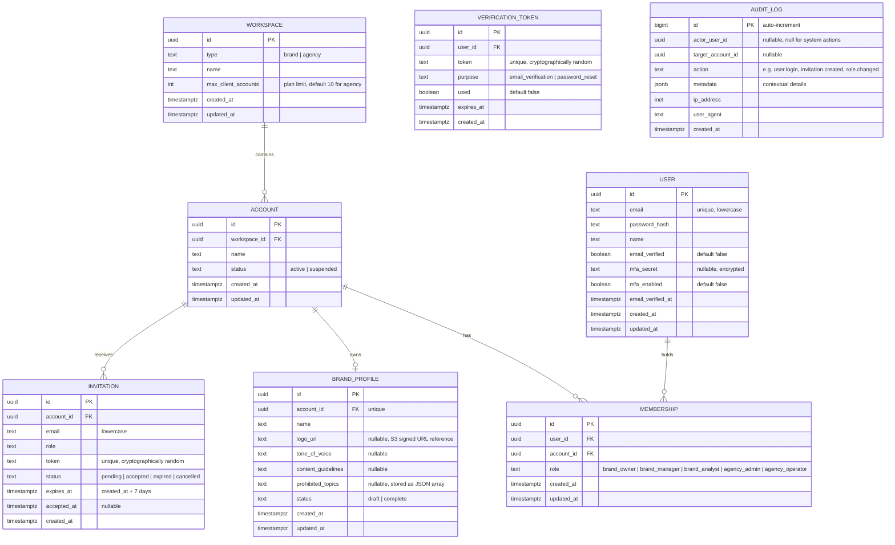

# E1 -- Access and Onboarding: Technical Architecture

## 1. Overview

This document specifies the data model, API contracts, and integration details for Epic E1 (Access and Onboarding). It covers five user stories: US-01 (self-service sign-up for brand and agency workspaces), US-02 (public pricing page), US-03 (brand profile registration with draft support), US-04 (team invitation with roles), and US-47 (agency client onboarding with data isolation).

All decisions here build on the foundation established in [Aurora's Architecture](../architecture.md): a NestJS modular monolith, PostgreSQL with row-level security for tenant isolation, Redis for caching and queues, and S3-compatible object storage for assets. The stack is not re-decided here. What this document adds is the concrete schema, the API surface, and the behavioral rules that backend-dev and frontend-dev implement against.

**Governing NFRs for every endpoint in this epic:**

| NFR | Target | How this design meets it |
|---|---|---|
| NFR-16 | 100% server-side authorization; zero cross-tenant reads; denials logged | Every tenant-scoped table carries `account_id` with an RLS policy. The API layer checks role permissions before the query runs. Denied attempts write to the audit log. |
| NFR-19 | MFA mandatory for financial-privilege roles | MFA is available at any time but enforced only on role assignment when the role carries financial privileges. Registration is not gated by MFA. |
| NFR-26 | WCAG 2.2 AA on onboarding flows | Frontend responsibility. The API returns structured error objects with machine-readable codes and human-readable messages in pt-BR, so the frontend can render accessible error states. |
| NFR-27 | Brazilian Portuguese primary; text externalized | All user-facing strings (emails, error messages) are keyed, not hardcoded. The API returns message keys alongside default pt-BR text. |
| NFR-09 | Up to 10 client accounts per agency workspace | Enforced by a check in the client-creation endpoint, reading the workspace plan's `max_client_accounts` value. |
| NFR-14 | TLS 1.3+ in transit; AES-256 at rest | Infrastructure-level. All endpoints served over HTTPS. PostgreSQL and S3 encryption at rest enabled. |
| NFR-17 | Immutable audit log for auth and financial events | Auth events (login, failed login, role change, invitation) written to the `audit_log` table, append-only. |

---

## 2. Data Model

### 2.1 Entity-Relationship Diagram



### 2.2 Entity Descriptions

**WORKSPACE.** The tenancy root. A brand workspace always contains exactly one account. An agency workspace contains one or more accounts (up to `max_client_accounts`). The workspace type is set at creation and cannot be changed.

**ACCOUNT.** The data isolation boundary. Every tenant-scoped table in the system carries `account_id` and has an RLS policy keyed on it. For a brand workspace, the single account is created automatically at sign-up. For an agency workspace, the first account is the agency's own account, and additional accounts are created through the client onboarding flow (US-47).

**USER.** A person. Users are global -- a user can hold memberships in multiple accounts (US-04, scenario 2). The email is the unique identifier and is stored lowercase. Password hashes use bcrypt with a work factor of 12. MFA secrets are encrypted at rest with an application-level key (envelope encryption).

**MEMBERSHIP.** The join between a user and an account, carrying the role. A user can have one membership per account. The role determines permissions (see section 2.3). A user who is invited to a second workspace gets a second membership, not a second user record.

**BRAND_PROFILE.** One per account. Status is `draft` when any required field (name) is present but optional fields are missing, and `complete` when all fields are filled. Campaigns can be created against a draft profile (resolved question 1), but the system warns that defaults may be incomplete. The `logo_url` field stores a reference to the S3 object key, not a signed URL directly -- signed URLs are generated at read time.

**INVITATION.** Tracks pending team invitations. The token is a 32-byte cryptographically random value, URL-safe base64 encoded. Expiry is 7 days from creation (resolved question 4). A cron job or scheduled task marks expired invitations. Only one pending invitation per email per account is allowed (US-04, scenario 3).

**VERIFICATION_TOKEN.** Handles email verification and password reset. Tokens expire after 24 hours for email verification. The `used` flag prevents replay.

**AUDIT_LOG.** Append-only. No UPDATE or DELETE is permitted on this table (enforced by a database trigger that raises an exception on UPDATE/DELETE). Covers authentication events, authorization denials, role changes, and invitation lifecycle events, satisfying NFR-17 for this epic's scope.

### 2.3 Role Permissions

Roles are workspace-type-scoped. Brand workspaces use `brand_owner`, `brand_manager`, and `brand_analyst`. Agency workspaces use `agency_admin` and `agency_operator`.

| Permission | brand_owner | brand_manager | brand_analyst | agency_admin | agency_operator |
|---|---|---|---|---|---|
| View workspace members | yes | yes | yes | yes | yes |
| Invite / remove members | yes | no | no | yes | no |
| Assign / change roles | yes | no | no | yes | no |
| Create / edit brand profile | yes | yes | no | yes | yes (own clients) |
| View brand profile | yes | yes | yes | yes | yes (own clients) |
| Create client accounts (agency) | -- | -- | -- | yes | no |
| View all client accounts | -- | -- | -- | yes | no |
| View assigned client accounts | -- | -- | -- | yes | yes |
| Create campaigns | yes | yes | no | yes | yes (own clients) |
| View campaigns | yes | yes | yes | yes | yes (own clients) |

"Own clients" for `agency_operator` means the client accounts they have been explicitly granted access to. This is enforced by a separate `operator_client_access` table (see section 2.4).

### 2.4 Agency Operator Client Access

For agency workspaces, operators can be scoped to specific client accounts (FR-58, US-45). This is tracked in a join table:

```
OPERATOR_CLIENT_ACCESS
  uuid id PK
  uuid membership_id FK  -- must be an agency_operator membership
  uuid account_id FK     -- the client account
  timestamptz created_at
  UNIQUE(membership_id, account_id)
```

When an `agency_operator` makes a request, the system checks both their membership in the workspace and their entry in this table for the target account. An `agency_admin` has implicit access to all client accounts in the workspace.

### 2.5 Row-Level Security Policies

Every tenant-scoped table (`account`, `brand_profile`, `invitation`, `membership`, and all future tables carrying `account_id`) has an RLS policy of this form:

```sql
ALTER TABLE brand_profile ENABLE ROW LEVEL SECURITY;
ALTER TABLE brand_profile FORCE ROW LEVEL SECURITY;

CREATE POLICY tenant_isolation ON brand_profile
  USING (account_id = current_setting('app.current_account_id')::uuid);
```

The application sets `app.current_account_id` on every database connection at checkout from the pool, before any query runs. A connection without this setting returns zero rows from any tenant-scoped table. The CI pipeline includes a check that every table with an `account_id` column has an RLS policy (risk R-02 from the architecture document).

For agency operators, an additional check ensures the `app.current_account_id` is in the set of accounts the operator has access to. This is enforced at the application layer (middleware), not RLS, because RLS operates on a single value and operator access spans multiple accounts.

### 2.6 Database Constraints

```sql
-- Workspace type is immutable after creation
-- Enforced by application layer + audit log (no direct UPDATE on type column)

-- One brand profile per account
ALTER TABLE brand_profile ADD CONSTRAINT uq_brand_profile_account
  UNIQUE (account_id);

-- One pending invitation per email per account
CREATE UNIQUE INDEX uq_pending_invitation
  ON invitation (account_id, lower(email))
  WHERE status = 'pending';

-- Email uniqueness on users
ALTER TABLE "user" ADD CONSTRAINT uq_user_email
  UNIQUE (lower(email));

-- Membership uniqueness
ALTER TABLE membership ADD CONSTRAINT uq_membership
  UNIQUE (user_id, account_id);

-- Audit log immutability
CREATE OR REPLACE FUNCTION prevent_audit_mutation()
RETURNS trigger AS $$
BEGIN
  RAISE EXCEPTION 'audit_log is append-only: UPDATE and DELETE are prohibited';
END;
$$ LANGUAGE plpgsql;

CREATE TRIGGER audit_log_immutable
  BEFORE UPDATE OR DELETE ON audit_log
  FOR EACH ROW EXECUTE FUNCTION prevent_audit_mutation();
```

---

## 3. API Contracts

### 3.1 Conventions

- **Base URL:** `https://api.aurora.com.br/v1`
- **Content type:** `application/json` for all request and response bodies, except file uploads which use `multipart/form-data`.
- **Authentication:** Bearer token (JWT) in the `Authorization` header. Tokens are short-lived (15 minutes) with a refresh token (7 days, rotated on use). Public endpoints are marked explicitly.
- **Tenant context:** For authenticated requests, the current account is derived from the JWT claims (for brand workspaces) or from the `X-Account-Id` header (for agency workspaces where the user has access to multiple accounts). The header value is validated against the user's memberships.
- **Error format:** All errors return a consistent shape:
  ```json
  {
    "error": {
      "code": "INVITATION_EXPIRED",
      "message": "O convite expirou. Solicite um novo convite ao administrador.",
      "details": {}
    }
  }
  ```
  `code` is machine-readable and stable. `message` is the pt-BR default. `details` carries field-level validation errors when applicable.
- **Pagination:** List endpoints use cursor-based pagination: `?cursor=<opaque>&limit=<int>`. Default limit is 20, maximum 100.
- **Timestamps:** All timestamps are ISO 8601 in UTC.

### 3.2 Authentication Endpoints

#### POST /auth/register

Creates a new user and workspace. Public endpoint, no authentication required.

**Request:**
```json
{
  "email": "marina@acme.com.br",
  "password": "S3cur3P@ss!",
  "name": "Marina Silva",
  "workspace_name": "Acme Cosmeticos",
  "workspace_type": "brand"
}
```

**Validation rules:**
- `email`: required, valid email format, stored lowercase.
- `password`: required, minimum 10 characters, at least one uppercase, one lowercase, one digit, one special character. Checked against a breached-password list.
- `name`: required, 2-100 characters.
- `workspace_name`: required, 2-100 characters.
- `workspace_type`: required, one of `brand` or `agency`.

**Success response (201 Created):**
```json
{
  "message": "Conta criada com sucesso. Verifique seu email para ativar sua conta.",
  "user_id": "a1b2c3d4-..."
}
```

**Behavior:**
1. Validate input. Reject with 422 if invalid.
2. Check if email exists. If it does, return 201 with the same generic message (prevents enumeration, US-01 scenario 2). Do not create a duplicate. Optionally send an email to the existing user informing them someone tried to register with their email.
3. Hash password with bcrypt (work factor 12).
4. In a single transaction: create the user, workspace, account (one account for brand, one "agency home" account for agency), and a membership with the owner role (`brand_owner` or `agency_admin`).
5. Generate a verification token (32 bytes, URL-safe base64, expires in 24 hours).
6. Send verification email asynchronously (enqueue to Redis).
7. Write audit log entry: `user.registered`.

**Error responses:**
- 422: Validation errors (weak password, invalid email format, etc.)
- 429: Rate limit exceeded (max 5 registration attempts per IP per hour)

---

#### POST /auth/verify-email

Verifies the user's email address. Public endpoint.

**Request:**
```json
{
  "token": "abc123..."
}
```

**Success response (200 OK):**
```json
{
  "message": "Email verificado com sucesso. Voce ja pode fazer login.",
  "access_token": "eyJ...",
  "refresh_token": "eyJ...",
  "expires_in": 900
}
```

**Behavior:**
1. Look up the token. If not found or already used, return 400.
2. If expired (>24 hours), return 400 with code `VERIFICATION_EXPIRED` and a message offering to resend (US-01 scenario 3).
3. Mark token as used, set `email_verified = true` and `email_verified_at` on the user.
4. Issue JWT tokens so the user is logged in immediately after verification.
5. Write audit log entry: `user.email_verified`.

**Error responses:**
- 400 `INVALID_TOKEN`: Token not found or already used.
- 400 `VERIFICATION_EXPIRED`: Token expired. Response includes a `resend_url` field.

---

#### POST /auth/resend-verification

Resends the verification email. Public endpoint.

**Request:**
```json
{
  "email": "marina@acme.com.br"
}
```

**Success response (200 OK):**
```json
{
  "message": "Se este email estiver cadastrado, um novo link de verificacao sera enviado."
}
```

**Behavior:** Always returns 200 with a generic message regardless of whether the email exists (prevents enumeration). If the email exists and is unverified, invalidate any existing verification tokens and create a new one. Rate-limited to 3 requests per email per hour.

---

#### POST /auth/login

Authenticates a user. Public endpoint.

**Request:**
```json
{
  "email": "marina@acme.com.br",
  "password": "S3cur3P@ss!",
  "mfa_code": "123456"
}
```

`mfa_code` is optional and only required when the user has MFA enabled.

**Success response (200 OK):**
```json
{
  "access_token": "eyJ...",
  "refresh_token": "eyJ...",
  "expires_in": 900,
  "user": {
    "id": "a1b2c3d4-...",
    "email": "marina@acme.com.br",
    "name": "Marina Silva",
    "mfa_enabled": false
  },
  "memberships": [
    {
      "account_id": "e5f6g7h8-...",
      "account_name": "Acme Cosmeticos",
      "workspace_id": "i9j0k1l2-...",
      "workspace_type": "brand",
      "role": "brand_owner"
    }
  ]
}
```

**Behavior:**
1. Validate credentials. On failure, return 401 with a generic message. Write audit log: `user.login_failed`.
2. Check `email_verified`. If false, return 403 with code `EMAIL_NOT_VERIFIED`.
3. If user has MFA enabled and `mfa_code` is missing, return 403 with code `MFA_REQUIRED`.
4. If user has MFA enabled and `mfa_code` is wrong, return 401.
5. Issue JWT. The access token contains: `sub` (user ID), `email`, `memberships` (array of `{account_id, role}`).
6. Write audit log: `user.login`.

**Error responses:**
- 401: Invalid credentials or invalid MFA code. Generic message.
- 403 `EMAIL_NOT_VERIFIED`: Account not yet verified.
- 403 `MFA_REQUIRED`: MFA code needed.
- 429: Rate limit (max 10 login attempts per email per 15 minutes; max 20 per IP per 15 minutes).

---

#### POST /auth/refresh

Refreshes the access token. Requires a valid refresh token.

**Request:**
```json
{
  "refresh_token": "eyJ..."
}
```

**Success response (200 OK):**
```json
{
  "access_token": "eyJ...",
  "refresh_token": "eyJ...",
  "expires_in": 900
}
```

**Behavior:** Validate the refresh token. If valid, issue new access and refresh tokens (rotation). Invalidate the old refresh token. If the refresh token is expired or invalid, return 401.

---

#### POST /auth/mfa/setup

Initiates MFA setup. Requires authentication.

**Request:** Empty body.

**Success response (200 OK):**
```json
{
  "secret": "JBSWY3DPEHPK3PXP",
  "qr_code_url": "otpauth://totp/Aurora:marina@acme.com.br?secret=JBSWY3DPEHPK3PXP&issuer=Aurora",
  "backup_codes": ["12345678", "87654321", "..."]
}
```

**Behavior:** Generate a TOTP secret. Return it along with a provisioning URI and one-time backup codes. The secret is not persisted until confirmed.

---

#### POST /auth/mfa/confirm

Confirms MFA setup by verifying a TOTP code. Requires authentication.

**Request:**
```json
{
  "code": "123456"
}
```

**Success response (200 OK):**
```json
{
  "message": "MFA ativado com sucesso."
}
```

**Behavior:** Validate the TOTP code against the pending secret. If valid, persist the encrypted secret and set `mfa_enabled = true`. Write audit log: `user.mfa_enabled`.

---

### 3.3 Pricing Endpoint

#### GET /pricing

Returns pricing information. Public endpoint, no authentication required.

**Success response (200 OK):**
```json
{
  "updated_at": "2026-09-01T00:00:00Z",
  "plans": [
    {
      "workspace_type": "brand",
      "name": "Brand",
      "platform_fee": {
        "amount": "497.00",
        "currency": "BRL",
        "interval": "month"
      },
      "commission": {
        "rate": "0.15",
        "description": "15% sobre o valor pago aos criadores"
      },
      "features": [
        "1 workspace de marca",
        "Ate 3 membros da equipe",
        "Perfil de marca completo",
        "Campanhas ilimitadas"
      ]
    },
    {
      "workspace_type": "agency",
      "name": "Agencia",
      "platform_fee": {
        "amount": "1497.00",
        "currency": "BRL",
        "interval": "month"
      },
      "commission": {
        "rate": "0.12",
        "description": "12% sobre o valor pago aos criadores"
      },
      "features": [
        "1 workspace de agencia",
        "Ate 10 contas de clientes",
        "Ate 10 membros da equipe",
        "Templates reutilizaveis entre clientes"
      ],
      "client_account_limit": 10
    }
  ]
}
```

**Behavior:**
- Pricing data is stored in the database and cached in Redis with a 1-hour TTL.
- If the backend is unavailable, the frontend should serve a statically cached version (US-02 scenario 3). The API returns a `Cache-Control: public, max-age=3600` header to support this.
- No login required. No "contact sales" gate. Complete fee model visible (US-02 scenario 1).

**Error responses:**
- 503: Backend unavailable. The frontend should display a cached version or a retry action.

---

### 3.4 Brand Profile Endpoints

All brand profile endpoints require authentication and an active account context.

#### POST /brand-profiles

Creates a brand profile for the current account. One per account.

**Required role:** `brand_owner`, `brand_manager`, `agency_admin`, or `agency_operator` (with client access).

**Request:**
```json
{
  "name": "Acme Cosmeticos",
  "tone_of_voice": "Informal, divertido, inclusivo",
  "content_guidelines": "Sempre mencionar ingredientes naturais...",
  "prohibited_topics": ["testes em animais", "concorrente X"]
}
```

All fields except `name` are optional. A profile created with optional fields missing is saved with status `draft`.

**Success response (201 Created):**
```json
{
  "id": "p1q2r3s4-...",
  "account_id": "e5f6g7h8-...",
  "name": "Acme Cosmeticos",
  "logo_url": null,
  "tone_of_voice": "Informal, divertido, inclusivo",
  "content_guidelines": "Sempre mencionar ingredientes naturais...",
  "prohibited_topics": ["testes em animais", "concorrente X"],
  "status": "draft",
  "created_at": "2026-09-25T14:30:00Z",
  "updated_at": "2026-09-25T14:30:00Z"
}
```

**Error responses:**
- 409 `PROFILE_EXISTS`: Account already has a brand profile. Use PATCH to update.
- 403: Insufficient role.
- 422: Validation errors (e.g., `name` missing or too long).

---

#### PATCH /brand-profiles/:id

Updates the brand profile. Partial updates are accepted.

**Required role:** `brand_owner`, `brand_manager`, `agency_admin`, or `agency_operator` (with client access).

**Request (example -- partial update):**
```json
{
  "tone_of_voice": "Informal e acolhedor",
  "prohibited_topics": ["testes em animais", "concorrente X", "ingredientes sinteticos"]
}
```

**Success response (200 OK):** Returns the full updated profile (same shape as POST response).

**Behavior:**
- Only provided fields are updated. Null fields are not cleared unless explicitly set to null in the request.
- After update, the system recalculates `status`: if `name`, `logo_url`, `tone_of_voice`, `content_guidelines`, and `prohibited_topics` are all non-null and non-empty, status becomes `complete`. Otherwise, `draft`.
- Write audit log: `brand_profile.updated`.

---

#### GET /brand-profiles/current

Returns the brand profile for the current account context.

**Required role:** Any authenticated member of the account.

**Success response (200 OK):** Same shape as POST response.

**Error responses:**
- 404: No brand profile exists for this account yet.

---

#### POST /brand-profiles/:id/logo

Uploads a logo image for the brand profile.

**Required role:** `brand_owner`, `brand_manager`, `agency_admin`, or `agency_operator` (with client access).

**Request:** `multipart/form-data` with a single `file` field.

**Validation rules:**
- Maximum file size: 5 MB.
- Allowed formats: PNG, JPG, JPEG, SVG, WEBP.
- Minimum dimensions: 200x200 pixels (for raster formats).

**Success response (200 OK):**
```json
{
  "logo_url": "https://assets.aurora.com.br/brand-profiles/p1q2r3s4/logo.png?...",
  "status": "complete"
}
```

**Behavior:**
1. Validate file size and format. Reject with 422 if invalid (US-03 scenario 3).
2. Upload to S3 under the path `brand-profiles/{profile_id}/logo.{ext}`.
3. Update the `logo_url` field on the brand profile.
4. Recalculate profile status.
5. Return the signed URL (short-lived, 1 hour) and the new status.

**Error responses:**
- 422 `FILE_TOO_LARGE`: File exceeds 5 MB. Message states the limit.
- 422 `UNSUPPORTED_FORMAT`: File format not accepted. Message lists allowed formats.
- 413: Request entity too large (infrastructure-level rejection for very large uploads).

---

### 3.5 Team Invitation Endpoints

#### POST /invitations

Sends a team invitation. Requires authentication.

**Required role:** `brand_owner` or `agency_admin`.

**Request:**
```json
{
  "email": "joao@acme.com.br",
  "role": "brand_manager"
}
```

**Validation rules:**
- `email`: required, valid email format.
- `role`: required, must be a valid role for the workspace type. A brand workspace can only assign `brand_manager` or `brand_analyst` (never `brand_owner` -- there is exactly one owner, transferred through a separate flow not in this epic's scope). An agency workspace can assign `agency_operator`.

**Success response (201 Created):**
```json
{
  "id": "inv-1234-...",
  "email": "joao@acme.com.br",
  "role": "brand_manager",
  "status": "pending",
  "expires_at": "2026-10-02T14:30:00Z",
  "created_at": "2026-09-25T14:30:00Z"
}
```

**Behavior:**
1. Check that the caller has the `brand_owner` or `agency_admin` role (US-04 scenario 4). If not, return 403 and log the denied attempt.
2. Check for an existing pending invitation for this email in this account (US-04 scenario 3). If found, return 409 with an offer to resend.
3. Generate invitation token (32 bytes, URL-safe base64).
4. Create invitation record with 7-day expiry.
5. Send invitation email asynchronously (enqueue to Redis). The email contains a link: `https://app.aurora.com.br/invitations/accept?token=<token>`.
6. Write audit log: `invitation.created`.

**Error responses:**
- 403 `INSUFFICIENT_PRIVILEGES`: Caller lacks permission. Logged as authorization denial.
- 409 `INVITATION_PENDING`: A pending invitation already exists for this email. Response includes `invitation_id` for resend.
- 422: Validation errors.

---

#### POST /invitations/:id/resend

Resends a pending invitation. Requires authentication.

**Required role:** `brand_owner` or `agency_admin`.

**Success response (200 OK):**
```json
{
  "message": "Convite reenviado com sucesso.",
  "expires_at": "2026-10-02T18:00:00Z"
}
```

**Behavior:**
1. Verify the invitation exists and belongs to the current account.
2. Generate a new token, reset `expires_at` to 7 days from now.
3. Send the invitation email again.
4. Write audit log: `invitation.resent`.

**Error responses:**
- 404: Invitation not found or not in the current account.
- 400 `INVITATION_NOT_PENDING`: Invitation is not in `pending` status.

---

#### GET /invitations

Lists invitations for the current account. Requires authentication.

**Required role:** `brand_owner`, `brand_manager`, `agency_admin`.

**Query parameters:**
- `status` (optional): Filter by status (`pending`, `accepted`, `expired`).
- `cursor`, `limit`: Pagination.

**Success response (200 OK):**
```json
{
  "data": [
    {
      "id": "inv-1234-...",
      "email": "joao@acme.com.br",
      "role": "brand_manager",
      "status": "pending",
      "expires_at": "2026-10-02T14:30:00Z",
      "created_at": "2026-09-25T14:30:00Z"
    }
  ],
  "pagination": {
    "next_cursor": "eyJ...",
    "has_more": false
  }
}
```

---

#### POST /invitations/accept

Accepts an invitation. This endpoint handles two cases: the invitee already has an Aurora account, or they need to create one.

**Public endpoint** (the token in the request body serves as authentication of the invitation).

**Request (new user):**
```json
{
  "token": "abc123...",
  "name": "Joao Santos",
  "password": "S3cur3P@ss!"
}
```

**Request (existing user, authenticated):**
```json
{
  "token": "abc123..."
}
```

If the request includes an `Authorization` header with a valid JWT, the system associates the invitation with the existing user. If not, `name` and `password` are required to create a new user.

**Success response (200 OK):**
```json
{
  "message": "Convite aceito. Voce agora faz parte do workspace.",
  "account_id": "e5f6g7h8-...",
  "workspace_id": "i9j0k1l2-...",
  "role": "brand_manager"
}
```

**Behavior:**
1. Look up the invitation by token. Validate it is `pending` and not expired.
2. If expired, return 400 `INVITATION_EXPIRED`.
3. If the caller is authenticated (has a JWT), add a membership for the existing user to the invitation's account with the invitation's role (US-04 scenario 2).
4. If the caller is not authenticated, create a new user with the provided name, password, and the invitation's email. Mark email as verified (the invitation email serves as verification). Create the membership.
5. Update invitation status to `accepted`, set `accepted_at`.
6. Write audit log: `invitation.accepted`.

**Error responses:**
- 400 `INVALID_TOKEN`: Token not found or already accepted.
- 400 `INVITATION_EXPIRED`: Token has expired.
- 422: Validation errors (missing name/password for new user).

---

#### DELETE /invitations/:id

Cancels a pending invitation. Requires authentication.

**Required role:** `brand_owner` or `agency_admin`.

**Success response (204 No Content).**

**Behavior:** Set invitation status to `cancelled`. Write audit log: `invitation.cancelled`.

---

### 3.6 Workspace and Account Endpoints

#### GET /workspaces/current

Returns the current user's workspace and account information.

**Required role:** Any authenticated user.

**Success response (200 OK):**
```json
{
  "workspace": {
    "id": "i9j0k1l2-...",
    "type": "agency",
    "name": "Agencia Criativa",
    "max_client_accounts": 10,
    "created_at": "2026-09-20T10:00:00Z"
  },
  "accounts": [
    {
      "id": "e5f6g7h8-...",
      "name": "Agencia Criativa",
      "status": "active",
      "is_home": true
    },
    {
      "id": "x1y2z3w4-...",
      "name": "Cliente: Acme",
      "status": "active",
      "is_home": false
    }
  ],
  "current_account": {
    "id": "e5f6g7h8-...",
    "role": "agency_admin"
  }
}
```

For brand workspaces, the `accounts` array has exactly one entry. For agency workspaces, it includes only the accounts the user has access to (all for `agency_admin`, scoped for `agency_operator`).

---

#### GET /accounts/:id/members

Lists members of an account. Requires authentication.

**Required role:** Any member of the account.

**Success response (200 OK):**
```json
{
  "data": [
    {
      "user_id": "a1b2c3d4-...",
      "email": "marina@acme.com.br",
      "name": "Marina Silva",
      "role": "brand_owner",
      "joined_at": "2026-09-20T10:00:00Z"
    }
  ],
  "pagination": {
    "next_cursor": null,
    "has_more": false
  }
}
```

---

#### PATCH /accounts/:accountId/members/:userId

Updates a member's role. Requires authentication.

**Required role:** `brand_owner` or `agency_admin`.

**Request:**
```json
{
  "role": "brand_analyst"
}
```

**Success response (200 OK):**
```json
{
  "user_id": "a1b2c3d4-...",
  "role": "brand_analyst",
  "updated_at": "2026-09-25T15:00:00Z"
}
```

**Behavior:**
1. Validate the new role is valid for the workspace type.
2. Prevent removing the last `brand_owner` or `agency_admin`.
3. If the new role carries financial privileges (not applicable to E1 roles, but the check is built in for future roles), require the user to have MFA enabled. If not, return 400 `MFA_REQUIRED_FOR_ROLE`.
4. Write audit log: `membership.role_changed`.

---

#### DELETE /accounts/:accountId/members/:userId

Removes a member from an account. Requires authentication.

**Required role:** `brand_owner` or `agency_admin`.

**Success response (204 No Content).**

**Behavior:** Delete the membership. Do not delete the user (they may have other memberships). Write audit log: `membership.removed`.

**Error responses:**
- 400 `CANNOT_REMOVE_LAST_OWNER`: Cannot remove the sole owner.

---

### 3.7 Agency Client Onboarding Endpoints

These endpoints are only available in agency workspaces.

#### POST /agency/clients

Creates a new client account within the agency workspace.

**Required role:** `agency_admin`.

**Request:**
```json
{
  "name": "Acme Cosmeticos",
  "copy_templates_from": "x1y2z3w4-..."
}
```

- `name`: required, 2-100 characters. The display name for the client account.
- `copy_templates_from` (optional): an existing client account ID in the same workspace. If provided, campaign templates from that account are copied into the new one. Only template structure is copied -- no campaign data, creator lists, financial data, or content (US-47 scenario 2).

**Success response (201 Created):**
```json
{
  "id": "new-acct-...",
  "workspace_id": "i9j0k1l2-...",
  "name": "Acme Cosmeticos",
  "status": "active",
  "templates_copied": 3,
  "created_at": "2026-09-25T15:00:00Z"
}
```

**Behavior:**
1. Check workspace type is `agency`. If not, return 400.
2. Count existing accounts in the workspace (excluding the home account). If count >= `max_client_accounts`, return 403 `CLIENT_LIMIT_REACHED` (US-47 scenario 3).
3. Create the account linked to the workspace.
4. If `copy_templates_from` is provided, validate it belongs to the same workspace and copy campaign template records (structure only, no data -- US-47 scenario 2).
5. The agency's branding defaults (if any exist from FR-57) are inherited by the new account.
6. Write audit log: `client_account.created`.

**Error responses:**
- 400 `NOT_AGENCY_WORKSPACE`: Endpoint only available for agency workspaces.
- 403 `CLIENT_LIMIT_REACHED`: "O limite de contas de clientes foi atingido (10). Entre em contato com o suporte para aumentar o limite." States the action needed (US-47 scenario 3).
- 403 `INSUFFICIENT_PRIVILEGES`: Caller is not an `agency_admin`.
- 422: Validation errors.

---

#### GET /agency/clients

Lists client accounts in the agency workspace.

**Required role:** `agency_admin` (sees all), `agency_operator` (sees only assigned accounts).

**Success response (200 OK):**
```json
{
  "data": [
    {
      "id": "x1y2z3w4-...",
      "name": "Acme Cosmeticos",
      "status": "active",
      "brand_profile_status": "draft",
      "created_at": "2026-09-20T10:00:00Z"
    }
  ],
  "pagination": {
    "next_cursor": null,
    "has_more": false
  },
  "limits": {
    "used": 3,
    "max": 10
  }
}
```

---

#### POST /agency/clients/:clientId/operators

Grants an agency operator access to a specific client account.

**Required role:** `agency_admin`.

**Request:**
```json
{
  "user_id": "op-user-id-..."
}
```

**Validation:** The user must be a member of the workspace with the `agency_operator` role.

**Success response (201 Created):**
```json
{
  "membership_id": "mem-...",
  "account_id": "x1y2z3w4-...",
  "granted_at": "2026-09-25T15:00:00Z"
}
```

---

#### DELETE /agency/clients/:clientId/operators/:userId

Revokes an operator's access to a client account.

**Required role:** `agency_admin`.

**Success response (204 No Content).**

---

## 4. Email Templates

E1 sends four transactional emails. All emails are in pt-BR with externalized strings.

| Email | Trigger | Key content |
|---|---|---|
| Email verification | POST /auth/register | Verification link (expires 24h). Subject: "Ative sua conta Aurora" |
| Invitation | POST /invitations | Invitation link (expires 7 days), workspace name, assigned role. Subject: "Voce foi convidado para {workspace_name} na Aurora" |
| Invitation accepted (to inviter) | POST /invitations/accept | Notification that the invitee joined. Subject: "{invitee_name} aceitou seu convite" |
| Existing account registration attempt | POST /auth/register (duplicate email) | Inform the existing user that someone tried to register with their email. Subject: "Tentativa de registro com seu email" |

---

## 5. Background Jobs

| Job | Queue | Trigger | Behavior |
|---|---|---|---|
| `send-email` | `email` | Registration, invitation, acceptance | Sends transactional email via the notification provider. Retries 3 times with exponential backoff. |
| `expire-invitations` | `scheduled` | Cron, every hour | Finds invitations where `expires_at < now()` and `status = 'pending'`, sets status to `expired`. |
| `expire-verification-tokens` | `scheduled` | Cron, every hour | Finds verification tokens where `expires_at < now()` and `used = false`, deletes them. |

---

## 6. Frontend Route Map

For frontend-dev's reference. All routes serve Brazilian Portuguese as the default locale.

| Route | Auth | Description |
|---|---|---|
| `/pricing` | Public | Pricing page (US-02). Fetches GET /pricing. Toggles between brand and agency plans. Serves cached content on backend failure. |
| `/register` | Public | Registration form (US-01). Workspace type selector (brand/agency). Posts to POST /auth/register. |
| `/verify-email` | Public | Email verification landing (US-01). Reads token from query param. Posts to POST /auth/verify-email. Shows expiry state with resend action. |
| `/invitations/accept` | Public (or auth) | Invitation acceptance (US-04). Reads token from query param. Shows registration form for new users or a confirmation for existing users. |
| `/login` | Public | Login form. Handles MFA flow when prompted. |
| `/app/brand-profile` | Auth | Brand profile editor (US-03). Form with all fields, file upload for logo. Auto-saves as draft. Shows completeness indicator. |
| `/app/team` | Auth | Team management (US-04). Lists members, pending invitations. Invite form (owner/admin only). |
| `/app/clients` | Auth (agency) | Client account list (US-47). Shows count vs. limit. Create client form. |
| `/app/clients/:id` | Auth (agency) | Client account detail. Brand profile editor for the client. Operator access management. |

---

## 7. NFR Compliance Checklist

| NFR | How this design satisfies it |
|---|---|
| NFR-04 | Read requests (GET endpoints) are simple queries with RLS. Write requests involve one or two DB operations. All well within p95 500ms/1500ms targets at pilot scale. |
| NFR-09 | `max_client_accounts` checked on POST /agency/clients. Default is 10 for the pilot plan. |
| NFR-14 | All endpoints served over TLS. Passwords hashed with bcrypt. MFA secrets encrypted at rest. Tokens are cryptographically random. |
| NFR-16 | RLS on every tenant-scoped table. Role checks in middleware before handlers execute. Authorization denials logged to audit_log. |
| NFR-17 | Audit log covers: registration, login, email verification, invitation lifecycle, role changes, member removal, client account creation. Append-only with mutation trigger. |
| NFR-19 | MFA available to all users via /auth/mfa/*. Enforced on role assignment when the role carries financial privileges. Not required at registration (resolved question 5). |
| NFR-26 | API returns structured errors with codes and pt-BR messages. Frontend implements WCAG 2.2 AA on the sign-up, verification, and invitation flows. |
| NFR-27 | All user-facing text (emails, error messages) uses externalized string keys. Default locale is pt-BR. |
| NFR-30 | All environment-specific values (database URL, Redis URL, S3 bucket, JWT secret, email provider credentials, MFA encryption key) are supplied via environment variables, never hardcoded. |
| NFR-32 | Every request gets a correlation ID (UUID) set in middleware, propagated to all log entries and audit records within that request. |
