# E2 -- Campaign Planning and Pool Buying: Technical Architecture

## 1. Overview

This document specifies the data model, API contracts, and behavioral rules for Epic E2 (Campaign Planning and Pool Buying). It covers six user stories: US-05 (define a campaign once), US-06 (pool size/reach/price quote), US-07 (buy the pool at one fixed price), US-08 (reusable templates), US-09 (pause/resume/cancel), and US-10 (automatic budget reallocation).

All decisions here build on the foundation established in [Aurora's Architecture](../architecture.md) and on the tenancy and RBAC model from E1 ([e1-access-onboarding.md](./e1-access-onboarding.md)): a NestJS modular monolith, PostgreSQL with row-level security keyed on `account_id`, Redis for queues/caching, and S3-compatible object storage. The stack is not re-decided here.

E2 is implemented as a new backend module, `campaign`, alongside the existing `auth`, `pricing`, `brand-profile`, `invitation`, `workspace`, `agency`, `audit`, and `jobs` modules. It reuses:

- The `account_id`-scoped RLS pattern and tenant-context middleware from E1.
- The role model (`brand_owner`, `brand_manager`, `brand_analyst`, `agency_admin`, `agency_operator`) and the `operator_client_access` table, unchanged.
- The `audit` module for all campaign lifecycle events.
- The `jobs` module (Bull/Redis) for asynchronous quote computation, scheduled reallocation, and expiry/notification jobs. A new queue, `campaign`, is added alongside the existing `email` queue.
- The `brand-profile` module as a read dependency: campaign creation reads the current account's brand profile to inherit prohibited topics and tone of voice as defaults (US-05 relates to US-03).

E2 introduces one new backend module (`campaign`) and does not require a new datastore, a new queue technology, or a new external service beyond what E1 already established. The matching/shortlist engine referenced in US-06's quote (guaranteed minimum pool size) is a stub in this epic -- its full implementation is E3's scope (FR-25). E2 defines the interface it calls and a deterministic fallback so quoting works end-to-end before E3 ships.

**Governing NFRs for every endpoint in this epic:**

| NFR | Target | How this design meets it |
|---|---|---|
| NFR-04 | Read p95 ≤ 500 ms; write p95 ≤ 1,500 ms | Campaign CRUD and quote-read endpoints are single-table or simple-join queries under RLS. Quote *computation* (which may call the matching stub) runs asynchronously; the synchronous endpoint returns a `pending` quote immediately and the client polls or is notified (see 3.4). |
| NFR-06 | Up to 150 creators per campaign without breaching NFR-04 | Pool composition is stored as a set of rows in `campaign_pool_member`, not embedded JSON, so reads and writes stay O(1) relative to pool size per operation, not O(n) against the campaign row. Reallocation touches only rows with new allocations, not the whole pool. |
| NFR-33 | Infra cost per campaign tracked from campaign 1 | Every campaign write increments a `campaign_cost_ledger` counter (job queue minutes, quote computation calls) tagged with `campaign_id`, exported as a metric. Not a hard gate yet, per PRD. |
| NFR-34 | Cost must not scale linearly with pool size | Reallocation and quote jobs operate in batches with pagination over `campaign_pool_member`, and the reallocation job is O(pool size) per run, not O(pool size²). Verified formally only once pools approach 5,000, per PRD; E2 design avoids the obvious linear traps (no full-pool recomputation on every budget tick). |

---

## 2. Data Model

### 2.1 Entity-Relationship Diagram

```mermaid
erDiagram
    ACCOUNT ||--o{ CAMPAIGN : owns
    CAMPAIGN {
        uuid id PK
        uuid account_id FK
        uuid created_by_user_id FK
        uuid template_id FK "nullable, source template if instantiated from one"
        text name
        text state "draft | quoted | confirmed | active | paused | completed | cancelled"
        numeric budget_amount "BRL, nullable until set"
        text budget_currency "default BRL"
        jsonb audience_targeting "structured targeting attributes"
        text message "campaign brief message, nullable until set"
        jsonb deliverable_formats "array of format enums, nullable until set"
        timestamptz timeline_start "nullable"
        timestamptz timeline_end "nullable"
        text missing_fields "computed, CSV of required fields still empty"
        timestamptz created_at
        timestamptz updated_at
    }

    CAMPAIGN ||--o| CAMPAIGN_QUOTE : has_latest
    CAMPAIGN_QUOTE {
        uuid id PK
        uuid campaign_id FK
        text status "pending | ready | failed | no_viable_pool"
        int guaranteed_min_pool_size "nullable until ready"
        int projected_reach_low "nullable until ready"
        int projected_reach_high "nullable until ready"
        numeric total_price "BRL, nullable until ready"
        text failure_reason "nullable, pt-BR message key"
        timestamptz requested_at
        timestamptz resolved_at "nullable"
    }

    CAMPAIGN ||--o{ CAMPAIGN_POOL_MEMBER : contains
    CAMPAIGN_POOL_MEMBER {
        uuid id PK
        uuid campaign_id FK
        uuid creator_id FK "references creator entity, owned by E3/E8"
        numeric allocated_budget "BRL, current committed+remaining allocation"
        numeric committed_budget "BRL, portion already paid/owed, immutable once set"
        text status "pending_publish | published | reallocation_eligible | excluded"
        timestamptz created_at
        timestamptz updated_at
    }

    CAMPAIGN ||--o{ CAMPAIGN_REALLOCATION_EVENT : logs
    CAMPAIGN_REALLOCATION_EVENT {
        uuid id PK
        uuid campaign_id FK
        jsonb before_allocations "pool_member_id -> amount snapshot"
        jsonb after_allocations "pool_member_id -> amount snapshot"
        text trigger "scheduled | manual"
        text outcome "applied | skipped_stale_metrics | skipped_no_data"
        timestamptz created_at
    }

    CAMPAIGN ||--o{ CAMPAIGN_STATE_TRANSITION : logs
    CAMPAIGN_STATE_TRANSITION {
        uuid id PK
        uuid campaign_id FK
        text from_state
        text to_state
        uuid actor_user_id "nullable, null for system transitions"
        text reason "nullable, free text for pause/cancel"
        timestamptz created_at
    }

    ACCOUNT ||--o{ CAMPAIGN_TEMPLATE : owns
    CAMPAIGN_TEMPLATE {
        uuid id PK
        uuid account_id FK
        uuid source_campaign_id FK "nullable, campaign it was saved from"
        text name
        jsonb audience_targeting
        text message
        jsonb deliverable_formats
        jsonb timeline_shape "relative durations, not absolute dates"
        jsonb brand_profile_snapshot "prohibited_topics etc. at save time, for staleness comparison"
        timestamptz created_at
        timestamptz updated_at
    }

    CAMPAIGN ||--o| REALLOCATION_BOUNDS : configures
    REALLOCATION_BOUNDS {
        uuid id PK
        uuid campaign_id FK "unique"
        numeric max_shift_pct "default 20, max percentage of a creator's remaining allocation that can move per cycle"
        numeric min_guaranteed_share_pct "default 50, floor below which a creator's remaining allocation cannot be reduced"
        boolean enabled "default false, reallocation off until buyer opts in"
        timestamptz created_at
        timestamptz updated_at
    }

    CAMPAIGN ||--o| POOL_SHORTFALL_RESOLUTION : records
    POOL_SHORTFALL_RESOLUTION {
        uuid id PK
        uuid campaign_id FK "unique"
        text resolution_type "partial_refund | revised_guarantee"
        numeric refund_amount "BRL, nullable, set when resolution_type = partial_refund"
        int revised_min_pool_size "nullable, set when resolution_type = revised_guarantee"
        text chosen_by "buyer | aurora_default"
        timestamptz notified_at
        timestamptz resolved_at "nullable, when buyer confirmed the offered option"
    }
```



### 2.2 Entity Descriptions

**CAMPAIGN.** The central entity. One row per campaign, scoped by `account_id` (RLS, same pattern as E1). `template_id` is set when the campaign was instantiated from a `CAMPAIGN_TEMPLATE`. `state` follows the lifecycle in FR-20: `draft -> quoted -> confirmed -> active -> paused/completed/cancelled`, with `active <-> paused` as the only bidirectional edge (see ADR-0006). `missing_fields` is computed on every write (not stored as a trigger, computed in the service layer and persisted for fast reads) so the frontend can render a checklist (US-05 scenario 2) without recomputing client-side logic.

**CAMPAIGN_QUOTE.** One row per quote *request*. A campaign can have multiple quotes over its draft lifetime (every time the buyer edits a draft and re-requests, FR-17 says a fresh quote is produced). Only the latest `ready` quote is "the" quote the frontend shows; older ones are kept for audit/history. `status = pending` while the quote job runs; `ready` with full numbers; `failed` for a timeout/degraded matching engine (US-06 scenario 3); `no_viable_pool` when zero creators match at all (distinguished from a small-but-viable minimum, US-06 scenario 2).

**CAMPAIGN_POOL_MEMBER.** One row per creator assigned to a confirmed campaign's pool. This table does not exist for `draft` or `quoted` campaigns -- it is populated at `confirmed` state transition from the quote's matched pool (the actual creator-to-pool match itself is E3's shortlist/curation mechanism; E2 only needs a place to hold the *allocation* once E3 hands it a creator list). `allocated_budget` is the current remaining spend target for that creator; `committed_budget` is the portion already locked in (published and owed, or contractually guaranteed) and is never reduced by reallocation (US-10 scenario 2, "leaves budget committed to not-yet-published creators untouched" -- note: committed here means *already earned*, not merely assigned; pre-publish creators' allocation can still move, within bounds).

**CAMPAIGN_REALLOCATION_EVENT.** Append-only audit trail of every reallocation cycle, whether it applied changes or skipped (US-10 scenario 3 requires skips to be logged, not silent).

**CAMPAIGN_STATE_TRANSITION.** Append-only log of every lifecycle transition, satisfying US-09's requirement that history is never lost and giving backend-dev a single place to enforce the state machine (reject invalid transitions, FR-20).

**CAMPAIGN_TEMPLATE.** Structure-only snapshot (US-08 scenario 1): no budget, no pool, no performance data. `brand_profile_snapshot` captures the brand profile fields relevant to the template at save time, so that instantiation can diff against the *current* brand profile and flag drift (US-08 scenario 3) without needing a full brand-profile version history (which E1's ADR-0004 explicitly deferred).

**REALLOCATION_BOUNDS.** One row per campaign, created with defaults when a campaign is confirmed, editable by the buyer before or during `active` state. Resolves PRD open question 1 (see ADR-0007).

**POOL_SHORTFALL_RESOLUTION.** One row per campaign, created when the guaranteed minimum cannot be met at launch (US-07 scenario 3, FR-19). Resolves PRD open question 3 (see ADR-0008).

### 2.3 Role Permissions (extends E1 table)

| Permission | brand_owner | brand_manager | brand_analyst | agency_admin | agency_operator (own clients) |
|---|---|---|---|---|---|
| Create / edit campaign (draft) | yes | yes | no | yes | yes |
| Request quote | yes | yes | no | yes | yes |
| Confirm campaign (commit spend) | yes | yes | no | yes | yes |
| Pause / resume / cancel campaign | yes | yes | no | yes | yes |
| Configure reallocation bounds | yes | yes | no | yes | yes |
| View campaign | yes | yes | yes | yes | yes |
| Save / instantiate template | yes | yes | no | yes | yes |
| Resolve pool shortfall (choose refund vs. revised guarantee) | yes | no | no | yes | no |

This reuses the E1 role table unchanged; no new roles are introduced. "Confirm campaign" is gated the same as "create campaign" because confirming commits real spend, consistent with `brand_analyst` having no write access to financial commitments. Shortfall resolution is restricted to the owner/admin tier because it is a financial decision (refund vs. reduced guarantee), not an operational one.

### 2.4 Row-Level Security

All six new tables (`campaign`, `campaign_quote`, `campaign_pool_member`, `campaign_reallocation_event`, `campaign_state_transition`, `campaign_template`, `reallocation_bounds`, `pool_shortfall_resolution`) carry `account_id` directly or transitively via `campaign_id` with a foreign-key-based RLS policy, following the same pattern as E1 section 2.5:

```sql
ALTER TABLE campaign ENABLE ROW LEVEL SECURITY;
ALTER TABLE campaign FORCE ROW LEVEL SECURITY;

CREATE POLICY tenant_isolation ON campaign
  USING (account_id = current_setting('app.current_account_id')::uuid);
```

Child tables without a direct `account_id` column (e.g., `campaign_pool_member`) use a policy that joins to `campaign`:

```sql
CREATE POLICY tenant_isolation ON campaign_pool_member
  USING (
    campaign_id IN (
      SELECT id FROM campaign
      WHERE account_id = current_setting('app.current_account_id')::uuid
    )
  );
```

The CI check from E1 (every `account_id`-bearing table has an RLS policy) is extended with a parallel check: every table with a `campaign_id` FK and no direct `account_id` column has a join-based policy, so the check does not silently pass tables that look safe but are not.

### 2.5 Database Constraints

```sql
-- Only one active (non-terminal) quote request in flight per campaign at a time
CREATE UNIQUE INDEX uq_campaign_pending_quote
  ON campaign_quote (campaign_id)
  WHERE status = 'pending';

-- Pool member uniqueness: one allocation row per creator per campaign
ALTER TABLE campaign_pool_member ADD CONSTRAINT uq_pool_member
  UNIQUE (campaign_id, creator_id);

-- Reallocation bounds: one row per campaign
ALTER TABLE reallocation_bounds ADD CONSTRAINT uq_reallocation_bounds_campaign
  UNIQUE (campaign_id);

-- Shortfall resolution: one row per campaign
ALTER TABLE pool_shortfall_resolution ADD CONSTRAINT uq_shortfall_campaign
  UNIQUE (campaign_id);

-- State transition log is append-only (same pattern as audit_log in E1)
CREATE OR REPLACE FUNCTION prevent_campaign_state_transition_mutation()
RETURNS trigger AS $$
BEGIN
  RAISE EXCEPTION 'campaign_state_transition is append-only: UPDATE and DELETE are prohibited';
END;
$$ LANGUAGE plpgsql;

CREATE TRIGGER campaign_state_transition_immutable
  BEFORE UPDATE OR DELETE ON campaign_state_transition
  FOR EACH ROW EXECUTE FUNCTION prevent_campaign_state_transition_mutation();

-- Reallocation event log is append-only
CREATE OR REPLACE FUNCTION prevent_reallocation_event_mutation()
RETURNS trigger AS $$
BEGIN
  RAISE EXCEPTION 'campaign_reallocation_event is append-only: UPDATE and DELETE are prohibited';
END;
$$ LANGUAGE plpgsql;

CREATE TRIGGER reallocation_event_immutable
  BEFORE UPDATE OR DELETE ON campaign_reallocation_event
  FOR EACH ROW EXECUTE FUNCTION prevent_reallocation_event_mutation();

-- Minimum campaign budget (see ADR-0009 for the number and rationale)
ALTER TABLE campaign ADD CONSTRAINT chk_campaign_minimum_budget
  CHECK (budget_amount IS NULL OR budget_amount >= 2000.00);

-- committed_budget on a pool member can never decrease (application-enforced via a BEFORE UPDATE trigger,
-- since Postgres cannot express "new.committed_budget >= old.committed_budget" declaratively per-row
-- without a trigger)
CREATE OR REPLACE FUNCTION prevent_committed_budget_decrease()
RETURNS trigger AS $$
BEGIN
  IF NEW.committed_budget < OLD.committed_budget THEN
    RAISE EXCEPTION 'committed_budget cannot decrease';
  END IF;
  RETURN NEW;
END;
$$ LANGUAGE plpgsql;

CREATE TRIGGER pool_member_committed_budget_guard
  BEFORE UPDATE ON campaign_pool_member
  FOR EACH ROW EXECUTE FUNCTION prevent_committed_budget_decrease();
```

### 2.6 Campaign State Machine

```
draft -----> quoted -----> confirmed -----> active <----> paused
  ^            |                               |            |
  |            v (re-edit after quote)         v            v
  +---------draft                        completed      cancelled
                                               ^
                                               |
                                          (from active, terminal)
```

Allowed transitions, enforced in the application layer (not just documented):

| From | To | Trigger |
|---|---|---|
| `draft` | `quoted` | POST /campaigns/:id/quote succeeds with `ready` or `no_viable_pool` is surfaced without a state change (stays `draft`) |
| `quoted` | `draft` | Any edit to budget/audience/message/deliverables after a quote exists (the old quote is superseded, FR-17 "fresh quote") |
| `quoted` | `confirmed` | POST /campaigns/:id/confirm |
| `confirmed` | `active` | Launch date reached (scheduled job) or immediate launch if `timeline_start <= now` |
| `active` | `paused` | POST /campaigns/:id/pause |
| `paused` | `active` | POST /campaigns/:id/resume |
| `active` | `completed` | `timeline_end` reached and all deliverables settled |
| `active`, `paused`, `confirmed` | `cancelled` | POST /campaigns/:id/cancel |
| any other pair | -- | Rejected with 400 `INVALID_STATE_TRANSITION` |

`completed` and `cancelled` are terminal. No transition is permitted out of them (US-09 scenario 3).

---

## 3. API Contracts

### 3.1 Conventions

Identical to E1 section 3.1: base URL `https://api.aurora.com.br/v1`, JSON bodies, bearer JWT auth, `X-Account-Id` header for agency multi-account context, the same structured error shape (`code`, `message`, `details`), cursor pagination, ISO 8601 UTC timestamps.

### 3.2 Campaign Endpoints

#### POST /campaigns

Creates a new campaign in `draft` state.

**Required role:** `brand_owner`, `brand_manager`, `agency_admin`, `agency_operator` (with client access).

**Request:**
```json
{
  "name": "Lancamento Serum Vitamina C",
  "budget_amount": "45000.00",
  "budget_currency": "BRL",
  "audience_targeting": {
    "geography": ["BR-SP", "BR-RJ"],
    "age_range": [18, 34],
    "interests": ["skincare", "beleza natural"],
    "gender": "any"
  },
  "message": "Destacar o ingrediente vitamina C e o resultado em 14 dias",
  "deliverable_formats": ["instagram_reel", "instagram_story"],
  "timeline_start": "2026-11-01T00:00:00Z",
  "timeline_end": "2026-11-30T00:00:00Z"
}
```

All fields except `name` are optional at creation (US-05 scenario 2: partial save allowed).

**Success response (201 Created):**
```json
{
  "id": "camp-1234-...",
  "account_id": "e5f6g7h8-...",
  "name": "Lancamento Serum Vitamina C",
  "state": "draft",
  "budget_amount": "45000.00",
  "budget_currency": "BRL",
  "audience_targeting": { "...": "..." },
  "message": "Destacar o ingrediente vitamina C e o resultado em 14 dias",
  "deliverable_formats": ["instagram_reel", "instagram_story"],
  "timeline_start": "2026-11-01T00:00:00Z",
  "timeline_end": "2026-11-30T00:00:00Z",
  "missing_fields": [],
  "brand_profile_status": "complete",
  "created_at": "2026-10-05T10:00:00Z",
  "updated_at": "2026-10-05T10:00:00Z"
}
```

If some fields are omitted, `missing_fields` lists them (e.g., `["message", "deliverable_formats"]`), per US-05 scenario 2. `brand_profile_status` is read from the account's brand profile (E1) and echoed here so the frontend can warn the user if it is `draft`.

**Behavior:**
1. Validate `name` (required, 2-150 chars).
2. If `budget_amount` is provided, validate it against the minimum (`chk_campaign_minimum_budget`, see ADR-0009). If below minimum, return 422 `BUDGET_BELOW_MINIMUM` and preserve all other submitted fields in the response `details` so the frontend can re-render the form without data loss (US-05 scenario 3).
3. If `audience_targeting` is provided, run a lightweight "addressable creator count" pre-check (a fast count query against the creator network, not the full matching engine) and reject with 422 `TARGETING_TOO_NARROW` if the count is zero. This is distinct from the full quote (US-06) which runs asynchronously; this check is synchronous and cheap, meant only to catch "no creators exist for this combination at all" before the user invests more time.
4. Compute `missing_fields`.
5. Create the campaign row, inheriting `prohibited_topics` and `tone_of_voice` defaults from the account's brand profile (read-only reference, not copied into the campaign row -- resolved at render/quote time to avoid staleness).
6. Write audit log: `campaign.created`. Write `campaign_state_transition` row (`from_state: null, to_state: draft`).

**Error responses:**
- 422 `BUDGET_BELOW_MINIMUM`: States the minimum (ADR-0009). Preserves other fields.
- 422 `TARGETING_TOO_NARROW`: States that no creators match the combination, suggests broadening geography/interests.
- 403: Insufficient role.

---

#### PATCH /campaigns/:id

Updates a draft or quoted campaign. Partial updates accepted.

**Required role:** Same as POST.

**Behavior:**
1. If campaign is `draft`: update fields, recompute `missing_fields`.
2. If campaign is `quoted`: any field change in `budget_amount`, `audience_targeting`, `message`, or `deliverable_formats` transitions the campaign back to `draft` and marks the existing `campaign_quote` row as superseded (it remains in history but is no longer "the" quote). This enforces FR-17's "fresh quote" rule structurally rather than relying on frontend discipline.
3. If campaign is in any other state (`confirmed`, `active`, `paused`, `completed`, `cancelled`), reject with 400 `CAMPAIGN_NOT_EDITABLE`.
4. Re-run the minimum budget and targeting pre-checks from POST.
5. Write audit log: `campaign.updated`.

**Success response (200 OK):** Same shape as POST, with the `state` field reflecting any implicit `quoted -> draft` transition.

**Error responses:**
- 400 `CAMPAIGN_NOT_EDITABLE`: Campaign is past the editable states.
- 422: Same validation errors as POST.

---

#### GET /campaigns/:id

Returns a single campaign with its latest quote (if any) embedded.

**Required role:** Any authenticated member with account access.

**Success response (200 OK):**
```json
{
  "id": "camp-1234-...",
  "name": "Lancamento Serum Vitamina C",
  "state": "quoted",
  "...": "all fields from POST response",
  "latest_quote": {
    "id": "quote-5678-...",
    "status": "ready",
    "guaranteed_min_pool_size": 42,
    "projected_reach_low": 180000,
    "projected_reach_high": 310000,
    "total_price": "45000.00",
    "requested_at": "2026-10-05T10:05:00Z",
    "resolved_at": "2026-10-05T10:05:40Z"
  }
}
```

`latest_quote` is `null` for campaigns still in `draft` with no quote request yet.

---

#### GET /campaigns

Lists campaigns for the current account.

**Required role:** Any authenticated member with account access.

**Query parameters:** `state` (optional filter), `cursor`, `limit`.

**Success response (200 OK):** Standard paginated list shape (see E1 section 3.1), each item summarized (`id`, `name`, `state`, `budget_amount`, `created_at`).

---

### 3.3 Quote Endpoints

#### POST /campaigns/:id/quote

Requests a quote for a draft campaign.

**Required role:** Same write roles as campaign creation.

**Preconditions:** Campaign is in `draft` state and has no `missing_fields` for the quote-required set (`budget_amount`, `audience_targeting`, `message`, `deliverable_formats`). If any are missing, return 400 `CAMPAIGN_INCOMPLETE` listing which fields block quoting (US-05 scenario 2: "No quote is generated from an incomplete definition").

**Request:** Empty body.

**Success response (202 Accepted):**
```json
{
  "quote_id": "quote-5678-...",
  "status": "pending",
  "poll_url": "/v1/campaigns/camp-1234-.../quote/quote-5678-..."
}
```

**Behavior:**
1. Validate preconditions (above).
2. Create a `campaign_quote` row with `status = pending`.
3. Enqueue a `compute-quote` job on the `campaign` queue, carrying `campaign_id` and `quote_id`.
4. Return 202 immediately (NFR-04 applies to this synchronous call, not to quote resolution time, which depends on the matching engine and is bounded separately by NFR-01 from E3, 60s p95).
5. The worker calls the matching engine's shortlist-estimate interface (E3 stub in E2, see section 3.3.1) to get a guaranteed minimum pool size and price. On success, updates the quote to `ready` and transitions the campaign to `quoted`. On a zero-result match, updates to `no_viable_pool` (US-06 scenario 2) and leaves the campaign in `draft`. On a timeout (the matching engine does not respond within a bounded window, 90 seconds), updates to `failed` (US-06 scenario 3) and leaves the campaign in `draft`.
6. Write audit log: `campaign.quote_requested`, and on resolution, `campaign.quote_ready` / `campaign.quote_failed`.

**Error responses:**
- 400 `CAMPAIGN_INCOMPLETE`: Lists blocking fields.
- 409 `QUOTE_ALREADY_PENDING`: A quote is already in flight for this campaign (enforced by `uq_campaign_pending_quote`).

---

#### GET /campaigns/:id/quote/:quoteId

Polls a quote's status. Frontend polls this at a 2-second interval until `status` is no longer `pending` (US-06 scenario 3: "clear loading or retry state").

**Required role:** Any authenticated member with account access.

**Success response (200 OK), while pending:**
```json
{
  "id": "quote-5678-...",
  "status": "pending",
  "requested_at": "2026-10-05T10:05:00Z"
}
```

**Success response (200 OK), when ready:**
```json
{
  "id": "quote-5678-...",
  "status": "ready",
  "guaranteed_min_pool_size": 42,
  "projected_reach_low": 180000,
  "projected_reach_high": 310000,
  "total_price": "45000.00",
  "requested_at": "2026-10-05T10:05:00Z",
  "resolved_at": "2026-10-05T10:05:40Z"
}
```

**When `no_viable_pool`:**
```json
{
  "id": "quote-5678-...",
  "status": "no_viable_pool",
  "failure_reason": "Nenhum criador disponivel para esta combinacao de publico. Tente ampliar a geografia ou os interesses.",
  "requested_at": "2026-10-05T10:05:00Z",
  "resolved_at": "2026-10-05T10:05:12Z"
}
```

**When `failed`:**
```json
{
  "id": "quote-5678-...",
  "status": "failed",
  "failure_reason": "Nao foi possivel calcular a cotacao agora. Tente novamente em alguns minutos.",
  "requested_at": "2026-10-05T10:05:00Z",
  "resolved_at": "2026-10-05T10:06:30Z"
}
```

##### 3.3.1 Matching Engine Interface (consumed from E3, stubbed in E2)

E2 depends on a `MatchingEngineAdapter` interface it defines but does not implement in full:

```typescript
interface MatchingEngineAdapter {
  estimatePool(input: {
    accountId: string;
    audienceTargeting: AudienceTargeting;
    deliverableFormats: string[];
    budgetAmount: string;
  }): Promise<{
    guaranteedMinPoolSize: number;
    projectedReachLow: number;
    projectedReachHigh: number;
    totalPrice: string;
  } | { noViablePool: true }>;
}
```

Until E3 ships FR-25, E2 ships a deterministic stub implementation (`StubMatchingEngineAdapter`) that queries the existing creator table (if any exist in the environment) with a simple filter-and-count, applies a fixed price-per-creator-per-format table, and returns a result in that shape. This lets US-05 through US-07 be built, tested, and demoed end-to-end without waiting on E3, and the swap to the real engine is a one-line DI binding change (no campaign or quote code changes), consistent with NFR-29 (replaceable matching model without disturbing the money path).

---

### 3.4 Confirmation Endpoints

#### POST /campaigns/:id/confirm

Confirms a `quoted` campaign, locking the price (FR-18) and committing spend.

**Required role:** `brand_owner`, `brand_manager`, `agency_admin`, `agency_operator` (with client access).

**Preconditions:** Campaign is in `quoted` state with a `ready` latest quote.

**Request:** Empty body.

**Success response (200 OK):**
```json
{
  "id": "camp-1234-...",
  "state": "confirmed",
  "locked_price": "45000.00",
  "guaranteed_min_pool_size": 42,
  "confirmed_at": "2026-10-05T11:00:00Z"
}
```

**Behavior:**
1. Validate preconditions. If quote is not `ready`, return 400 `QUOTE_NOT_READY`.
2. Copy `total_price` from the latest quote onto the campaign as the locked price (immutable from this point; per-creator cost variance during sourcing never changes this value, FR-18, US-07 scenario 2).
3. Transition state to `confirmed`. Write `campaign_state_transition`.
4. Create `reallocation_bounds` row with defaults (`max_shift_pct = 20`, `min_guaranteed_share_pct = 50`, `enabled = false`) -- see ADR-0007.
5. Write audit log: `campaign.confirmed`.
6. Enqueue a `pool-fill-check` job scheduled to run shortly before `timeline_start`, to detect and act on shortfall (US-07 scenario 3, see next endpoint).

**Error responses:**
- 400 `QUOTE_NOT_READY`: No ready quote exists.
- 400 `INVALID_STATE_TRANSITION`: Campaign is not in `quoted` state.

---

#### GET /campaigns/:id/shortfall

Returns the shortfall resolution, if one has been triggered for this campaign (US-07 scenario 3).

**Required role:** Any authenticated member with account access.

**Success response (200 OK), when no shortfall:**
```json
{ "shortfall": null }
```

**Success response (200 OK), when a shortfall exists:**
```json
{
  "shortfall": {
    "id": "shortfall-9999-...",
    "resolution_type": "partial_refund",
    "refund_amount": "8500.00",
    "revised_min_pool_size": null,
    "choice_offered": true,
    "chosen_by": "aurora_default",
    "notified_at": "2026-10-28T09:00:00Z",
    "resolved_at": null
  }
}
```

---

#### POST /campaigns/:id/shortfall/resolve

Lets the buyer accept the offered resolution or pick between refund and revised guarantee, if both are offered (see ADR-0008 for which cases offer a choice).

**Required role:** `brand_owner` or `agency_admin` (financial decision, restricted tier).

**Request:**
```json
{
  "resolution_type": "revised_guarantee"
}
```

**Success response (200 OK):**
```json
{
  "id": "shortfall-9999-...",
  "resolution_type": "revised_guarantee",
  "revised_min_pool_size": 35,
  "resolved_at": "2026-10-28T10:15:00Z"
}
```

**Behavior:** Validate the chosen `resolution_type` is one of the options actually offered for this shortfall (per ADR-0008's rule). Set `resolved_at`. Write audit log: `campaign.shortfall_resolved`. If `partial_refund`, enqueue a refund job (handed off to E6's payment module via an internal event; E2 only records the obligation amount and does not implement payment execution).

---

### 3.5 Lifecycle Endpoints

#### POST /campaigns/:id/pause

**Required role:** `brand_owner`, `brand_manager`, `agency_admin`, `agency_operator` (with client access).

**Request:**
```json
{ "reason": "Incidente de imagem da marca, revisao de todas as publicacoes pendentes" }
```
`reason` is optional free text, recorded for the audit trail.

**Success response (200 OK):**
```json
{ "id": "camp-1234-...", "state": "paused", "paused_at": "2026-11-05T14:00:00Z" }
```

**Behavior:**
1. Validate campaign is `active`. If not, return 400 `INVALID_STATE_TRANSITION` with a message naming the current state (US-09 scenario 3).
2. Transition to `paused`. Halt all pending publications: set every `campaign_pool_member` with status `pending_publish` to a held sub-state (tracked via the content-workflow module in E5; E2 emits an internal event `campaign.paused` that E5's workflow listens to and acts on -- E2 does not own publication-halting logic directly, only the campaign state).
3. Notify creators with pending (not-yet-published) deliverables that the campaign is on hold (email job, reusing the `jobs` module's email queue pattern).
4. Write `campaign_state_transition` and audit log.

**Error responses:**
- 400 `INVALID_STATE_TRANSITION`: States current state and that pause is not valid from it.

---

#### POST /campaigns/:id/resume

**Required role:** Same as pause.

**Success response (200 OK):**
```json
{ "id": "camp-1234-...", "state": "active", "resumed_at": "2026-11-06T09:00:00Z" }
```

**Behavior:**
1. Validate campaign is `paused`. If not, 400 `INVALID_STATE_TRANSITION`.
2. Transition to `active`. Emit `campaign.resumed` event (E5 releases held content back into review/publication, without data loss -- E2 guarantees it never deleted or altered pool member or draft data during the pause, since pausing is a pure state flag, not a destructive operation).
3. Write `campaign_state_transition` and audit log.

---

#### POST /campaigns/:id/cancel

**Required role:** Same as pause.

**Request:** Same shape as pause (`reason` optional).

**Success response (200 OK):**
```json
{ "id": "camp-1234-...", "state": "cancelled", "cancelled_at": "2026-11-06T09:30:00Z" }
```

**Behavior:**
1. Validate campaign is `active`, `paused`, or `confirmed`. Any other state (including already `cancelled`/`completed`) returns 400 `INVALID_STATE_TRANSITION`.
2. Transition to `cancelled` (terminal). Emit `campaign.cancelled` event for E5 (halt all pending publications permanently) and E6 (settle any owed-but-unpaid obligations for already-published content; uncommitted budget is released, not paid out).
3. Write `campaign_state_transition` and audit log.

---

### 3.6 Reallocation Endpoints

#### PUT /campaigns/:id/reallocation-bounds

Configures the buyer's reallocation bounds for a confirmed-or-later campaign.

**Required role:** Same write roles as campaign creation.

**Request:**
```json
{
  "enabled": true,
  "max_shift_pct": 15,
  "min_guaranteed_share_pct": 60
}
```

**Validation rules (see ADR-0007 for the defaults and the reasoning):**
- `max_shift_pct`: 0-30. Caps how much of a creator's *remaining* (not yet committed) allocation can move per reallocation cycle.
- `min_guaranteed_share_pct`: 40-100. A creator's remaining allocation can never be reduced below this percentage of their original allocation. A value of 100 effectively disables reallocation for that campaign while leaving `enabled` true (no-op bounds, intentionally allowed rather than rejected, since it is a valid configuration the buyer might choose).
- `enabled`: reallocation runs only when true. Default `false` at confirmation (opt-in, not opt-out).

**Success response (200 OK):** Echoes the saved bounds.

**Error responses:**
- 422 `BOUNDS_OUT_OF_RANGE`: States the valid range.
- 403: Insufficient role.

---

#### GET /campaigns/:id/reallocation-events

Lists the reallocation history for a campaign (US-10 scenario 1: "records the reallocation in the campaign's history").

**Required role:** Any authenticated member with account access.

**Success response (200 OK):**
```json
{
  "data": [
    {
      "id": "realloc-001",
      "trigger": "scheduled",
      "outcome": "applied",
      "before_allocations": { "pool-member-a": "500.00", "pool-member-b": "500.00" },
      "after_allocations": { "pool-member-a": "650.00", "pool-member-b": "350.00" },
      "created_at": "2026-11-10T06:00:00Z"
    },
    {
      "id": "realloc-002",
      "trigger": "scheduled",
      "outcome": "skipped_stale_metrics",
      "before_allocations": {},
      "after_allocations": {},
      "created_at": "2026-11-11T06:00:00Z"
    }
  ],
  "pagination": { "next_cursor": null, "has_more": false }
}
```

---

### 3.7 Template Endpoints

#### POST /campaigns/:id/save-as-template

Saves a confirmed-or-later campaign's structure as a reusable template (US-08 scenario 1).

**Required role:** Same write roles as campaign creation.

**Request:**
```json
{ "name": "Lancamento de produto - padrao" }
```

**Success response (201 Created):**
```json
{
  "id": "tmpl-001",
  "account_id": "e5f6g7h8-...",
  "source_campaign_id": "camp-1234-...",
  "name": "Lancamento de produto - padrao",
  "audience_targeting": { "...": "..." },
  "message": "Destacar o ingrediente vitamina C e o resultado em 14 dias",
  "deliverable_formats": ["instagram_reel", "instagram_story"],
  "timeline_shape": { "duration_days": 29 },
  "created_at": "2026-12-01T10:00:00Z"
}
```

**Behavior:**
1. Copy `audience_targeting`, `message`, `deliverable_formats` from the source campaign.
2. Convert absolute `timeline_start`/`timeline_end` into a relative `duration_days` shape (templates do not carry fixed dates, since they are reused later).
3. Explicitly exclude `budget_amount`, `campaign_pool_member` rows, and any quote/performance data (US-08 scenario 1: "without the campaign's prior budget commitment or historical performance data").
4. Snapshot the current brand profile's `prohibited_topics` and `tone_of_voice` into `brand_profile_snapshot`, for staleness comparison at instantiation time.
5. Write audit log: `campaign_template.created`.

**Scope note (resolves PRD open question 4, see ADR-0010):** Templates are scoped to the account (visible to all members of that account with campaign-creation rights), not to the individual creating user. Agency cross-client sharing (US-41) is out of scope here per the stories document and belongs to E9.

---

#### GET /campaign-templates

Lists templates for the current account.

**Required role:** Any authenticated member with campaign view rights.

**Success response (200 OK):** Paginated list, each item summarized (`id`, `name`, `created_at`, `source_campaign_id`).

---

#### POST /campaign-templates/:id/instantiate

Creates a new draft campaign from a template (US-08 scenario 2/3).

**Required role:** Same write roles as campaign creation.

**Request:**
```json
{
  "name": "Lancamento Serum Vitamina C - Dezembro",
  "budget_amount": "52000.00",
  "timeline_start": "2026-12-05T00:00:00Z"
}
```

`budget_amount` and `timeline_start` are required (templates do not carry a budget commitment, and the buyer must set the new campaign's actual start date; `timeline_end` is derived from `timeline_shape.duration_days`).

**Success response (201 Created):**
```json
{
  "id": "camp-5555-...",
  "state": "draft",
  "template_id": "tmpl-001",
  "name": "Lancamento Serum Vitamina C - Dezembro",
  "budget_amount": "52000.00",
  "audience_targeting": { "...": "..." },
  "message": "Destacar o ingrediente vitamina C e o resultado em 14 dias",
  "deliverable_formats": ["instagram_reel", "instagram_story"],
  "timeline_start": "2026-12-05T00:00:00Z",
  "timeline_end": "2027-01-03T00:00:00Z",
  "brand_profile_drift": [],
  "missing_fields": [],
  "created_at": "2026-12-01T11:00:00Z"
}
```

**Behavior:**
1. Load the template. Diff `brand_profile_snapshot` against the account's *current* brand profile (`prohibited_topics`, `tone_of_voice`). If any differ, populate `brand_profile_drift` with the specific fields that changed (US-08 scenario 3: "flags which template fields no longer match ... asks her to confirm or update them").
2. Pre-fill all template fields into a new `draft` campaign, with the new `name`, `budget_amount`, and computed `timeline_end`.
3. If `brand_profile_drift` is non-empty, the campaign is still created in `draft`, but the quote endpoint (POST /campaigns/:id/quote) is blocked with 400 `BRAND_PROFILE_DRIFT_UNRESOLVED` until the buyer calls a confirmation sub-action (below) acknowledging each drifted field.
4. Write audit log: `campaign_template.instantiated`.

**Error responses:**
- 404: Template not found or not in current account.

---

#### POST /campaigns/:id/acknowledge-drift

Confirms or updates the fields flagged by `brand_profile_drift`, unblocking quoting.

**Required role:** Same write roles as campaign creation.

**Request:**
```json
{
  "acknowledged_fields": ["prohibited_topics"],
  "overrides": {
    "prohibited_topics": ["testes em animais", "ingredientes sinteticos"]
  }
}
```

**Success response (200 OK):** Returns the campaign with `brand_profile_drift: []` once all flagged fields are acknowledged (with or without an override value).

---

## 4. Background Jobs

| Job | Queue | Trigger | Behavior |
|---|---|---|---|
| `compute-quote` | `campaign` | POST /campaigns/:id/quote | Calls `MatchingEngineAdapter.estimatePool`. Updates `campaign_quote` to `ready`, `no_viable_pool`, or `failed` (90s timeout). On `ready`, transitions campaign to `quoted`. |
| `pool-fill-check` | `campaign` | Scheduled at `timeline_start` minus 24h, enqueued on confirm | Compares the actual matched pool size (handed off from E3's shortlist mechanism) against `guaranteed_min_pool_size`. If short, creates a `pool_shortfall_resolution` row per ADR-0008 and notifies the buyer. If met, no-op. |
| `reallocate-budget` | `campaign` | Cron, every 6 hours, only for `active` campaigns with `reallocation_bounds.enabled = true` | Pulls performance data for pool members with sufficient data (skips members with none). If the metrics feed (FR-52) is stale/unavailable, writes a `skipped_stale_metrics` event and exits without modifying allocations (US-10 scenario 3). Otherwise computes a bounded reallocation (ADR-0007's algorithm) and writes an `applied` event. |
| `expire-pending-quotes` | `scheduled` | Cron, every 15 minutes | Any `campaign_quote` stuck `pending` for more than 2 minutes past its 90s timeout window (safety net for a crashed worker) is marked `failed`, campaign stays `draft`. |

---

## 5. Frontend Route Map

| Route | Auth | Description |
|---|---|---|
| `/app/campaigns` | Auth | Campaign list (all states), filterable. |
| `/app/campaigns/new` | Auth | Campaign definition form (US-05). Budget, audience, message, deliverables, timeline. Saves as draft on every step; shows a completeness checklist from `missing_fields`. |
| `/app/campaigns/:id` | Auth | Campaign detail. Shows state, quote (polls while pending), confirm action, pause/resume/cancel actions (contextual to state), reallocation bounds form, reallocation history. |
| `/app/campaigns/:id/shortfall` | Auth | Shortfall resolution screen, shown only when GET /campaigns/:id/shortfall returns non-null and unresolved. |
| `/app/templates` | Auth | Template library (US-08). List, instantiate action. |
| `/app/templates/:id/instantiate` | Auth | Instantiation form: new name, budget, start date. Shows brand profile drift warnings inline if present, with an acknowledge/override control before allowing quote request. |

---

## 6. NFR Compliance Checklist

| NFR | How this design satisfies it |
|---|---|
| NFR-04 | Campaign CRUD, pause/resume/cancel, and bounds configuration are single-row writes under RLS, well within 500ms/1500ms. Quote computation is explicitly asynchronous (202 + poll) so the heavier matching call never blocks an interactive request. |
| NFR-06 | `campaign_pool_member` is a row-per-creator table, not an embedded array, so operations at 150 creators stay proportional, not quadratic. Reallocation batches by pool member, not by recomputing the whole campaign. |
| NFR-33 | `campaign_cost_ledger` metric tagged per campaign from the first `compute-quote` job onward, exported for tracking (not yet gated, per PRD). |
| NFR-34 | Reallocation job is O(pool size) per cycle (one pass over pool members with sufficient data), not O(pool size²). Quote computation is a single call to the matching adapter, not one call per creator. Formal verification at 5,000-creator scale is deferred, per PRD, but the design avoids the known linear-cost trap of per-creator synchronous calls. |

---

## 7. Open Questions Resolved

| PRD open question | Resolution | ADR |
|---|---|---|
| 1. Reallocation bounds defaults and floor | Opt-in (`enabled=false` by default), `max_shift_pct` default 20% (range 0-30%), `min_guaranteed_share_pct` default 50% (range 40-100%), floor applies to *remaining* allocation only, never to `committed_budget` which cannot decrease. A creator can be reduced toward (not below) the floor, never to zero if already above it, and never once published. | ADR-0007 |
| 2. Campaign minimum budget | R$ 2,000.00, fixed platform-wide for the pilot, enforced by a database constraint. | ADR-0009 |
| 3. Partial refund vs. revised guarantee | Aurora computes and offers a default resolution; for small shortfalls (<15% of guaranteed minimum) a revised guarantee is offered with no buyer choice; for larger shortfalls, the buyer explicitly chooses between a proportional refund and a revised guarantee. | ADR-0008 |
| 4. Template library scope | Account-scoped (shared across the workspace's single account for brands, or the specific client account for agencies), not user-private. Agency cross-account sharing deferred to E9/US-41. | ADR-0010 |
