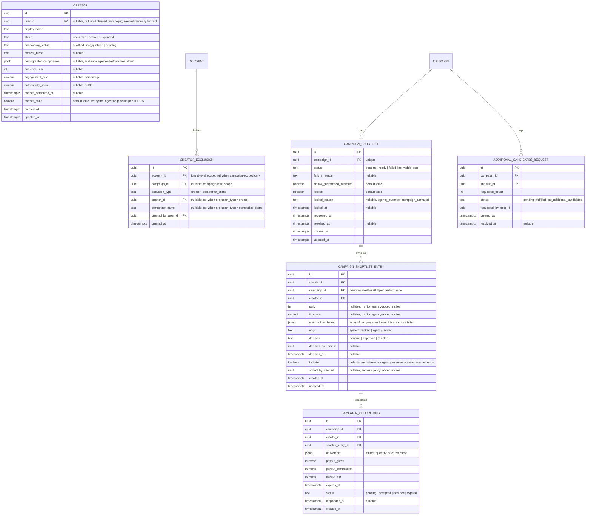

# E3 -- Creator Matching and Curation: Technical Architecture

## 1. Overview

This document specifies the data model, API contracts, and behavioral rules for Epic E3 (Creator Matching and Curation). It covers six user stories: US-11 (automatic shortlist ranked by fit), US-12 (inspect audience and authenticity metrics), US-13 (approve or reject individual creators), US-14 (exclusion lists), US-28 (creator accepts/declines an opportunity), and US-40 (agency overrides the shortlist with its own network).

All decisions here build on the foundation established in [Aurora's Architecture](../architecture.md), [E1](./e1-access-onboarding.md) (tenancy, RBAC, RLS), and [E2](./e2-campaign-planning-pool-buying.md) (campaign lifecycle, `campaign_pool_member`, the `MatchingEngineAdapter` interface and its stub). The stack is not re-decided here: NestJS modular monolith, PostgreSQL with RLS keyed on `account_id`, Redis for queues/caching, S3-compatible object storage.

E3 is implemented as a new backend module, `matching`, alongside `auth`, `pricing`, `brand-profile`, `invitation`, `workspace`, `agency`, `audit`, `jobs`, and `campaign`. It:

- **Replaces** `StubMatchingEngineAdapter` with `RealMatchingEngineAdapter`, bound to the same `MatchingEngineAdapter` DI token that `campaign` already depends on (see ADR-0011). The campaign module's quoting code (section 3.3 of the E2 doc) does not change.
- **Introduces** a minimal `creator` entity, since no creator profile table exists yet in the codebase (E8, which owns the full creator network per FR-08 to FR-15, has not shipped). E3 needs somewhere to anchor scores, shortlists, exclusions, and opportunities, so it defines the smallest `creator` schema that satisfies E3's needs and is explicitly designed to be extended, not replaced, by E8 (see ADR-0013).
- **Adds** the shortlist, approval, exclusion, and opportunity tables that did not exist before.
- **Reuses** the `account_id`-scoped RLS pattern and tenant-context middleware from E1, the `audit` module for every shortlist/approval/exclusion/opportunity event, and the `jobs` module (Bull/Redis) for asynchronous shortlist generation and opportunity expiry, on a new `matching` queue alongside `campaign` and `email`.
- **Consumes** `campaign_pool_member` from E2: once a campaign activates, the approved shortlist becomes the seed for that table (E2 owns the allocation; E3 owns who is on the list and why).

**Governing NFRs for every endpoint in this epic:**

| NFR | Target | How this design meets it |
|---|---|---|
| NFR-01 | Shortlist generation p95 ≤ 60 seconds for campaigns of up to 100 creators | Generation is asynchronous (202 + poll, same pattern as E2's quote). The real matching engine scores candidates with pre-computed, indexed fields (no per-candidate external API calls at request time -- metrics are ingested separately, per NFR-35) so scoring is a bounded in-database computation. |
| NFR-06 | Up to 150 creators per campaign without breaching NFR-01/NFR-04 | Shortlist entries are a row-per-creator table (`campaign_shortlist_entry`), not embedded JSON, mirroring E2's `campaign_pool_member` decision (ADR-0005). Scoring runs as a single batched SQL query with weighted ranking, not N individual lookups. |
| NFR-29 | Matching model replaceable without touching campaign/payment code or a migration | The `MatchingEngineAdapter` interface (owned by `campaign`, per E2 ADR already in place) gains one new method, `generateShortlist`. Swapping scoring logic means changing the `matching` module's implementation of that method and the DI binding; it touches no table that `campaign` or E6's payment code reads directly, because the hand-off point is `campaign_pool_member`, a table E2 already owns and already treats as an opaque input (see ADR-0011, ADR-0012). |

---

## 2. Data Model

### 2.1 Entity-Relationship Diagram



### 2.2 Entity Descriptions

**CREATOR.** The minimal creator profile E3 needs to exist. It is **not** owned long-term by E3: E8 (FR-08 to FR-15) will extend this table with social account links, media kits, rate preferences, and the full claim/unclaim lifecycle from US-23. For the pilot, `creator` rows are seeded (manually or by a lightweight import script outside this epic's scope) with `status = 'active'` and `onboarding_status = 'qualified'`, since no self-registration flow exists yet. `user_id` is nullable so the schema does not need a migration when E8 ships real registration -- it simply starts populating `user_id` and driving `status` transitions through its own flows (see ADR-0013). This table is **not** account-scoped (no RLS by `account_id`): creators are a shared network across all brand and agency accounts, exactly as the PRD's M2 module implies. Visibility restrictions (e.g., hiding unclaimed profiles from brands, per FR-12) are enforced in query filters, not RLS, because the restriction is about profile lifecycle state, not tenant boundary.

**CREATOR_EXCLUSION.** One row per exclusion entry. `account_id` set and `campaign_id` null means a brand-level exclusion (applies to every campaign under that account, US-14 scenario 1). `campaign_id` set means a campaign-level exclusion (applies only to that campaign, US-14 scenario 2). Both scopes apply with OR semantics at shortlist-generation time (see ADR-0014): a creator excluded at either level is excluded, with no reconciliation required from the buyer. `exclusion_type = competitor_brand` stores a free-text competitor name matched against a creator's declared brand-partnership history (a field E8 will populate; until then this check is a no-op filter that never excludes anyone, which is acceptable since no creator carries that data yet).

**CAMPAIGN_SHORTLIST.** One row per campaign (unique on `campaign_id`), representing the *current authoritative* shortlist, not a history of generation attempts. `status` mirrors E2's quote pattern (`pending` while the generation job runs, `ready`, `failed`, `no_viable_pool`). `below_guaranteed_minimum` is set when the ready shortlist has fewer approved-eligible entries than the campaign's `guaranteed_min_pool_size` (from E2's `campaign_quote`), satisfying US-11 scenario 2's explicit-flag requirement. `locked` becomes `true` either when an agency saves an override (US-40 scenario 2, FR-29's "never altered after the fact" guarantee) or when the campaign activates (US-13 scenario 3, shortlist decisions freeze at activation). Once `locked`, no regeneration, re-ranking, or scheduled job may write to this row or its entries (enforced by a database trigger, see 2.5).

**CAMPAIGN_SHORTLIST_ENTRY.** One row per creator on a campaign's shortlist. `origin = system_ranked` for entries the matching engine produced; `origin = agency_added` for creators Renata added from her own network (US-40). `rank`/`fit_score` are null for agency-added entries, since they were never scored by the engine -- their inclusion is a judgment call, not an algorithmic one (this is also why `ADR-0016` does not require them to count toward NFR-01's performance budget). `decision` tracks Marina's (or Renata's, acting for her client) per-creator approve/reject call (US-13). `included` is the field that actually determines whether a creator proceeds toward an opportunity (US-28): it is distinct from `decision` because an agency removing a system-ranked creator (US-40 scenario 1) is a different event from Marina rejecting one (US-13), even though both end in "this creator does not get an opportunity." Both set `included = false`. `matched_attributes` holds the specific campaign attributes this creator satisfied (FR-26), e.g. `["geography:BR-SP", "interests:skincare", "age_range:18-34"]`.

**CAMPAIGN_OPPORTUNITY.** One row per creator who was approved and included on the (locked) shortlist and has been sent an opportunity (US-28). Created only for entries with `included = true` and `decision = approved` (or `origin = agency_added`, which is treated as implicitly approved -- an agency would not add a creator to reject them in the same action). `payout_gross/commission/net` are computed at opportunity-creation time from the campaign's locked price and the creator's rate (the actual computation and E6 integration are out of this epic's scope per US-28's "confirms the gross/commission/net payout figures... (US-29, E6)"; E3 only stores the figures it was given and displays them). `status` transitions `pending -> accepted | declined | expired`, enforced by a background job for expiry (section 4).

**ADDITIONAL_CANDIDATES_REQUEST.** Created when Marina's rejections (US-13 scenario 2) drop the approved pool below the guaranteed minimum and she explicitly asks for more candidates. Resolves PRD open question 4 (see ADR-0018): this is a **top-up**, not a new quote -- it re-runs the matching engine against the same campaign parameters, excluding creators already on the shortlist (any decision) and respecting all active exclusions, and appends new `system_ranked` entries to the *same*, still-open `campaign_shortlist` row. It never re-prices the campaign (FR-18's locked price is untouched) and never creates a second `campaign_quote`.

### 2.3 Role Permissions (extends E1/E2 tables)

| Permission | brand_owner | brand_manager | brand_analyst | agency_admin | agency_operator (own clients) | creator |
|---|---|---|---|---|---|---|
| Request/view shortlist | yes | yes | yes (view only) | yes | yes | -- |
| Approve/reject shortlist entries | yes | yes | no | yes | yes | -- |
| Request additional candidates | yes | yes | no | yes | yes | -- |
| Manage brand-level exclusion list | yes | yes | no | yes | yes | -- |
| Manage campaign-level exclusion list | yes | yes | no | yes | yes | -- |
| Override shortlist (remove/add from own network) | -- | -- | -- | yes | yes (own clients) | -- |
| View creator audience/authenticity metrics | yes | yes | yes | yes | yes | -- |
| View own opportunity | -- | -- | -- | -- | -- | yes (self) |
| Accept/decline own opportunity | -- | -- | -- | -- | -- | yes (self) |

`brand_analyst` can view the shortlist and metrics (consistent with E1's existing "analyst = read-only" pattern) but cannot approve, reject, exclude, or override -- those are financial/brand-risk decisions reserved for the write-capable roles, matching E2's precedent for campaign-affecting actions. The shortlist-override permission (US-40) is agency-only; a brand workspace has no override action because FR-29 is explicitly scoped to agency curation (there is no "Marina overrides her own system shortlist with an outside network" story -- she uses approve/reject, US-13, instead).

**Creator-side access.** Creators are not members of any `account` and hold no row in `membership`. A creator's JWT carries `sub = user_id` and a `creator_id` claim, issued through a creator-specific login (owned by E8; for the pilot, a minimal creator-login endpoint is stubbed under this epic only far enough to let US-28 be testable end-to-end -- see ADR-0013). Every creator-portal endpoint checks `creator_id` from the JWT against the resource's `creator_id` column directly, since there is no account-based RLS boundary to lean on for this actor type.

### 2.4 Row-Level Security

`campaign_shortlist`, `campaign_shortlist_entry`, `campaign_opportunity`, and `additional_candidates_request` are tenant-scoped transitively through `campaign_id`, following E2's join-based RLS pattern:

```sql
CREATE POLICY tenant_isolation ON campaign_shortlist
  USING (
    campaign_id IN (
      SELECT id FROM campaign
      WHERE account_id = current_setting('app.current_account_id')::uuid
    )
  );
```

`creator_exclusion` carries `account_id` directly (nullable, for campaign-scoped rows it is still populated with the owning account so RLS applies uniformly):

```sql
ALTER TABLE creator_exclusion ADD CONSTRAINT chk_exclusion_scope
  CHECK (
    (campaign_id IS NULL AND exclusion_type IN ('creator', 'competitor_brand'))
    OR (campaign_id IS NOT NULL)
  );

CREATE POLICY tenant_isolation ON creator_exclusion
  USING (account_id = current_setting('app.current_account_id')::uuid);
```

`creator` itself carries **no** `account_id` and **no** RLS policy -- it is shared reference data across tenants, same architectural category as E1's `pricing` data. The CI check from E1/E2 (every `account_id`-bearing table has a policy) is extended with an explicit allow-list for intentionally shared tables (`creator`, `pricing`), so the check does not flag them as a gap.

### 2.5 Database Constraints

```sql
-- One shortlist per campaign
ALTER TABLE campaign_shortlist ADD CONSTRAINT uq_campaign_shortlist
  UNIQUE (campaign_id);

-- One entry per creator per campaign shortlist
ALTER TABLE campaign_shortlist_entry ADD CONSTRAINT uq_shortlist_entry
  UNIQUE (shortlist_id, creator_id);

-- Only one opportunity per creator per campaign
ALTER TABLE campaign_opportunity ADD CONSTRAINT uq_opportunity
  UNIQUE (campaign_id, creator_id);

-- A locked shortlist cannot be mutated by anything except the explicit
-- unlock-on-reopen path, which this epic does not expose (locking is terminal
-- for the shortlist's purpose: it feeds campaign activation, FR-29, US-13 sc.3)
CREATE OR REPLACE FUNCTION prevent_locked_shortlist_mutation()
RETURNS trigger AS $$
BEGIN
  IF OLD.locked = true THEN
    RAISE EXCEPTION 'campaign_shortlist % is locked: no further changes permitted', OLD.id;
  END IF;
  RETURN NEW;
END;
$$ LANGUAGE plpgsql;

CREATE TRIGGER shortlist_lock_guard
  BEFORE UPDATE ON campaign_shortlist
  FOR EACH ROW
  WHEN (OLD.locked = true AND NEW.locked = true)
  EXECUTE FUNCTION prevent_locked_shortlist_mutation();

CREATE OR REPLACE FUNCTION prevent_locked_shortlist_entry_mutation()
RETURNS trigger AS $$
DECLARE
  is_locked boolean;
BEGIN
  SELECT locked INTO is_locked FROM campaign_shortlist WHERE id = OLD.shortlist_id;
  IF is_locked THEN
    RAISE EXCEPTION 'shortlist entry % belongs to a locked shortlist: no further changes permitted', OLD.id;
  END IF;
  RETURN NEW;
END;
$$ LANGUAGE plpgsql;

CREATE TRIGGER shortlist_entry_lock_guard
  BEFORE UPDATE ON campaign_shortlist_entry
  FOR EACH ROW EXECUTE FUNCTION prevent_locked_shortlist_entry_mutation();

-- Opportunity payout figures are immutable once sent (consistency with the
-- money path's integrity expectations, even though settlement itself is E6's scope)
CREATE OR REPLACE FUNCTION prevent_opportunity_payout_mutation()
RETURNS trigger AS $$
BEGIN
  IF OLD.payout_gross IS DISTINCT FROM NEW.payout_gross
     OR OLD.payout_commission IS DISTINCT FROM NEW.payout_commission
     OR OLD.payout_net IS DISTINCT FROM NEW.payout_net THEN
    RAISE EXCEPTION 'opportunity payout figures are immutable once created';
  END IF;
  RETURN NEW;
END;
$$ LANGUAGE plpgsql;

CREATE TRIGGER opportunity_payout_immutable
  BEFORE UPDATE ON campaign_opportunity
  FOR EACH ROW EXECUTE FUNCTION prevent_opportunity_payout_mutation();
```

### 2.6 Shortlist State Machine

```
(no shortlist) --> pending --> ready --> [approve/reject entries, agency override]
                      |          |
                      v          v
                   failed   no_viable_pool
                      |          |
                      +----------+--> (buyer retries: POST /campaigns/:id/shortlist)

ready --[campaign activates]--> locked (locked_reason = campaign_activated)
ready --[agency saves override]--> locked (locked_reason = agency_override)
```

A shortlist can be regenerated (new `pending` -> `ready` cycle, replacing the row's own status and entries, not creating a new campaign_shortlist row) any number of times while `locked = false`. `ADDITIONAL_CANDIDATES_REQUEST` appends entries without resetting `status`. Once `locked = true`, the database trigger above rejects any further write to the shortlist or its entries, regardless of source (scheduled job, manual edit, or a second override attempt).

---

## 3. API Contracts

### 3.1 Conventions

Identical to E1/E2: base URL `https://api.aurora.com.br/v1`, JSON bodies, bearer JWT, `X-Account-Id` header for agency context, the same structured error shape, cursor pagination, ISO 8601 UTC timestamps. Creator-portal endpoints live under `/v1/creator-portal/*` and authenticate with a creator JWT (no `X-Account-Id`, since creators are not tenant members).

### 3.2 Shortlist Endpoints (US-11, US-14)

#### POST /campaigns/:id/shortlist

Requests shortlist generation for a campaign. Idempotent trigger: if a `ready`, unlocked shortlist already exists, this **regenerates** it (US-11's "requests the shortlist (or it is generated automatically on confirmation)").

**Required role:** `brand_owner`, `brand_manager`, `agency_admin`, `agency_operator` (with client access).

**Preconditions:** Campaign is `confirmed` or later and not `cancelled`. If the shortlist is `locked`, return 409 `SHORTLIST_LOCKED`.

**Request:** Empty body.

**Success response (202 Accepted):**
```json
{
  "shortlist_id": "sl-001",
  "status": "pending",
  "poll_url": "/v1/campaigns/camp-1234-.../shortlist"
}
```

**Behavior:**
1. Upsert the `campaign_shortlist` row to `status = pending` (create if absent, reset status+entries if regenerating an unlocked one).
2. Enqueue a `generate-shortlist` job on the `matching` queue.
3. Worker calls `MatchingEngineAdapter.generateShortlist` (section 3.2.1), which applies brand- and campaign-level exclusions **before** ranking (US-14 scenario 1, FR-27), scores and ranks remaining eligible creators, and returns up to the pool size needed.
4. On success with at least one eligible creator: write `campaign_shortlist_entry` rows (`origin = system_ranked`), set `status = ready`, compute `below_guaranteed_minimum` against the campaign's `guaranteed_min_pool_size`.
5. On success with zero eligible creators: `status = no_viable_pool`.
6. On timeout (60s target per NFR-01, hard cutoff at 90s matching E2's pattern) or an engine error: `status = failed`, with a retryable, explicit message (US-11 scenario 3).
7. Write audit log: `shortlist.requested`, `shortlist.ready` / `shortlist.failed`.

**Error responses:**
- 409 `SHORTLIST_LOCKED`: Shortlist is already locked (activated or overridden). States that further creator changes must go through campaign controls or are no longer possible.
- 400 `CAMPAIGN_NOT_READY`: Campaign has not been confirmed yet.

---

#### GET /campaigns/:id/shortlist

Polls/reads the current shortlist and its entries.

**Required role:** Any authenticated member with account access.

**Success response (200 OK), when ready:**
```json
{
  "id": "sl-001",
  "campaign_id": "camp-1234-...",
  "status": "ready",
  "below_guaranteed_minimum": false,
  "locked": false,
  "entries": [
    {
      "id": "entry-001",
      "creator_id": "creator-9001",
      "rank": 1,
      "fit_score": 0.91,
      "matched_attributes": ["geography:BR-SP", "interests:skincare", "age_range:18-34"],
      "origin": "system_ranked",
      "decision": "pending",
      "included": true
    }
  ],
  "requested_at": "2026-10-05T10:00:00Z",
  "resolved_at": "2026-10-05T10:00:45Z"
}
```

**When `below_guaranteed_minimum` is true**, the response additionally carries `"guaranteed_min_pool_size": 42, "matched_count": 29` so the frontend can render US-11 scenario 2's explicit warning rather than padding silently.

**When `status` is `pending`, `failed`, or `no_viable_pool`:** Same shape as E2's quote-poll endpoint (section 3.3 of the E2 doc), with `failure_reason` populated for the latter two.

---

#### 3.2.1 Matching Engine Interface Extension (replaces the E2 stub)

The existing `MatchingEngineAdapter` interface (owned by `campaign`, see E2 section 3.3.1) gains one method. `estimatePool` (used by E2's quote) is unchanged; `generateShortlist` is new and is what E3 calls:

```typescript
interface MatchingEngineAdapter {
  estimatePool(input: EstimatePoolInput): Promise<EstimatePoolResult>; // unchanged, E2

  generateShortlist(input: {
    campaignId: string;
    accountId: string;
    audienceTargeting: AudienceTargeting;
    deliverableFormats: string[];
    guaranteedMinPoolSize: number;
    excludedCreatorIds: string[]; // resolved brand + campaign exclusions, already unioned
    alreadyOnShortlistCreatorIds: string[]; // for top-up requests, empty otherwise
    maxCandidates: number; // 150 ceiling per NFR-06
  }): Promise<
    | { status: 'ready'; entries: Array<{ creatorId: string; rank: number; fitScore: number; matchedAttributes: string[] }> }
    | { status: 'no_viable_pool' }
  >;
}
```

`RealMatchingEngineAdapter` implements both methods against the `creator` table and its metrics (see ADR-0011 for the scoring model). The matching module registers this adapter under the same `MATCHING_ENGINE_ADAPTER` DI token that `campaign` already injects, so `campaign`'s quote code starts calling the real engine the moment E3 ships, with no code change in `campaign` and no migration (NFR-29).

---

### 3.3 Creator Metrics Endpoint (US-12)

#### GET /creators/:id/metrics

Returns audience and authenticity metrics for a creator, in the context of a shortlist (so the frontend can show "why this creator matched" alongside the raw metrics).

**Required role:** Any authenticated member with account access (read-only for `brand_analyst`, consistent with section 2.3).

**Query parameters:** `campaign_id` (optional; if provided and the creator is on that campaign's shortlist, `matched_attributes` is echoed in the response).

**Success response (200 OK):**
```json
{
  "creator_id": "creator-9001",
  "display_name": "Duda Oliveira",
  "audience_size": 18400,
  "demographic_composition": { "age_18_24": 0.41, "age_25_34": 0.33, "gender_female": 0.78 },
  "engagement_rate": "4.2",
  "content_niche": "beleza e skincare",
  "authenticity_score": 87,
  "authenticity_flag": "none",
  "metrics_computed_at": "2026-10-04T08:00:00Z",
  "metrics_stale": false,
  "matched_attributes": ["geography:BR-SP", "interests:skincare"]
}
```

**When metrics are stale (US-12 scenario 3, NFR-35):**
```json
{
  "creator_id": "creator-9002",
  "audience_size": 9800,
  "metrics_computed_at": "2026-09-20T08:00:00Z",
  "metrics_stale": true,
  "stale_since": "2026-10-01T00:00:00Z",
  "...": "remaining fields are the last-known values, never blanked"
}
```

**When the authenticity score is low (US-12 scenario 2):** `authenticity_flag` is `"low"` (score < 50) or `"review"` (50-69), per the threshold policy in ADR-0017. The field is always present and always rendered prominently by the frontend contract -- the API does not hide or omit low scores, and never removes the creator from any shortlist response as a side effect of this endpoint (approval/rejection is a separate, explicit action, US-13).

**Error responses:**
- 404: Creator not found, or (if `campaign_id` given) not visible in that campaign's context (e.g., an unclaimed profile).

---

### 3.4 Approval Endpoints (US-13)

#### PATCH /campaigns/:id/shortlist/entries/:entryId

Approves or rejects a single shortlist entry.

**Required role:** `brand_owner`, `brand_manager`, `agency_admin`, `agency_operator` (with client access).

**Preconditions:** Shortlist is `ready` and not `locked`. If `locked`, return 400 `SHORTLIST_LOCKED_FOR_DECISIONS` stating decisions are frozen and further creator changes go through campaign controls (US-13 scenario 3).

**Request:**
```json
{ "decision": "approved" }
```
or `{ "decision": "rejected" }`.

**Success response (200 OK):**
```json
{
  "id": "entry-001",
  "decision": "approved",
  "included": true,
  "decision_at": "2026-10-05T11:00:00Z"
}
```

**Behavior:**
1. Set `decision`, `decision_by_user_id`, `decision_at`. For `decision = rejected`, also set `included = false`.
2. Recompute the count of `included = true AND decision != 'rejected'` entries against `guaranteed_min_pool_size`. If it drops below the minimum, set `campaign_shortlist.below_guaranteed_minimum = true` and include `"warning": "pool_below_guaranteed_minimum"` in the response (US-13 scenario 2).
3. Write audit log: `shortlist_entry.approved` / `shortlist_entry.rejected`.

**Error responses:**
- 400 `SHORTLIST_LOCKED_FOR_DECISIONS`: Shortlist is locked; states the campaign is active and points to pause/resume controls (US-09) for further changes.

---

#### PATCH /campaigns/:id/shortlist/entries/bulk

Bulk approve/reject (US-13 scenario 1, "one by one or in bulk").

**Request:**
```json
{
  "decisions": [
    { "entry_id": "entry-001", "decision": "approved" },
    { "entry_id": "entry-002", "decision": "rejected" }
  ]
}
```

**Behavior:** Same as the single-entry endpoint, applied transactionally (all-or-nothing) over the provided entries, with one combined `below_guaranteed_minimum` recomputation and one audit event (`shortlist_entries.bulk_decision`) carrying the full list in `metadata`.

---

#### POST /campaigns/:id/shortlist/request-additional-candidates

Requests more candidates after rejections drop the pool below the guaranteed minimum (US-13 scenario 2). Resolves PRD open question 4.

**Required role:** Same as approval endpoints.

**Preconditions:** `campaign_shortlist.below_guaranteed_minimum = true` and shortlist not `locked`.

**Request:** Empty body.

**Success response (202 Accepted):**
```json
{
  "request_id": "req-001",
  "status": "pending"
}
```

**Behavior:** See ADR-0018. Creates an `additional_candidates_request` row, enqueues a `top-up-shortlist` job that calls `generateShortlist` with `alreadyOnShortlistCreatorIds` populated (so no duplicates) and `guaranteedMinPoolSize` set to the remaining shortfall, not the full original minimum. New entries are appended to the same `campaign_shortlist` with `origin = system_ranked` and `decision = pending`. Does **not** create a new `campaign_quote` and does **not** change the locked price (FR-18). If the engine still cannot fill the gap, `additional_candidates_request.status = no_additional_candidates` and the existing `below_guaranteed_minimum` warning remains, now with a note that no further automated top-up is possible -- the buyer's remaining options are the FR-19 shortfall flow (E2) at launch time.

---

### 3.5 Exclusion List Endpoints (US-14)

#### POST /exclusions

Adds a brand-level or campaign-level exclusion.

**Required role:** `brand_owner`, `brand_manager`, `agency_admin`, `agency_operator` (with client access).

**Request (brand-level):**
```json
{ "scope": "brand", "exclusion_type": "creator", "creator_id": "creator-5555" }
```

**Request (campaign-level, competitor):**
```json
{ "scope": "campaign", "campaign_id": "camp-1234-...", "exclusion_type": "competitor_brand", "competitor_name": "Marca Rival Ltda" }
```

**Success response (201 Created):** Echoes the created exclusion.

**Behavior:**
1. Validate `exclusion_type` matches the provided identifying field (`creator_id` xor `competitor_name`).
2. Create the row. Brand-level exclusions carry `account_id` and `campaign_id = null`; campaign-level exclusions carry both.
3. Write audit log: `exclusion.created`.
4. **Does not retroactively modify any existing shortlist.** An exclusion added after a shortlist exists and has approvals is not applied backward (US-14 scenario 3). The response includes `"applies_to": "future_shortlist_generations_only"` so the frontend can state this explicitly rather than implying immediate effect.

**Error responses:**
- 422: Invalid combination of `exclusion_type` and identifying field.

---

#### GET /exclusions

Lists exclusions for the current account (brand-level) or a specific campaign (campaign-level, via `?campaign_id=`).

**Required role:** Any authenticated member with account access.

**Success response (200 OK):** Paginated list, each item showing `scope`, `exclusion_type`, `creator_id` or `competitor_name`, `created_at`.

---

#### DELETE /exclusions/:id

Removes an exclusion. Does not affect any already-generated shortlist (symmetric with the creation behavior).

**Required role:** Same as POST.

**Success response (204 No Content).**

---

### 3.6 Agency Override Endpoints (US-40)

#### POST /campaigns/:id/shortlist/override

Saves Renata's final curated selection, replacing the system ranking as the authoritative shortlist and locking it (US-40 scenario 1, 2). Resolves PRD open questions 1 and 2 (see ADR-0015, ADR-0016).

**Required role:** `agency_admin`, `agency_operator` (with client access). Not available to brand-workspace roles (section 2.3).

**Preconditions:** Shortlist exists (`ready`), campaign belongs to a client account under the acting agency workspace (tenant check per NFR-16), and the shortlist is not already `locked`.

**Request:**
```json
{
  "remove_entry_ids": ["entry-003", "entry-004"],
  "add_creators": [
    { "creator_id": "creator-7777" },
    { "creator_id": "creator-8888" }
  ]
}
```

**Success response (200 OK):**
```json
{
  "shortlist_id": "sl-001",
  "locked": true,
  "locked_reason": "agency_override",
  "locked_at": "2026-10-05T12:00:00Z",
  "below_guaranteed_minimum": false,
  "entries": [ "...": "full updated entry list" ]
}
```

**Behavior:**
1. For each `remove_entry_ids`, set `included = false` on that entry (soft removal, auditable -- the system-ranked entry is never deleted, consistent with keeping a record of what the engine originally proposed).
2. For each `add_creators`, validate the creator exists, `status = active`, and `onboarding_status = qualified` (US-40 scenario 3). If not, return 422 `CREATOR_NOT_ELIGIBLE` naming the specific creator and whether the blocker is "no profile" (trigger an invitation via E8's flow, out of this epic's direct scope, acknowledged in the error payload as `suggested_action: invite`) or "onboarding incomplete" (`suggested_action: wait_for_onboarding`).
3. Insert new `campaign_shortlist_entry` rows for valid additions, `origin = agency_added`, `rank = null`, `fit_score = null`, `decision = approved` (an agency addition is implicitly approved -- there is no separate approve step for Renata's own picks, consistent with "her final selection... distinct from the system's original ranking").
4. Recompute `below_guaranteed_minimum` against the campaign's guaranteed minimum (see ADR-0016 for whether this blocks the save).
5. Set `campaign_shortlist.locked = true`, `locked_reason = 'agency_override'`, `locked_at = now()`.
6. **Opportunity sequencing (ADR-0015):** if any `campaign_opportunity` rows already exist for removed creators (because the system shortlist had already been approved and opportunities sent before Renata's override), those opportunities are not deleted retroactively; see ADR-0015 for the exact rule.
7. Write audit log: `shortlist.agency_overridden`, with full before/after entry snapshots in `metadata` (same pattern as E2's `campaign_reallocation_event`, for auditability of a judgment call that the system will never re-rank).

**Error responses:**
- 422 `CREATOR_NOT_ELIGIBLE`: Names the creator and the specific blocker, with a `suggested_action`.
- 403 `NOT_AGENCY_CONTEXT`: Caller's current account is not an agency client account, or caller lacks client access (NFR-16 tenant isolation).
- 409 `SHORTLIST_ALREADY_LOCKED`: A second override attempt, or an override attempt after campaign activation.

---

### 3.7 Opportunity Endpoints (US-28)

These live under `/v1/creator-portal/*`, authenticated with a creator JWT.

#### GET /creator-portal/opportunities

Lists the authenticated creator's opportunities.

**Success response (200 OK):**
```json
{
  "data": [
    {
      "id": "opp-001",
      "campaign_id": "camp-1234-...",
      "brand_name": "Acme Cosmeticos",
      "deliverable": { "format": "instagram_reel", "quantity": 1 },
      "payout_gross": "800.00",
      "payout_commission": "120.00",
      "payout_net": "680.00",
      "expires_at": "2026-10-08T23:59:59Z",
      "status": "pending"
    }
  ]
}
```

---

#### POST /creator-portal/opportunities/:id/accept

**Preconditions:** `status = pending` and `now() < expires_at`. If expired, return 410 `OPPORTUNITY_EXPIRED` (even though the background job should have already flipped it, this is a defensive check against race conditions, per US-28 scenario 3's "no payout obligation is created" guarantee).

**Success response (200 OK):**
```json
{
  "id": "opp-001",
  "status": "accepted",
  "responded_at": "2026-10-06T09:00:00Z",
  "payout_gross": "800.00",
  "payout_commission": "120.00",
  "payout_net": "680.00"
}
```

**Behavior:**
1. Set `status = accepted`, `responded_at`.
2. Emit `opportunity.accepted` event, consumed by E5 (briefing, US-18/US-30) and E6 (US-29 payout transparency) -- E3 does not implement either, only signals the hand-off.
3. Write audit log: `opportunity.accepted`.

---

#### POST /creator-portal/opportunities/:id/decline

**Success response (200 OK):**
```json
{ "id": "opp-001", "status": "declined", "responded_at": "2026-10-06T09:05:00Z" }
```

**Behavior:**
1. Set `status = declined`.
2. Set the corresponding `campaign_shortlist_entry.included = false` (removes the creator from the active pool for this campaign, US-28 scenario 2). This does **not** touch `decision` (which stays `approved` -- the creator's own choice is a separate fact from the buyer's approval) and does **not** penalize the creator's eligibility for other campaigns (no field on `creator` is touched by a decline).
3. Recompute `below_guaranteed_minimum` on the campaign's (locked) shortlist for visibility purposes only -- the shortlist is locked, so this is a read-side flag recomputation, not a write to locked entries; it surfaces the FR-19 obligation to E2's existing shortfall mechanism via an emitted event (`opportunity.declined`), which E2's `pool-fill-check` job already consumes.
4. Write audit log: `opportunity.declined`.

---

## 4. Background Jobs

| Job | Queue | Trigger | Behavior |
|---|---|---|---|
| `generate-shortlist` | `matching` | POST /campaigns/:id/shortlist | Calls `MatchingEngineAdapter.generateShortlist`. Updates `campaign_shortlist` to `ready`, `no_viable_pool`, or `failed` (90s hard timeout, mirroring E2's quote job). |
| `top-up-shortlist` | `matching` | POST /campaigns/:id/shortlist/request-additional-candidates | Same engine call with `alreadyOnShortlistCreatorIds` populated and a reduced target count. Appends entries or marks the request `no_additional_candidates`. |
| `expire-opportunities` | `matching` | Cron, every 5 minutes | Any `campaign_opportunity` with `status = pending` and `expires_at < now()` is set to `status = expired`. Emits `opportunity.expired` (consumed the same way as a decline for pool-shortfall purposes, minus the "does not penalize eligibility" framing, which applies identically). No payout obligation is ever created for an expired opportunity, since obligations are created downstream in E6 only from `accepted` status. |
| `refresh-creator-metrics-staleness` | `matching` | Cron, every hour | Marks `creator.metrics_stale = true` for any creator whose `metrics_computed_at` is older than the platform's staleness window (24 hours, matching NFR-35's rate-limit/outage tolerance), without blanking any existing value. The actual metric *computation* pipeline is E8's scope; this job only manages the staleness flag so E3's read endpoints can display it honestly even before E8 ships a live ingestion pipeline. |

---

## 5. Frontend Route Map

| Route | Auth | Description |
|---|---|---|
| `/app/campaigns/:id/shortlist` | Auth (brand/agency) | Shortlist view (US-11). Polls while `pending`. Shows ranked entries, `below_guaranteed_minimum` warning banner, per-entry approve/reject controls (US-13), bulk actions, "request more candidates" action when below minimum. |
| `/app/campaigns/:id/shortlist/creators/:creatorId` | Auth (brand/agency) | Creator metrics detail (US-12). Audience size, demographics, engagement, authenticity score with flag styling, staleness indicator. |
| `/app/exclusions` | Auth (brand/agency) | Brand-level exclusion list management (US-14). |
| `/app/campaigns/:id/exclusions` | Auth (brand/agency) | Campaign-level exclusion list management (US-14). |
| `/app/campaigns/:id/shortlist/override` | Auth (agency only) | Renata's override screen (US-40): remove system-ranked entries, search and add from the creator network or invite a new one, save (locks the shortlist). |
| `/creator-portal/opportunities` | Auth (creator) | Duda's opportunity inbox (US-28). List, detail with payout breakdown, accept/decline actions, expiry countdown. |

---

## 6. NFR Compliance Checklist

| NFR | How this design satisfies it |
|---|---|
| NFR-01 | Shortlist generation is asynchronous (202 + poll). The real engine scores against pre-computed, indexed creator fields in a single batched query rather than per-candidate external calls, keeping the computation itself well under the 60s p95 target at 100-creator scale. |
| NFR-06 | `campaign_shortlist_entry` is a row-per-creator table, mirroring E2's `campaign_pool_member` pattern (ADR-0005 precedent). Approval, exclusion-filtering, and override operations are O(entries touched), not O(pool size) rewrites of a single document. |
| NFR-29 | `generateShortlist` is one new method on the existing `MatchingEngineAdapter` interface, owned by `campaign`. Swapping the scoring algorithm (e.g., adding a new signal) means changing `RealMatchingEngineAdapter` and nothing in `campaign` or any E6 payment code, and requires no migration since the interface, not the schema, is the seam. |

---

## 7. Open Questions Resolved

| PRD open question | Resolution | ADR |
|---|---|---|
| 1. Override sequencing vs. opportunity notification | An agency override is permitted at any time before campaign activation, even after some opportunities were already sent under the system shortlist. Already-sent, still-`pending` opportunities for creators the override removes are left standing (not revoked) but the removed creator will not appear in future campaign communications; already-`accepted` opportunities for removed creators are honored as a commitment already made to that creator. See ADR-0015 for the full rule and its justification. | ADR-0015 |
| 2. Guaranteed minimum enforcement on override | The guaranteed minimum from the quote still applies to an agency override's *final* pool size, but enforcement is advisory, not blocking: the save succeeds, `below_guaranteed_minimum` is set if applicable, and the buyer (agency) is warned, consistent with FR-19's existing shortfall-at-launch mechanism in E2 rather than a new, stricter gate invented for this one path. See ADR-0016. | ADR-0016 |
| 3. Exclusion list vs. agency network additions | Brand exclusions (brand- and campaign-level) apply to agency-added creators exactly as they apply to system-ranked ones. An agency cannot add an excluded creator; the override endpoint validates against `creator_exclusion` the same way shortlist generation does. See ADR-0014. | ADR-0014 |
| 4. "Request additional candidates" mechanics | A top-up against the existing locked price and existing quote, not a new quote. See ADR-0018. | ADR-0018 |
| 5. Authenticity score threshold | Flag-only, no automatic exclusion from matching, with a two-tier threshold (`< 50` = "low", `50-69` = "review", `>= 70` = "none") surfaced via `authenticity_flag`, confirmed as the pilot default subject to product revisiting post-launch. See ADR-0017. | ADR-0017 |
