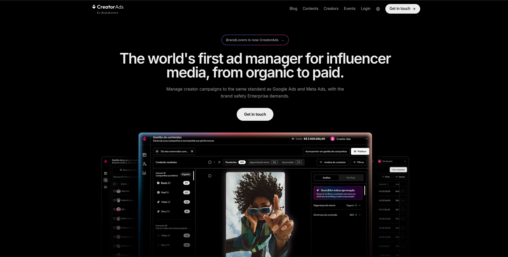
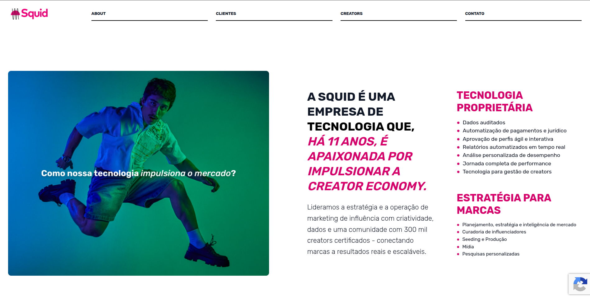
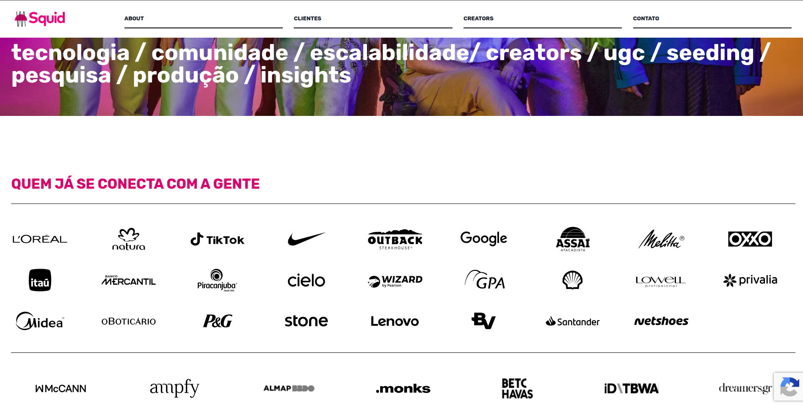
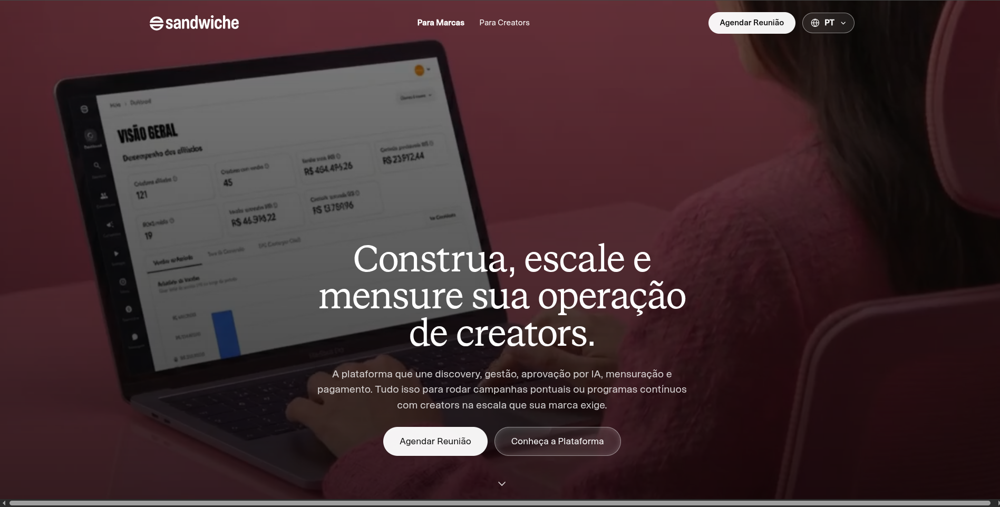
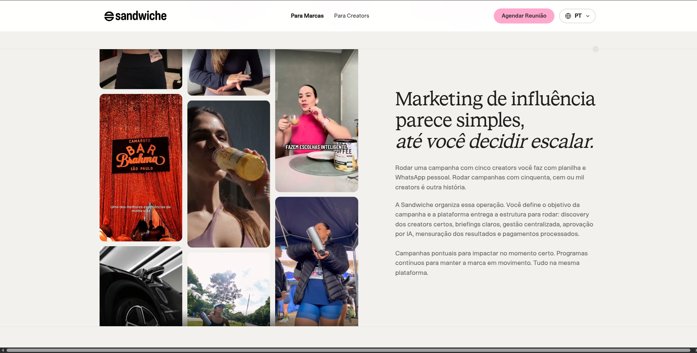
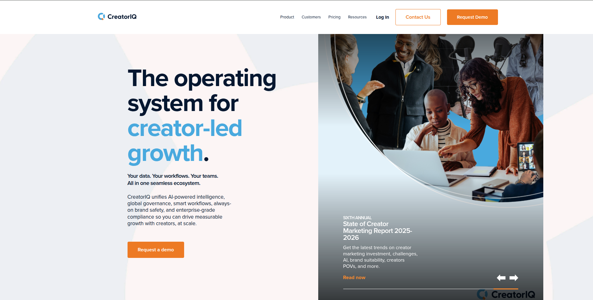
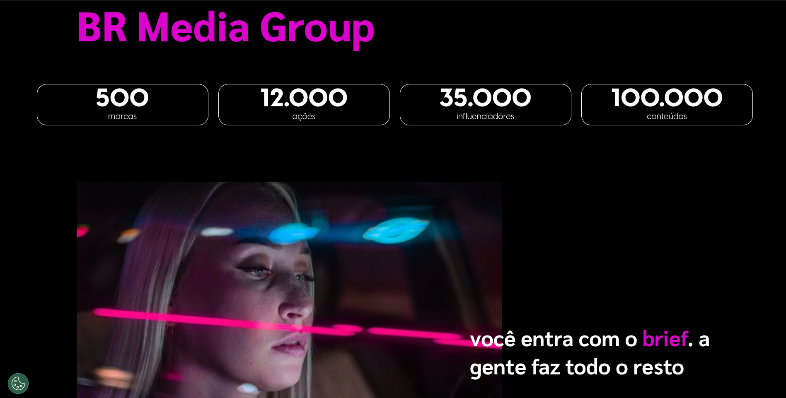
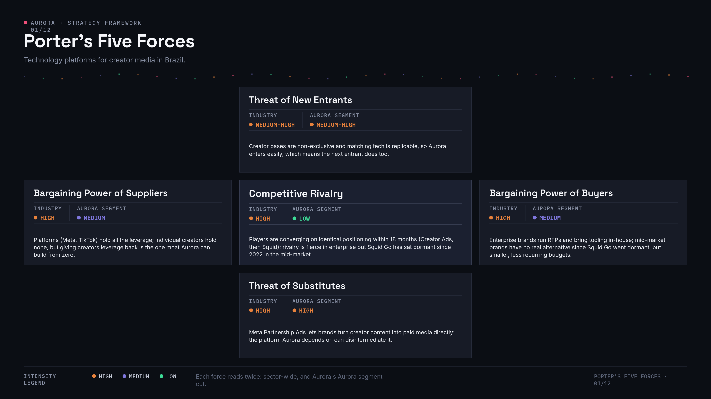
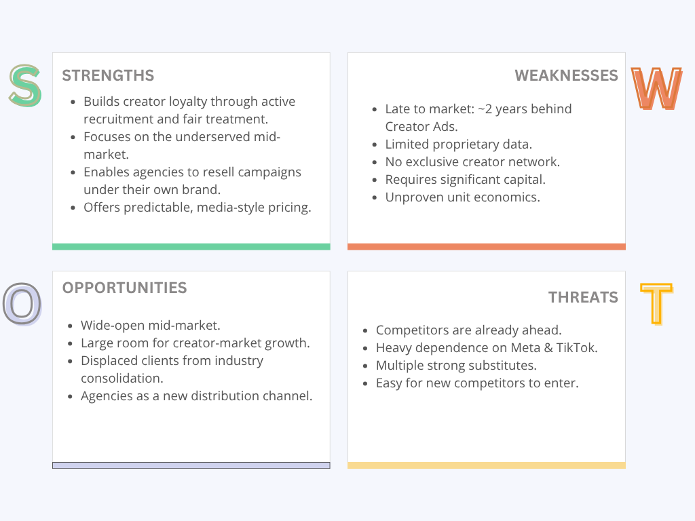
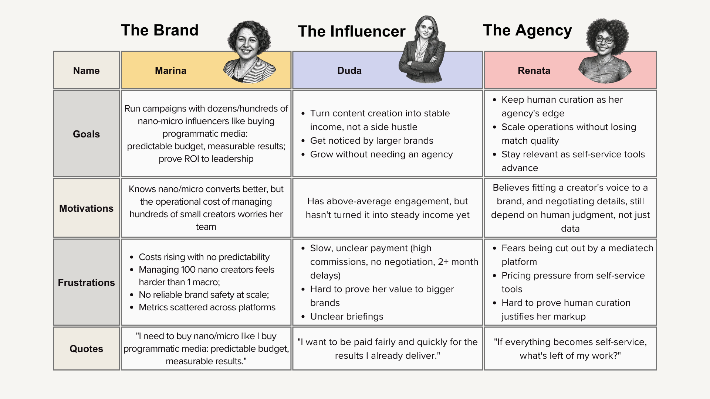

# Aurora's Business Analysis

# Table of Contents
1. [Research and Context](#1-research-and-context)
   - 1.1 [Industry Context and Analysis](#11-industry-context-and-analysis)
   - 1.2 [The Problem](#12-the-problem)
   - 1.3 [The Solution](#13-the-solution)
   - 1.4 [Market Players](#14-market-players)
2. [Frameworks](#2-frameworks)
   - 2.1 [Competitive Matrix](#21-competitive-matrix)
   - 2.2 [Porter's Five Forces](#22-porters-five-forces)
   - 2.3 [Gap Analysis](#23-gap-analysis)
   - 2.4 [SWOT](#24-swot)
   - 2.5 [Risk Matrix](#25-risk-matrix)
   - 2.6 [Personas](#26-personas)
   - 2.7 [Value Proposition Canvas](#27-value-proposition-canvas)
   - 2.8 [Revenue and Cost Structure](#28-revenue-and-cost-structure)
3. [References](#3-references)

---

## 1. Research and Context

---

### 1.1 Industry Context and Analysis

The creator economy is made up of individual creators, such as influencers, artists, writers, streamers, and musicians, who turn online content into income. It also includes the platforms, tools, and services that support them: social networks, subscription platforms, editing tools, agencies, and analytics. YouTube coined the word "creator" in 2011 to describe users with large audiences who were not celebrities in the usual sense.

The industry grew out of Web 2.0 and the rise of user generated content in the late 1990s. Blogging platforms, and later YouTube in 2005, solved the distribution problem: anyone could publish. Instagram and Twitter sped things up in the late 2000s, helped by cheaper smartphones and cameras. By 2012 and 2013 platforms started sharing ad revenue with creators, and Patreon pioneered the direct subscription model between fans and creators. From 2020 onward, the pandemic pushed more people to spend time online and to look for new income sources, and TikTok made it possible to go viral without an established audience or professional production.

Today the creator economy is worth hundreds of billions of dollars and it keeps growing fast. Estimates vary a lot depending on the source, but they all point in the same direction.

<strong>Table 1</strong>

<em>Creator Economy Market Size and Growth Projections by Source</em>

| Source | 2025/2026 Value | Future Projection | CAGR |
|---|---|---|---|
| Research and Markets | $323.48B (2026) | $820.83B by 2030 | 26.2% |
| Coherent Market Insights | $248.95B (2026) | $1.05T by 2033 | 22.9% |
| Precedence Research | $313.95B (2026) | $2.08T by 2035 | 23.4% |
| Grand View Research | $205.25B (2024) | $1.35T by 2033 | 23.3% |
| Goldman Sachs | ~$250B (2023, base) | ~$480B by 2027 | 10 to 20% |

*Note.* CAGR (Compound Annual Growth Rate) indicates the market's average yearly growth on a compounded basis. It's useful for comparing sources with different values and timeframes on a common basis.

Some other numbers worth knowing:
- Goldman Sachs Research estimates there are about 50 million creators worldwide (Goldman Sachs, 2023).
- In the US, the number of full time creators has grown to more than 1.5 million, nearly eight times the 2020 level (Interactive Advertising Bureau, 2025).
- Global influencer marketing reached an estimated US$32.55B in 2025 (Influencer Marketing Hub, 2025b).
- Income is very unequal. More than half of creators earn less than US$15,000 a year (Influencer Marketing Hub, 2025a), and only about 4% earn more than US$100,000 a year (Goldman Sachs, 2023).
- YouTube alone supported more than 425,000 full time jobs in the US and added US$25B to US GDP in 2021 (Oxford Economics, 2022).

The rise of creators is changing traditional media too. Ad budgets are moving from TV and traditional media to creators, since niche content now competes directly with mass programming. Brands prefer creators because audiences trust them more than traditional ads. In one US survey, 74% of consumers said they had bought a product because an influencer recommended it (IZEA, 2024). Traditional journalism and entertainment have started copying creator strategies, using subscriptions and branded content of their own.

The shift also changed the labor market. "Creator" has become a real job category, even though it is still not tracked formally in workforce surveys, which makes its true economic impact hard to measure. It creates indirect jobs too, since many creators employ editors, managers, and production teams. It also raises new questions about taxes, since side income is hard to audit, and about labor rights, since creators usually have no formal employment or benefits.

On a broader level, the creator economy changed who gets discovered. It no longer depends on record labels, publishers, or broadcasters. It created a winner takes most dynamic, where a small number of creators at the top earn most of the money while most creators live on unstable, supplementary income. Generative AI and cheaper creation tools are speeding this up even more, shortening the time between starting out and going professional.

#### The shift toward nano and micro creators

For years, brands believed that a bigger audience meant a bigger campaign result. That belief is changing. Instead of chasing reach alone, companies increasingly look for creators who can build trust with a specific, smaller community.

<strong>Table 2</strong>

<em>Average Instagram Engagement Rate by Follower Tier (2026)</em>

| Tier | Followers | Average Engagement |
|---|---|---|
| Nano | 1K to 10K | 3.86% |
| Micro | 10K to 100K | about 2.60% |
| Macro | 100K to 1M | lower |
| Mega or celebrity | 1M+ | about 1.21% |

*Note.* Compiled from Influencer Marketing Hub, HypeAuditor, Social Cat, and ViralMango.

Nano creators consistently show higher engagement than mega influencers, the pattern already visible in Table 2, and it holds across the datasets reviewed, including Influencer Marketing Hub, HypeAuditor, Social Cat, and ViralMango. They also tend to be more cost-effective per engagement.

Why did this happen? A few reasons line up:

1. In the early 2010s, follower count made sense as a metric, since more people seemed to mean more engagement.
2. Then came the fraud problem. Research found that a large share of engagement on sponsored posts was fake. In one analysis, 25% of the followers of 10,000 influencers were fake, and about half of the engagement on sponsored content was likely fraudulent, a billion-dollar problem that pushed brands like Unilever to demand more transparency (Lieber, 2019).
3. COVID accelerated the shift, as more micro and nano creators entered the scene with highly focused audiences.
4. TikTok changed the game by letting anyone go viral, not just established influencers.
5. By 2026, EMARKETER expects micro and nano influencers to take 45.5% of all influencer marketing spend, a real structural move of budget (Willens, 2026).

In Brazil the shift is even stronger. Nielsen counted more than 500,000 content creators in the country, each with at least 10,000 followers (Nielsen, 2021). Squid's own 2023 census found that about 40% of Brazilian influencers have fewer than 10,000 followers, and 78% have up to 50,000 (Teixeira, 2023). In other words, the Brazilian market was already built around micro and nano creators. That same data showed nano creators with an average engagement rate of 8.7%, against only 1.5% for macro influencers in traditional campaigns, an even bigger gap than the global average (Bettoni, 2024). As of 2026, about 44% of Brazilians say they discover new products through influencers (Alves, 2026), and roughly 80% of consumers globally trust influencer recommendations (Exame, 2024).

This does not mean macro influencers are finished. It is more a matter of choosing the right tool for the goal. For categories that need a lot of trust, like financial services, health, parenting, or premium lifestyle products, micro creators work better. For impulse buys or mass market products, where reach matters more than depth of persuasion, macro creators still hold value. Brands entering a new country or category, without any trust built yet, still use local celebrities to borrow credibility quickly, something nano and micro creators cannot replace. By 2026, most brands run a hybrid approach that mixes both levels for different stages of a campaign.

One more distinction matters here: UGC, or user generated content. In everyday use, UGC is content, like a photo, video, or review, made by ordinary people about a product, usually in an organic or lightly incentivized way. In influencer marketing, the term has taken on a more specific meaning recently. Brands now pay creators, usually nano or micro, to produce content that looks organic but that the brand then owns and reuses as its own asset, in paid ads, on its website, or on its own social channels, instead of the creator posting it on their own profile. This is different from a normal influencer post. With a normal post, the content stays on the creator's profile, the brand pays for the creator's reach, and the main metric is organic engagement. With UGC, the brand receives the file and publishes it wherever it wants, pays for the work of producing the content, and measures it as a paid ad. This matters for Aurora because "a pool of creators as one media unit" can include both formats, and they come with very different pricing, usage rights, and brand safety needs. A UGC contract usually includes licensing for the brand to reuse the content, while a normal influencer post does not.

---

### 1.2 The Problem

Brands already know that nano and micro creators convert better than big influencers. The hard part is using them at scale. Running a campaign through one or two macro influencers is simple: one contract, one relationship, one deliverable to track. Running the same campaign through 300 or 3,000 small creators means managing hundreds of separate briefings, delivery deadlines, payments, and brand safety checks at once. For most brands, that amount of coordination is simply more than a team can handle by hand.

Large platforms like Creator Ads, Squid, and CreatorIQ already solved the technology side of this problem, at least for big brands. They can buy creator media in a programmatic way, reallocate budget in real time based on performance, and run automated brand safety checks before anything gets published. None of them, however, serve the middle of the market well. Brands that are too big to run a campaign from a spreadsheet and a WhatsApp group, but too small to justify an enterprise contract that starts at tens of thousands of dollars a year, are left without a real option.

On the creator side, the problem looks different but points to the same gap. Almost every platform depends on open self registration, which means a good nano creator who never signs up simply does not exist for the market. Creators are treated as an anonymous supply, not as customers. Payment is often slow, briefings are often unclear, and creators have very little say in which brands they work with or how much they earn.

This leads to the core question behind Aurora: what is missing from the creator market today? The creator economy still represents only a small share of Brazil's media budget, leaving significant room to grow. The problem is not a lack of demand, but a lack of infrastructure to support the middle of the market and build lasting relationships with creators.

---

### 1.3 The Solution

<strong>Figure 1</strong>

<em>Aurora's Business Core</em>

*Note.* Diagram of Aurora's business model, treating a pool of nano and micro creators as a single media unit.

Aurora is a technology platform that treats a curated pool of nano and micro creators as one media unit that a brand can plan and buy, much like a media buyer plans reach and frequency for TV or paid social, but built specifically for creator media. A brand defines a budget, an audience, and a message once. From there, the platform handles matching creators to the campaign, running the campaign day to day, checking brand safety with AI assistance, and paying every creator in the pool.

When Aurora was first designed, four ideas were treated as its main advantages, the features expected to set it apart from anything else in the market:

1. Programmatic buying of creator pools: treating a group of nano and micro creators as one media unit that a brand could plan and buy, the way it would buy traditional ad space.
2. Real time optimization: automatically shifting budget toward the best performing creators while a campaign was still running.
3. Message level brand safety: checking the actual content of each post, not just its format, before it went live.
4. A curated network of nano and micro creators: treated as a hard to copy advantage, on the assumption that access to good, reliable creators was scarce.

The market research covered in section 1.4 tested these four ideas against what platforms like Creator Ads, Squid, and CreatorIQ already do today, and the result changed the plan. The first three ideas are no longer real differentiators. They are now baseline requirements that any serious technology platform in this market is expected to offer, since Creator Ads and Squid already do all three well. The fourth idea, the curated network, turned out to be the weakest one from the start, since every platform's creator base is open and non exclusive, so curating from a pool every competitor can also reach was never a real moat.

That same research also pointed to two gaps that nobody in the market has closed yet: the mid-market, meaning brands too big to run campaigns from a spreadsheet but too small to justify an enterprise contract, and the idea of treating creators, and possibly agencies, as real customers instead of as anonymous supply or as parties to be cut out. Aurora's plan shifted to focus on these two gaps, since the original four pillars stopped being enough on their own.

The core bet now is simple: the technology needed to run creator campaigns at scale is no longer a real differentiator, since the big players already built it and it works. What is still missing is a platform built for the underserved middle of the market, and a real relationship with creators, one built on fair pay, clear briefings, and respect, instead of open self registration and silence.

Aurora's working thesis, in one sentence:

> Aurora is creator media infrastructure for the mid-market, with an advantage built on the supply side: it actively recruits nano and micro creators outside the self registration model and treats them as customers, becoming the platform they prefer to work with.

---

### 1.4 Market Players

This section maps the main platforms that connect brands, agencies, and creators today, in Brazil and globally, and looks closely at the five players most relevant to Aurora's positioning.

The single most important finding from this research is that Creator Ads, formerly BrandLovrs, is not just an adjacent competitor. It is already executing the exact idea Aurora was built around, and it is roughly two years ahead. Creator Ads already offers programmatic buying of creator pools, real time budget reallocation during a campaign, and brand safety checks at the message level before content goes live, backed by proof at scale, such as a Pantene campaign that ran with 5,000 creators at once (Exame Brand Solutions, 2026). This does not mean Aurora has no path forward. It means the original idea, that the gap was programmatic buying, real time optimization, and message level brand safety, is no longer open in the Brazilian market. The plan needs to shift toward a different angle, covered later in this section and in the Gap Analysis.

**Creator Ads (formerly BrandLovrs)**

<strong>Figure 2</strong>

<em>Creator Ads: Website Homepage</em>

*Note.* Homepage screenshot captured from the company's website.

[www.creatorads.io](https://www.creatorads.io/)

Founded in 2021 as BrandLovrs, rebranded to Creator Ads in June 2026. Founders: Rapha Avellar, Rômulo Galvão, and Rafael Marino. Investors include Kaszek, which led a R$35M seed round, along with Canary, The Venture City, Endeavor, Will.i.am, and J. Balvin (Rolfini, 2024; CB Insights, n.d.).

The company positions itself as a technology company, not an agency: software that lets brands automate manual work, cut out middlemen, and build their own creator databases, described as "infrastructure for creator advertising" (Creator Ads, n.d.). Revenue looks tied to media spend rather than to a seat based subscription. Average campaign ticket grew 136% between Q2 2025 and Q1 2026 (Propmark, 2026). Its CreatorPay product also acts like a financing layer, fronting creator payments quickly while brands pay on normal terms (Fernandes, 2025).

Its automation goes beyond simple process work. SmartMatch AI scans more than 200,000 creator profiles in microseconds against campaign history, briefing fit, past performance, and brand safety criteria. Real time budget redistribution shifts spend automatically toward the best performing creators mid campaign, which is the exact capability Aurora once treated as its own edge. Whisper, an AI agent, handles routine creator communication through WhatsApp and the Creator App, escalating sensitive cases to a human. Boost connects to Meta's Partnership Ads API, turning creator content into paid ads in a few clicks (Exame Brand Solutions, 2026).

Its pricing follows media planning logic, not one by one negotiation. The stated goal is for brands to build reach and frequency the same way they would with TV, radio, or out of home ads. Its brand safety tool, GuardIAn, checks 100% of submitted content before publication: images, audio, and captions are reviewed individually, video is processed at up to five frames per second, and the system flags hate speech, explicit content, illegal content, pseudoscience, mispronounced brand names, and copyrighted music. Rejected content comes back with AI generated feedback so creators can fix it in minutes instead of days (Exame Brand Solutions, 2026).

Creator Ads has 500,000 registered creators, 100,000 of them outside Brazil, up from just 3,000 in its first three months back in 2022. Ten of the twenty largest advertisers in Brazil use the platform, with 97% retention. Named clients include Mercado Livre, Coca-Cola, L'Oréal, P&G, Pantene, and Mercado Pago. It grew 500% in six months, and it is expanding into the US and Mexico in 2026, with former Publicis CEO Miriam Shirley now serving as president (Exame Brand Solutions, 2026).

**Squid (formerly Wake Creators)**

<strong>Figure 3</strong>

<em>Squid: Website Homepage</em>

*Note.* Homepage screenshot captured from the company's website.

[squid.com.br](https://squid.com.br/)

Founded in 2014 by Felipe Oliva and Carlos Tristan. One of Brazil's pioneers in influencer marketing, built as a data driven platform that connects creators to agencies and companies, automating identification, recruitment, management, and payment (Squid, n.d.).

<strong>Figure 4</strong>

<em>Squid: Website (Additional View)</em>

*Note.* Screenshot captured from the company's website.

Ownership has changed hands more than once. Locaweb bought 100% of Squid for about R$176.5M in 2021 (Startupi, n.d.; Alexandro, 2021). It was rebranded Wake Creators in 2023 (Mercado&Consumo, 2024), then bought by the UNLK fund in October 2025, and reverted to the Squid name in November 2025 (Mercado&Consumo, 2025). In June 2026 it launched Squid OS, its AI powered flagship product, aimed at a "perfect match" between brands and influencers (Squid, n.d.).

Its business model runs on a take rate for transactions between creators and brands, closer to a marketplace than to a software subscription. ARR passed R$100M around the time of the Locaweb acquisition (Mercado&Consumo, 2021). It also runs a performance product, Squid Performance, billed on CPC, CPL, CPI, and CPA. In plain terms, those are cost per click, cost per lead, cost per install, and cost per acquisition, the standard ways of charging for a measurable result rather than for reach alone. The product also includes hybrid models where top performing influencers earn an extra sales commission. Squid OS claims to go one step further than matching: it says its AI delivers a ready media strategy decision to the client, and automates briefing delivery, compliance, and creator payment. It is modular, so brands can use only the pieces they need (Squid, n.d.). No public evidence was found of automated mid campaign budget reallocation, so the claims center on matching and decision support rather than fully autonomous optimization.

Brand safety is the weakest part of Squid's public story. Compliance is mentioned as a step in the workflow, but there is no dedicated brand safety product with the kind of detail Creator Ads or CreatorIQ publish.

Squid has more than 300,000 creators today, up from 50,000 in 2021. To join, creators need a business or creator Instagram account, at least 5,000 followers, and 1% engagement, and the base is open, not exclusive. Named brands include Ambev, Spotify, Unilever, Bradesco, Natura, Magazine Luiza, Samsung, 99, and iFood, across more than 5,000 campaigns in 11 years (Squid, n.d.).

**Sandwiche**

<strong>Figure 5</strong>

<em>Sandwiche: Website Homepage</em>

*Note.* Homepage screenshot captured from the company's website.

[sandwiche.me](https://sandwiche.me/)

Investors include Bossa Invest and Raio Capital, who led a R$1.5M seed round in 2026, following an earlier R$2M angel round that included PicPay co founder Anderson Chamon and Leve founder Gustavo Raposo (Tondo, 2026).

Sandwiche runs a hybrid model built mostly on affiliate economics: one off campaigns, always on community programs, and affiliate programs with trackable links and automatic commission. Creators can earn up to 25% commission, paid only on confirmed sales, with no commission on cancellations, chargebacks, or refunds, and a R$50 minimum payout. This structure rewards direct conversion and pulls the product toward e-commerce integrations, like Shopify, Nuvemshop, and VTEX, more than toward media buying (Sandwiche, n.d.).

<strong>Figure 6</strong>

<em>Sandwiche: Website (Additional View)</em>

*Note.* Screenshot captured from the company's website.

Its automation is mostly about process, not decisions: briefing, scheduling, delivery monitoring, AI assisted content review with approval suggestions, WhatsApp feedback, and payment processing. No evidence was found of automated budget reallocation or of the platform swapping out underperforming creators mid campaign on its own. Sandwiche is also clear that it does not try to replace the agency: the agency keeps brand positioning and creative planning, while Sandwiche runs campaign execution with creators.

Its creator base size is not published with precision, but it describes itself as the largest affiliate hub for creators in Brazil, open and non exclusive. It works with 75 or more brands, including C&A and Natura, with 20 to 25 active clients such as Mastercard and General Motors. It already runs part of its business internationally, including half of Emma Colchões' creator marketing work in Spain and Germany (Sandwiche, n.d.).

**CreatorIQ (global benchmark)**

<strong>Figure 7</strong>

<em>CreatorIQ: Website Homepage</em>

*Note.* Homepage screenshot captured from the company's website.

[creatoriq.com](https://www.creatoriq.com/)

CreatorIQ is included here because it marks the ceiling Aurora would eventually compete against if it ever moves upmarket or goes international. It runs on enterprise SaaS pricing with annual, per seat contracts. Entry pricing is reported around $35,000 to $36,000 a year, with enterprise tiers reaching six figures, and realistic budgets often land between $200,000 and $800,000 a year depending on team size (G2, n.d.). This is a fundamentally different model from the Brazilian players, since it charges for seats and governance tools, not for media spend or transaction volume.

Its strength is in decision support and governance rather than autonomous media buying: discovery, measurement, attribution, and compliance workflows. Its Creator Graph processes more than 123 million social posts a day across more than 15 million creators, using direct API data instead of scraped numbers (CreatorIQ, n.d.). Its brand safety product, SafeIQ, launched in October 2025 and claims to be the first brand specific, self learning safety tool in the industry, learning each brand's own risk thresholds instead of applying one fixed score to everyone (CreatorIQ, 2025). CreatorIQ works with more than 1,300 brands and agencies, including Disney, Unilever, Dell, Google, LVMH, Nestlé, Sephora, and Delta Air Lines, and Forrester rates it highest for measurement, data science, and influencer data management (Forrester, 2020).

**BR Media Group (consolidation benchmark)**

<strong>Figure 8</strong>

<em>BR Media Group: Website Homepage</em>

*Note.* Homepage screenshot captured from the company's website.

[br-mediagroup.com](https://br-mediagroup.com/)

BR Media is included because it represents the largest deal in the Brazilian market so far, and it shows where the category is heading structurally. Publicis Groupe acquired it in 2025 for about R$550M (Pio & Viri, 2025), taking on an ecosystem of more than 500,000 creators and 500 brands (BR Media Group, n.d.).

Its relevance to Aurora is less about product features and more about what the deal signals. First, holding companies are now buying into this space directly, which means agency groups are becoming owners of creator infrastructure rather than staying on the sidelines. This matters for the still open question of how agencies fit into Aurora's model: they may be buyers of infrastructure, not just parties being replaced. Second, consolidation in the sector keeps advancing, visible in Squid changing owners twice and Creator Ads expanding internationally, and the market is settling around a small number of well funded platforms.

**Cross player comparison**

<strong>Table 3</strong>

<em>Cross-Player Comparison of Leading Creator Media Platforms</em>

| | Creator Ads | Squid | Sandwiche | CreatorIQ | BR Media |
|---|---|---|---|---|---|
| Revenue model | Media spend | Take rate on transactions | Affiliate commission plus campaign fee | Enterprise SaaS seats | Agency or holding (Publicis) |
| Automation depth | Decision level (real time budget reallocation) | Decision support (media strategy output) | Process level (workflow, payments) | Governance and measurement | Human and service led |
| Pricing predictability | Media planning logic | Take rate plus CPC/CPL/CPI/CPA | Configurable commission rules | Quote only, $35k+/yr | Negotiated |
| Brand safety | Message level, multi format, before publication (GuardIAn) | Weak, compliance step only | AI review with suggestions only | Message level, brand specific learning (SafeIQ) | Human curation |
| Creator base | 500k (100k international) | 300k+ | Not disclosed, affiliate hub | 15M indexed | 500k |
| Base exclusivity | Non exclusive | Non exclusive | Non exclusive | Index, not a network | Non exclusive |
| Anchor clients | Coca-Cola, L'Oréal, P&G, Mercado Livre | Ambev, Unilever, Natura, iFood | C&A, Natura, Mastercard, GM | Disney, Unilever, LVMH, Nestlé | 500 brands |

*Note.* The five platforms are contrasted along the seven dimensions that most separate their business models. Creator Ads and CreatorIQ sit at opposite ends of the market. Creator Ads pairs media-spend pricing with decision-level automation, while CreatorIQ charges for enterprise SaaS seats focused on governance and measurement. BR Media Group, now part of Publicis, represents the human and service-led model rather than a self-service platform. Every creator base except CreatorIQ's index is open and non-exclusive, which means the same creators are reachable across multiple platforms at once.

**Other players in Brazil and abroad**

PlayNest, created by Play9 (a media company founded by João Pedro Paes Leme, Felipe Neto, and Marcus Vinícius Freire), focuses on professionalizing digital influencers through educational content and an automated media kit. It runs two products: PlayNest Creators, for growing and monetizing on social media, and PlayNest Business, where brands connect with creators through expert curation. It has more than 50,000 registered creators (PlayNest, n.d.-a).

A longer list of Brazilian mediatechs with their own platforms includes Airfluencers (discovery plus audience data), Influency.me (brand and creator journeys with proprietary data analysis), Infleux (discovery and end to end hiring), Inflr (a performance focused ecosystem), Post2B (broad influencer portfolio for medium to large campaigns), Buzzer, formerly Buzzerdigital (digital strategy with an influence layer), and Kuak (discovery with audience data and impact tracking). Celebryts, BeInfluence, and FYI run mostly Brazilian bases with local filters. More traditional, human led agencies include BR Media Group, MField, Mynd, Spark, and Wake, Squid's former parent company during the Wake Creators period. As a side note, in 2023 Squid itself launched a gamified initiative called "Brand Lovers" to recruit nano influencers, a name that looks similar to, but has no relation with, BrandLovrs and Creator Ads, which is an independent company founded in 2022.

Outside Brazil, the closest references are Shopify Collabs, GRIN, Upfluence, CreatorIQ, Traackr, and IZEA.

**What this means for Aurora**

The four original pillars described in section 1.3 do not hold up as well as before, once checked against this research. Programmatic buying of creator pools is now occupied, since Creator Ads launched it in November 2024 and Squid adopted the same framing by June 2026. Real time optimization is occupied too, since Creator Ads already redistributes budget automatically mid campaign. Message level brand safety is occupied twice over, by GuardIAn in Brazil and SafeIQ globally. The idea of a curated nano and micro network as a hard to copy advantage was always the weakest pillar, since every player's base is open and non exclusive, and the same creators sit on multiple platforms at once.

That does not mean the market is closed. Only about 2% of Brazil's roughly R$80bn media budget currently goes to creator partnerships (Kantar IBOPE Media, 2025; Statista, n.d.), so the category still has a lot of room to grow. Demand is already proven at the top, since ten of Brazil's twenty largest advertisers buy this way with 97% retention. And consolidation keeps creating gaps: every acquisition, from Squid twice over to BR Media and Publicis, leaves behind some amount of integration debt, neglected segments, and displaced customers.

The most promising white space still sits in a few places, as hypotheses to test rather than settled facts. The mid-market looks underserved, since Creator Ads focuses on the top 20 advertisers, CreatorIQ starts at $35k a year, and Sandwiche serves only 20 to 25 active clients. Agencies increasingly look like infrastructure buyers rather than parties being cut out, especially after Publicis bought BR Media. Cross platform unification is still more promised than delivered, since every player leans heavily on Instagram and Meta, even as TikTok Shop grows in Brazil. Creator side economics remain mostly untouched outside of CreatorPay, since almost everyone treats creators as supply rather than as a customer worth keeping. And no player has built a version of this product tailored to a regulated vertical, like pharma or financial services, with the specific compliance needs that come with it.

A note on method: all of this research comes from public sources, company marketing, press coverage, and analyst summaries. Vendor claims about AI capability are self reported and were not independently verified. The real difference between decision level automation and simple process automation can only be confirmed through actual product demos.

---

## 2. Frameworks

This section brings together the strategic frameworks built on top of the research in Section 1: Competitive Matrix, Porter's Five Forces, Gap Analysis, SWOT, Risk Matrix, Personas, Value Proposition Canvas, and Revenue and Cost Structure. Each framework keeps its own Overview, explaining the tool and how it connects to the rest of the document, before applying it to Aurora.

---

### 2.1 Competitive Matrix

#### Overview

A feature by feature competitive matrix is a simple, standard tool. It lines up direct competitors against the same set of dimensions, so differences and gaps become easy to see instead of staying buried in narrative comparisons. To keep this document consistent, this matrix covers the same five companies profiled in Market Players, section 1.4: Creator Ads, Squid, Sandwiche, CreatorIQ, and BR Media Group. It compares them across eleven dimensions: follower focus, discovery and matching, campaign management, brand safety, payment, usage rights, pricing model, creator education, creator base size, customization, and how international each platform is. Where a source did not disclose a detail for a given company, the cell says so directly instead of guessing.

<strong>Table 4</strong>

<em>Competitive Feature Matrix Across Eleven Dimensions</em>

| Dimension | Creator Ads | Squid (Squid OS) | Sandwiche | CreatorIQ | BR Media Group |
|---|---|---|---|---|---|
| Follower focus | Nano and micro is the core focus (500k creators, 100k international) | Nano to mega, with a separate journey per tier | No fixed tier, open to any creator through its affiliate model | No tier focus, an index of 15M+ creators of all sizes | Not tier specific, a curated ecosystem across sizes |
| Discovery and matching | SmartMatch AI scans 200k+ profiles against campaign history, briefing fit, performance, and brand safety | AI on a first party database of 400k linked influencers, delivering a ready media strategy decision | No AI matching described, campaigns are configured manually against a brand defined objective and brief | Creator Graph processes 123M+ posts a day across 15M+ creators using direct API data | Not a technology matching product, built on human curation |
| Campaign management | Automated digital journey in app: invitations, guided delivery flow, calendar, notifications | Automated at scale, from briefing dispatch to compliance | Briefing, per creator scheduling, delivery monitoring, and AI assisted content review with approval suggestions | Strong on discovery, measurement, attribution, and compliance workflows, governance focused | Human and service led, not software driven |
| Brand safety and moderation | GuardIAn checks content before publication for briefing fit, brand guidelines, and legal requirements, rejecting non compliant content with direct feedback | Compliance mentioned, no detail on specific AI | AI content review with approval suggestions, not a dedicated safety engine | SafeIQ, a brand specific, self learning safety tool with multimodal detection and continuous monitoring | Human curation, no dedicated safety tool disclosed |
| Payment | Creator Pay fronts payments quickly, positioned as a financing layer for creators | Automated, one payment from the brand regardless of how many influencers are involved | Commission based, paid only on confirmed sales, up to 25% commission, with an instant advance option | Not disclosed, media and creator costs are negotiated separately by the brand | Not disclosed |
| Usage rights and paid media | Native integration with Meta's Partnership Ads API, turning posts into ads directly | Not highlighted | Not highlighted, built more for e-commerce attribution than paid media rights | Not disclosed | Not disclosed |
| Pricing model | Programmatic pricing, following media planning logic | Take rate on transactions, plus Squid Performance with hybrid CPC/CPA, CPL/CPA, and CPI/CPA models | Affiliate commission, up to 25%, plus a configurable campaign fee | Enterprise SaaS, quote only, entry pricing around $35k a year | Agency and holding model, under Publicis, negotiated |
| Creator education | Not a focus | Journey varies by influencer type | Not mentioned | Not a focus | Not disclosed |
| Creator base | 500k creators, 100k outside Brazil | 300k+ creators (400k in its linked database) | Not disclosed with precision, described as the largest affiliate hub in Brazil | 15M+ profiles indexed | 500k+ creators, 500 brands |
| Customization | Closed, focused on performance | Brand can use only the modules it needs: search, campaign management, or gamification | Commission rules are configurable per campaign, but the product itself is not modular | Governance and workflow modules, with SafeIQ also sold standalone | Not applicable, not a self service software product |
| International reach | Expanding to the US and Mexico in 2026 | Focused on Brazil | Already operating in Spain and Germany | Global, works with brands like Disney, Unilever, and LVMH | Part of the Publicis global network |

*Note.* Where a source did not disclose a detail for a given company, the cell says so directly rather than guessing.

#### Conclusions

None of the five platforms fully solves a few real problems, based on cross referencing this matrix with the market pains covered in the industry context above.

1. Quality consistency at large scale is still an unsolved problem. Nobody has a clean answer for making sure 500 nano influencers deliver the right message without heavy manual review. Creator Ads, Squid, and Sandwiche all automate parts of the workflow, but checking the actual message, not just the format, still relies on a human or on generic compliance AI in most cases.
2. Cost predictability at scale is also weak outside of a few players. Squid runs a pure performance model with CPA and CPC pricing, and Sandwiche pays on confirmed sales through commission, but neither is a fixed, predictable price for buying a pool of creators as one unit. CreatorIQ solves predictability only for brands that can afford its enterprise pricing.
3. No platform treats a group of nano influencers as one media unit that can be tested and reallocated automatically by performance, the way an ad set works in digital advertising. Creator Ads comes closest with its Meta ads API integration, but it still works post by post, not as a single budget managed across a pool of creators.
4. Cross platform coverage is still weak for the Brazilian players. Creator Ads, Squid, and Sandwiche all lean heavily on Instagram, with little native support for TikTok or YouTube Shorts in the same decision layer. CreatorIQ is the exception, since its global scale pushes it across more channels.

---

### 2.2 Porter's Five Forces

#### Overview

Porter's Five Forces is a strategy framework built by Michael Porter in 1979 to judge how attractive and competitive an industry is, separate from how well any single company in it performs. It looks at five pressures: rivalry among current competitors, the threat of new entrants, the threat of substitutes, and the bargaining power of both suppliers and buyers, and rates how strong each one is. The goal is to understand the underlying shape of a market before deciding how to compete in it. Instead of asking whether an idea sounds good on its own, it asks whether the industry itself allows for real, lasting profit, and where that pressure is weakest. Applying it gives a grounded read on where competition is genuinely tough versus where it is soft, which forces are outside forces Aurora cannot change, like dependency on Meta or TikTok, and which ones Aurora can actively shape, like loyalty from creators. In the end, it gives a clearer answer to the real question: not just whether Aurora can compete, but where, specifically, it can compete well.

Industry defined as: technology platforms for creator media in Brazil. This includes Creator Ads, Squid, Sandwiche, and global players operating locally. It excludes pure service influencer agencies, like MField and Mynd, and the social networks themselves. Defining the industry too broadly, like all of digital advertising, makes the analysis too generic to be useful. Defining it too narrowly, like creator platforms just for the Brazilian mid-market, would leave an industry where only Aurora exists. This scope tries to stay wide enough to be honest and narrow enough to be useful.

<strong>Figure 9</strong>

<em>Porter's Five Forces Applied to Aurora</em>

*Note.* Each force is rated and analyzed in the Forces Analysis below.

#### Forces Analysis

**Force 1: Rivalry among existing competitors is HIGH**

Creator Ads raised a R$35M seed from Kaszek, has 500k creators, works with 10 of Brazil's 20 largest advertisers, holds 97% retention, grew 500% in six months, hired a former Publicis CEO as president, and is expanding to the US and Mexico (Rolfini, 2024; Exame Brand Solutions, 2026). Squid has 11 years in the market, 300k+ creators, and clients like Ambev, Unilever, and Natura, and just relaunched as Squid OS in June 2026 (Squid, n.d.). Sandwiche raised R$3.5M, works with 75+ brands including Mastercard and GM, and already operates in Spain and Germany (Tondo, 2026; Sandwiche, n.d.).

Rivalry is high because players are converging on the same language: programmatic, AI, brand safety, all within an 18 month window. Creator Ads made this claim in November 2024, and Squid adopted the same framing by June 2026. That kind of convergence is a sign of intense competition, not of a settled market. What matters for Aurora is the qualifier: rivalry is high specifically in the enterprise segment. In the mid-market it is low, since Squid Go has been dormant since 2022 and Creator Ads has moved upmarket. This is exactly what makes Aurora's repositioned plan viable, even though the industry looks unattractive as a whole.

**Force 2: Threat of new entrants is MEDIUM-HIGH**

Some real barriers exist: proprietary performance data, which only builds up by running actual campaigns and cannot be bought; commercial relationships with large advertisers, which take long sales cycles and legal review to build; and capital, since Creator Ads' R$35M round now sets the bar for what a serious competitor needs to raise.

Other barriers do not really exist. Creator bases are non exclusive everywhere, built on open self registration, so the same creator can be found on every platform. Matching and optimization technology is replicable by any competent team. Access to social platform APIs is open to anyone. Entry is easy, but entering and surviving is expensive. Aurora itself is proof that the barrier to entry is low, which cuts both ways: whatever let Aurora in will let the next entrant in too.

**Force 3: Threat of substitutes is HIGH, and probably underrated**

What does a brand do instead of using a creator platform at all? A few real options exist. Traditional Meta and Google Ads are the most dangerous substitute, since they compete for the same budget with mature measurement and proven attribution, which is part of why creator spend is stuck at 2%. Influencer agencies, like MField, Mynd, and BR Media under Publicis, offer a human service without a platform and remain the default choice for many brands. An in house team running things through a spreadsheet and WhatsApp is a real substitute in the mid-market, and it costs nothing extra. Meta Partnership Ads lets brands turn creator content directly into paid media, which is a structural threat since it removes the need for a middleman. TikTok Shop and native affiliate programs are also building creator monetization inside their own platforms.

Meta Partnership Ads deserves special attention, since it is a threat coming from the platform owner itself. Creator Ads chose to integrate with it through its Boost product rather than compete with it, which is a quiet admission that fighting the platform directly is not realistic. If Meta ever turns this into a full self service product, much of the middleman layer in this market could become unnecessary.

**Force 4: Bargaining power of suppliers is HIGH, and it splits into two very different groups**

Social platforms like Meta, TikTok, and Google hold extreme power. They control the APIs, the performance data, and the monetization rules, and they can enter this business directly whenever they choose. This is a structural dependency with no real counterweight.

Individual creators, on the other hand, hold low power on their own, but medium power as a group. A single nano creator has no real leverage in a negotiation. But because creator bases are non exclusive, creators can move to another platform in bulk, at no real cost to themselves. This is exactly where Aurora's plan lives: if creator power is low today, whoever gives that power back to creators earns their preference. It is a bit counterintuitive, since a strong supplier usually works against a buyer's interest. For Aurora, deliberately making creators stronger is the strategy, because creator loyalty is the one advantage that cannot simply be bought.

**Force 5: Bargaining power of buyers is HIGH in enterprise, MEDIUM in the mid-market**

Enterprise clients, like Coca-Cola, L'Oréal, and P&G, hold very high power. Their budgets are concentrated, they have in house legal teams, and they can demand customization, run RFPs across platforms, or simply bring the work in house. One account of that size can represent a meaningful share of a vendor's whole revenue, which is a real form of dependency for the vendor.

Mid-market clients hold less power. Their budgets are more fragmented, they lack a sophisticated procurement process, and they have no obvious alternative today, since Squid Go is dormant and CreatorIQ starts around US$35k a year (G2, n.d.). But the same fragmentation cuts the other way too: smaller budgets and less recurring spend are probably the real reason Locaweb walked away from this segment in the first place.

One methodological note: one reference analysis found that buyer power tends to account for around half of the insights generated in real world Five Forces work, which suggests a common bias toward over focusing on the customer. For Aurora, substitutes and supplier power from the platforms matter more structurally.

#### Conclusions

<strong>Table 5</strong>

<em>Summary of Porter's Five Forces Intensities and Implications for Aurora</em>

| Force | Intensity | Implication for Aurora |
|---|---|---|
| Rivalry | High in enterprise, low in mid-market | Confirms the segment choice |
| New entrants | Medium-high | Aurora enters easily, so will the next competitor |
| Substitutes | High | The biggest structural risk, especially Meta |
| Suppliers, platforms | High | Dependency with no counterweight, a permanent risk |
| Suppliers, creators | Medium | The real opportunity: give power to those who currently have none |
| Buyers | High in enterprise, medium in mid-market | Confirms the segment choice, but smaller tickets carry their own risk |

*Note.* Synthesis based on the Forces Analysis in this section.

Overall, the industry looks structurally unattractive, since four of the six dimensions score high. An industry with strong suppliers, strong substitutes, and strong buyers tends to squeeze margins.

Even so, it is worth playing in, because the industry is not one uniform thing. Force intensity drops a lot in the mid-market and supply-side segment, which is exactly where Aurora's plan has been repositioned. A Five Forces analysis that concludes "a hard industry, except in one specific niche" is still a useful answer. It shows that competing head on is not realistic, and that focusing on a niche is a necessity, not just a modest choice.

A few questions remain open, and are addressed again in the Gap Analysis below. 
1. Why exactly did the mid-market stay empty? 
   - It could be CAC economics that do not work out, ticket sizes too small to cover operating costs, small and medium brands lacking a recurring media budget, or simply Locaweb failing to execute well. The first three of those would hit Aurora too. 
2. Do nano creators actually choose which jobs they accept, or do they take everything offered to them? 
   - If they take everything, the supply side advantage disappears.
3. Is actively recruiting creators even affordable at scale?

A note on method: vendor capability claims in this analysis are self reported through press coverage and company materials, and were not independently verified. Confirming the real difference between decision level automation and simple process automation requires an actual product demo.

---

### 2.3 Gap Analysis

This is a consolidated view of market problems and Aurora's opportunities. Each row is marked with its current status, since mixing confirmed facts with hypotheses is the mistake that would carry through into every framework that follows.

#### Market problems and Aurora's role

<strong>Table 6</strong>

<em>Market Problems and Aurora's Role</em>

| Problem identified | Status in the market | Aurora's role |
|---|---|---|
| Brands moved to nano and micro creators for engagement, community, conversion, and niche reach, but managing thousands of them is beyond what a human team can handle | Real, but already solved. Creator Ads runs 5,000 creators at once (Pantene) | Table stakes, not a real differentiator. Aurora needs to do this well, but does not gain much by doing it |
| Creator recruitment is 100% passive everywhere, since every platform depends on self registration. A great nano creator who never signs up simply does not exist to the market | Still open. Nobody has solved active, qualified recruitment at scale | The core of the thesis: actively recruiting nano creators outside of self registration |
| Creators are treated as supply, not as customers: no income stability, weak briefings, no predictability | Partly addressed. CreatorPay from Creator Ads covers some of this | The source of the only advantage Aurora can build from scratch: becoming the platform creators prefer to work with |
| The mid-market has no real service, too big for a spreadsheet, too small for enterprise | Still open, with a warning sign. Squid Go has been abandoned since 2022, Creator Ads moved upmarket, and CreatorIQ starts at US$35k a year | The target segment, but the root cause of the gap needs to be understood first |

*Note.* Status reflects the market research in section 1.4 and sections 2.1–2.2.

#### Opportunities and how they become product

<strong>Table 7</strong>

<em>Opportunities, Supporting Evidence, and Product Translation</em>

| Opportunity | Evidence | How it becomes product |
|---|---|---|
| The incumbent retreated from the mid-market | Locaweb paid R$176.5M for Squid in 2021 (Startupi, n.d.) and sold it for about R$45M in 2025 (Mercado&Consumo, 2025). Squid Go has been frozen with 2022 data | A self service product with a light onboarding process and a ticket size that fits, without requiring the brand to staff a dedicated influencer team |
| Creators are non exclusive and present on every platform | Every base runs on open self registration | A real commercial advantage on the supply side: fair payment, clear briefings, transparency, and operational respect, which builds preference over time |
| Agencies are becoming builders and buyers of infrastructure, not being cut out | Publicis bought BR Media for about R$550M (Pio & Viri, 2025), and MField is building its own tool called Atlas | Agencies as a distribution channel and as an infrastructure customer, bringing their own creators and running their clients' campaigns on Aurora |
| The category is validated and still underused | 10 of the 20 largest advertisers already buy this way with 97% retention (Exame Brand Solutions, 2026), yet only about 2% of R$80bn in media spend goes to creators (Kantar IBOPE Media, 2025; Statista, n.d.) | No need to educate the market from scratch, since someone else already paid that cost |
| Consolidation keeps creating displaced customers | Squid changed owners twice in 5 years | Displaced customers and neglected segments are a real entry point commercially |

The resulting thesis, in one sentence:

> Aurora is creator media infrastructure for the mid-market, with an advantage built on the supply side: it actively recruits nano and micro creators outside the self registration model and treats them as customers, becoming the platform they prefer to work with.

---

### 2.4 SWOT

#### Overview

SWOT stands for Strengths, Weaknesses, Opportunities, and Threats. It is a planning framework that maps a company's internal capabilities against outside market conditions in a simple 2x2 grid. It complements Porter's Five Forces, covered in section 2.2, which looks at how attractive the industry is as a whole, by asking a more specific question: given how this industry is shaped, what does Aurora actually bring to the table, and what is working against it. 

The Gap Analysis in section 2.3 and the Five Forces analysis already give a lot of the raw material this SWOT will draw on. For example, the open mid-market segment and the idea of treating creators as customers point naturally toward Opportunities and Strengths, while dependency on platforms like Meta and TikTok, and the disproven idea of a curated network as an advantage, point toward Threats and Weaknesses.

<strong>Figure 10</strong>

<em>SWOT Analysis for Aurora</em>

#### SWOT Analysis

Aurora's **strengths** come from its supply-side plan. It builds creator loyalty by actively recruiting nano and micro creators and treating them as customers, with fair pay and clear briefings, instead of waiting for open sign-ups. It also focuses on the underserved mid-market, lets agencies run and resell campaigns under their own brand, and offers predictable, media-style pricing for buying a pool of creators as a single unit.

Its **weaknesses** are mostly about timing and resources. Aurora arrives late, roughly two years behind Creator Ads (Rolfini, 2024), so it still has limited proprietary performance data, which only builds up by running real campaigns. Its creator network is not exclusive, since every platform's base is open, so it is not a real moat. Competing also takes significant capital, given the R$35M round Creator Ads has already raised (Rolfini, 2024), and its unit economics are still unproven, because the cost of recruiting creators and the small mid-market tickets have to add up.

The **opportunities** are real and mostly external. The mid-market is wide open, since Squid Go has been dormant since 2022 and CreatorIQ starts around US$35k a year (G2, n.d.). There is large room to grow, because only about 2% of Brazil's roughly R$80bn media budget goes to creators (Kantar IBOPE Media, 2025; Statista, n.d.). Industry consolidation keeps leaving displaced clients behind, and agencies are turning into a new distribution channel as they start buying infrastructure (Pio & Viri, 2025).

The **threats** are structural. Competitors are already ahead, with Creator Ads offering programmatic buying and the GuardIAn brand safety tool (Exame Brand Solutions, 2026) and CreatorIQ offering SafeIQ (CreatorIQ, 2025). Aurora also depends heavily on platforms like Meta and TikTok, which control the APIs and the data and could enter the market directly. Several strong substitutes compete for the same budget, from influencer agencies to in-house spreadsheets, and low barriers to entry make it easy for the next competitor to copy the model.

#### Conclusions

The SWOT lines up with the rest of the analysis. Aurora's strongest cards are on the supply side and in the mid-market, exactly where competition is weakest, while its main risks come from stronger, better-funded incumbents and from its dependence on the big platforms. The plan only works if Aurora turns its supply-side relationships and mid-market focus into a real advantage before a better-funded rival copies it.

---

### 2.5 Risk Matrix

#### Overview

A risk matrix for Aurora crosses two axes, likelihood (how likely it is to happen) and impact (how much damage if it does), to decide which risks need an active mitigation plan and which only need watching. The risks come straight from what was already raised: the three open questions in the Gap Analysis and the structural pressures from Porter's Five Forces.

#### Aurora Application

<strong>Table 8</strong>

<em>Risk Matrix for Aurora</em>

| Risk | Likelihood | Impact | Priority | Mitigation |
|---|---|---|---|---|
| Mid-market economics do not add up (high CAC, small tickets, no recurring budget) | High | High | Critical | Test the numbers with a small cohort before scaling; light onboarding to keep CAC low |
| Platform dependency (Meta/TikTok change the rules or enter directly) | Medium | High | High | Stay multi-platform; integrate rather than fight; avoid relying on a single API |
| Supply-side advantage fails (nano creators accept everything, no loyalty) | Medium | High | High | Confirm creators actually choose their jobs; deliver fast pay and transparency that earn preference |
| Recruiting creators is too expensive at scale | Medium | High | High | Measure cost per recruited creator; prioritize referral and organic channels |
| Incumbents move down into the mid-market | Medium | High | High | Move fast and lock in creator loyalty and the agency channel before they arrive |
| Cannot raise enough capital to compete (the R$35M bar) | Medium | High | High | Prove traction in a niche first; grow capital-efficiently |
| A new entrant copies the model (low barriers to entry) | Medium | Medium | Medium | Build the one moat that cannot be copied: creator relationships and data from real campaigns |
| Brand safety failure at scale | Low to Medium | High | Medium | Message-level checks from day one; human review on sensitive verticals |

*Note.* CAC stands for Customer Acquisition Cost. It is the total amount a company spends to win one new customer, counting everything that goes into getting them: marketing, ads, sales team, onboarding, and so on.

#### Conclusions

- The main reading: the **hot zone** (high likelihood plus high impact) is the **mid-market economics risk**. 
- It is the existential one, and it is no coincidence that it matches the three open questions in the Gap Analysis, since it was probably what pushed Locaweb out of that segment. 
- The platform, supply-side, and capital risks sit just behind it, at high impact with medium likelihood. 
- The ones at the bottom (new entrant, brand safety) you monitor, but they do not need a heavy plan right now.

---

### 2.6 Personas

These are the initial personas for the tool that connects large brands to micro and nano influencers, based on the market pains and gaps identified in the sections above.

<strong>Figure 11</strong>

<em>Aurora's Personas</em>

**Persona 1: The Brand**

Fictional name: Marina, Influencer Media Manager at a large consumer goods, retail, or beauty brand.

Context: Marina manages an influencer budget that today is split between one or two safe macro influencers and occasional attempts at micro and nano campaigns run through agencies or manual spreadsheets. She knows from market data that nano and micro creators convert better, but the operational cost of managing hundreds of small creators worries her team.

Her goals: run campaigns with dozens or hundreds of nano and micro influencers the way she would buy programmatic media, with a predictable budget and measurable results. Prove ROI clearly to leadership, since her CMO and CFO expect efficiency. Scale her program without growing her internal team at the same pace.

Her frustrations today, and the gap the tool attacks: creator costs keep rising without predictability, so she cannot budget them like traditional paid media. Managing 100 nano influencers feels like more work than managing one macro influencer, even though she knows the combined result is better. She has no reliable way to guarantee brand safety at scale, meaning the actual message, not just the format. Her metrics are scattered across different platforms.

What she needs from the tool: a media buy of nano and micro influencers with a fixed, predictable price, similar in spirit to Squid Performance but built natively for this. One single performance dashboard, by creator and by pool. Automated, not manual, brand safety guarantees.

**Persona 2: The Influencer (Micro/Nano)**

Fictional name: Duda, a content creator with 15 thousand followers on Instagram, in the parenting and lifestyle niche.

Context: Duda has been creating content for two years and has above average engagement compared to larger profiles, but her income is unstable. She mixes barter partnerships with a few paid jobs here and there. Like most Brazilian nano influencers, she has never had steady paid work: fewer than 20% of creators like her have ever been paid at all.

Her goals: turn content creation into a stable source of income, not a side hustle. Get noticed by larger brands, not only small local businesses. Grow professionally without needing an agency.

Her frustrations today: payment is often slow and unclear, sometimes with no transparency on how much she is owed. Real reports from other platforms describe high commissions taken from the creator, no room to negotiate rates, and payments delayed by two months or more. It is hard for her to prove her real value to land campaigns with bigger brands. Brand briefings are often unclear about what is actually expected.

What she needs from the tool: fast, transparent payment. Visibility into opportunities from larger brands, not just small local businesses. Simple tools that help her prove her value, like an automatic media kit and clear metrics.

**Persona 3: The Agency**

Fictional name: Renata, a partner or manager at a mid-sized influencer agency.

Context: Renata has built her agency's reputation on curating the right creators for a brand's voice, work she believes still depends on human judgment more than on data alone. She watches self-service, algorithm-driven platforms enter the market and worries about her agency's role shrinking.

Her goals: keep human curation as the agency's competitive edge. Scale her agency's operations without losing quality in the brand-to-creator match. Stay relevant as self-service tools keep advancing.

Her motivation: she believes that fitting a creator's voice to a brand, and negotiating the finer details, still depend on human judgment, not just data and algorithms.

Her frustrations today: she fears a mediatech platform could cut the agency out of curation, negotiation, and management altogether. She feels pricing pressure from self-service platforms undercutting her rates. It is hard for her to prove that human curation justifies the markup she charges clients.

What she needs from the tool: Multi-client, white-label campaign management to run nano/micro campaigns on behalf of her own clients; consolidated per-client billing and reporting; the same predictable pricing and automated brand-safety infrastructure Marina gets, wrapped for Renata to resell as her own managed service.

A common concern among agencies today: the real difference between a mediatech and a traditional agency is how much weight goes to human judgment versus an algorithm in curation. Agencies worry about losing that edge if everything becomes self service. Aurora sidesteps that concern by keeping the agency in control of curation for its own clients, while Aurora supplies the underlying infrastructure.

---

### 2.7 Value Proposition Canvas

#### Overview

The Value Proposition Canvas maps a customer profile, meaning their jobs to be done, pains, and gains, against a value map, meaning pain relievers, gain creators, and the actual product or service, to test whether an offer truly fits what a customer needs. It builds directly on the Marina and Duda personas documented in section 2.6. The frustrations and needs already gathered for each persona map almost directly onto the Pains and Gains parts of the canvas.

#### Aurora Application

Aurora is a two-sided platform, so it needs a value proposition canvas for each of its two main customers: the brand (Marina) and the creator (Duda). Each canvas checks whether Aurora's offer actually fits what that customer needs.

<strong>Figure 12</strong>

<em>Value Proposition Canvas for Aurora — The Brand</em>

On the brand side, Marina's jobs are to run campaigns with hundreds of nano and micro creators the way she buys programmatic media, prove ROI to her leadership, scale without growing her team, and keep brand safety under control. Her main pains are unpredictable creator costs, the heavy coordination of managing many small creators, weak brand safety at the message level, and metrics scattered across platforms. Aurora answers these directly, with a fixed, predictable price for buying a pool of creators as one unit, a single dashboard by creator and by pool, automated message-level brand safety, and one platform that handles matching, running, and payment. The fit is strong because each part of Aurora's value map removes one of Marina's specific pains and delivers the gains she is after.

<strong>Figure 13</strong>

<em>Value Proposition Canvas for Aurora — The Creator</em>

On the creator side, Duda's jobs are to turn content into stable income, get noticed by bigger brands, and grow without depending on an agency. Her pains are slow and unclear payment, high commissions with no room to negotiate, difficulty proving her value, and vague briefings. Aurora relieves these with fast and transparent payment, active recruitment that gives her visibility to larger brands, an automatic media kit with clear metrics, and clearer briefings. Here the fit is what sets Aurora apart from the rest of the market, since most platforms treat creators as anonymous supply rather than as customers worth keeping.

The two canvases connect. Aurora wins brands by first winning creators, because a loyal, well-treated creator base is what lets it deliver the predictable, high-quality campaigns Marina needs. The value proposition on one side depends on getting the value proposition on the other side right.

#### Conclusions

The canvases show a solid fit on both sides, with Aurora's offer mapping closely onto the pains and gains already captured in the Marina and Duda personas. The strongest and most defensible fit is on the creator side, since treating creators as customers is the part of the model competitors do not copy. The main open question is not whether the fit exists, but whether Aurora can deliver it affordably, which ties back to the cost and unit-economics risks raised in the Gap Analysis and the Risk Matrix.

---

### 2.8 Revenue and Cost Structure

#### Overview

Revenue Streams and Cost Structure describes how the business earns money and what it costs to run. The pricing comparison already gathered in the Competitive Matrix, section 2.1, covering take rate, media spend, SaaS seats, and affiliate commission, is the direct input for deciding Aurora's own revenue model. The supply side thesis from the Gap Analysis, actively recruiting creators, also implies a cost line that competitors relying on self registration simply do not have: the cost of acquiring each creator.

**Revenue Streams (how Aurora makes money)**

- **Primary:** a platform fee, or take rate, on the media a brand spends through Aurora. Brands buy a pool of nano and micro creators as one unit at a fixed, predictable price, and Aurora keeps a margin on that spend, following media-planning logic rather than negotiating deal by deal.
- **Mid-market access:** a light subscription or self-service tier that gives smaller brands predictable pricing and onboarding without an enterprise contract, which is exactly the segment Aurora targets.
- **Agency/white-label:** a licensing or per-client fee from agencies (the Renata persona) that run and resell campaigns on Aurora's infrastructure under their own brand.
- **Optional add-ons:** value-added services such as automated brand safety and a CreatorPay-style financing layer that fronts creator payments, which can carry its own spread.

**Cost Structure (what it costs to run)**

- **The distinctive line: creator acquisition cost.** Because Aurora actively recruits creators instead of waiting for sign-ups, each recruited creator carries a real cost that competitors relying on open self-registration simply do not have. This is Aurora's signature cost and its signature risk.
- **Creator payouts and financing float:** the money paid to creators is mostly pass-through, but paying them fast (CreatorPay-style) while brands pay on normal terms ties up working capital.
- **Technology and product:** building and running the platform, the matching AI, and the brand-safety AI. Mostly fixed.
- **Brand safety and moderation:** AI compute plus human review on sensitive cases. Variable with campaign volume.
- **Brand acquisition (sales and marketing):** the cost of landing each new brand, the classic CAC.
- **Team and operations:** support, account management, and general operations.

Fixed versus variable: technology and team are largely fixed, while creator payouts, financing float, moderation compute, and acquisition scale with volume.

#### Conclusions

**The tension to flag**

The whole model lives or dies on unit economics. Revenue is a take rate on relatively small mid-market tickets, while the cost side carries two acquisition costs at once, one for brands and one for creators. If those costs are too high relative to what a mid-market brand spends over time, the numbers do not close. This is the same existential risk raised in the Gap Analysis and the Risk Matrix, and it is likely part of why Locaweb left this segment.

---

## 3. References

The entries below follow APA 7th-edition style and are listed alphabetically. Titles are kept in their original language of publication. Where a page did not display a publication date, "n.d." (no date) is used per APA. Four sources named in the appendix could not be located as a specific, stable page and are therefore not listed here: *Marketing Inc* and *Glomm* (no matching article found); Squid's *Brazil Content Creator Census, 2023* (the primary figures are cited through the Meio & Mensagem and Fast Company Brasil articles below, which report them with attribution to Squid); and a joint *HypeAuditor with ESPM* report (no co-published report was verifiable, so HypeAuditor's engagement data is cited through King, 2025, below).

ABC da Comunicação. (2020, August 26). *Squid lança solução focada em Nano Influenciadores*. https://www.abcdacomunicacao.com.br/squid-lanca-solucao-focada-em-nano-influenciadores/

Adnews. (2024, November 11). *Creator Ads: BrandLovrs escala influência com programática*. https://adnews.com.br/post/creator-ads-brandlovrs-escala-influencia-com-programatica

Alexandro, V. (2021, October 13). *Locaweb compra Squid e entra para o mercado de Creators Economy*. GKPB – Geek Publicitário. https://gkpb.com.br/76078/locaweb-compra-squid/

Alves, S. (2026, July 28). *IA muda a jornada de compra e redefine papel dos creators*. Exame. https://exame.com/marketing/exclusivo-ia-muda-a-jornada-de-compra-e-redefine-papel-dos-creators/

Anadol, E. (2022, November 11). *Understanding social media influencers: Micro, macro, mega, nano*. TANKE. https://www.tanke.fr/en/understanding-social-media-influencers-micro-macro-mega-nano/

Bajaj, S. (2026, June 10). *Why every influencer marketing agency is betting on micro influencers over celebrities*. SoftwareSuggest. https://www.softwaresuggest.com/blog/micro-influencers-over-celebrities

Baptista, A. (2026, August 27). *A força dos super-creators, dos nano e micro influenciadores*. Propmark. https://propmark.com.br/opiniao/a-forca-dos-super-creators-dos-nano-e-micro-influenciadores/

Bettoni, R. G. (2024, October 25). *Nano influencers, macro retorno*. Gazz Conecta. https://gazzconecta.com.br/vozes/gazzconecta-colab/nano-influencers-macro-retorno/

Bloom, D. (2018, September 6). *Three ways to spot follower fraud among online influencers*. Forbes. https://www.forbes.com/sites/dbloom/2018/09/06/online-influencer-follower-fraud-detection-fullscreen-creatoriq-white-paper/

BR Media Group. (n.d.). *BR Media Group: Maior hub de conteúdo e influência para marcas e creators* [Home page]. Retrieved from https://br-mediagroup.com/

Brenner, M. (2019, January 24). *Influencer marketing: Everything brands need to know*. Marketing Insider Group. https://marketinginsidergroup.com/influencer-marketing/influencer-marketing-for-brands/

The Business Research Company. (2026). *Creator economy market report 2026*. Research and Markets. https://www.researchandmarkets.com/reports/6226071/creator-economy-market-report

Cândido, I. (2024, November 11). *BrandLovrs lança Creator Ads mirando conexão entre marcas e micro influenciadores*. Mundo do Marketing. https://mundodomarketing.com.br/brandlovrs-lanca-creator-ads-mirando-conexao-entre-marcas-e-micro-influenciadores

CB Insights. (n.d.). *BrandLovrs: Products, competitors, financials, employees, headquarters locations*. Retrieved from https://www.cbinsights.com/company/brandlovrs

Chalegra, J. (2024, June 19). *Brasil é líder mundial em número de influenciadores digitais*. Consumidor Moderno. https://consumidormoderno.com.br/brasil-influencia-digital/

Coherent Market Insights. (2026). *Creator economy market size and share analysis: Growth trends and forecasts (2026–2033)*. https://www.coherentmarketinsights.com/industry-reports/global-creator-economy-market

Cooper, K. (2022, May 25). *The creator economy: History, trends & how to be successful*. Springboard. https://www.springboard.com/blog/business-and-marketing/creator-economy/

Creator Ads. (n.d.). *Creator Ads: The world's first ad manager for influencer media, from organic to paid* [Home page]. Retrieved from https://www.creatorads.io/

CreatorIQ. (n.d.). *CreatorIQ: The operating system for creator-led growth* [Home page]. Retrieved from https://www.creatoriq.com/

CreatorIQ. (2025). *The state of safety report: How brand safety powers creator growth*. https://www.creatoriq.com/whitepaper/state-of-safety-report

Ekholm, F. (2020, January 22). *How to quality assure influencers*. Cure Media. https://www.curemedia.com/how-to-quality-assure-influencers/

Eloi. (2026, February 27). *Micro vs macro influencers: Data-backed guide (2026)*. Promote. https://promote.sh/blog/micro-vs-macro-influencers

Exame. (2024, December 9). *80% dos consumidores confiam nas recomendações de influenciadores, diz pesquisa*. https://exame.com/marketing/80-dos-consumidores-confiam-nas-recomendacoes-de-influenciadores-diz-pesquisa/

Exame Brand Solutions. (2026, February 13). *BrandLovers acelera profissionalização da creator economy com tecnologia e IA*. Exame. https://exame.com/negocios/brandlovers-creator-tecnologia/

Fernandes, V. (2025, March 5). *O que a BrandLovers busca com a criação de um "banco dos creators"*. NeoFeed. https://neofeed.com.br/startups/o-que-a-brandlovers-busca-com-a-criacao-de-um-banco-dos-creators/

Forrester. (2020). *The Forrester New Wave™: Influencer marketing solutions, Q2 2020*. https://www.forrester.com/report/The+Forrester+New+Wave+Influencer+Marketing+Solutions+Q2+2020/-/E-RES157488

G2. (n.d.). *CreatorIQ reviews 2026: Details, pricing, & features*. Retrieved from https://www.g2.com/products/creatoriq/reviews

Gasner, W. (2024, March 6). *The ultimate guide to leveraging nano influencers for effective marketing campaigns*. Stack Influence. https://stackinfluence.com/nano-influencers/

Goldman Sachs. (2023, April 19). *The creator economy could approach half-a-trillion dollars by 2027*. Goldman Sachs Research. https://www.goldmansachs.com/insights/articles/the-creator-economy-could-approach-half-a-trillion-dollars-by-2027

Grand View Research. (2026). *Creator economy market size, share & trends analysis report, 2026–2033*. https://www.grandviewresearch.com/industry-analysis/creator-economy-market-report

Homework. (2024, November 13). *BrandLovrs lança Creator Ads, trazendo a eficiência da mídia programática para escalar o marketing de influência*. Terra. https://www.terra.com.br/economia/brandlovrs-lanca-creator-ads-trazendo-a-eficiencia-da-midia-programatica-para-escalar-o-marketing-de-influencia,f7c482e815229f0e3f667b8517d42c06l78irg0r.html

Influencer Marketing Hub. (2024, September 4). *Nano vs. micro-influencer marketing: What's the difference?* https://influencermarketinghub.com/nano-vs-micro-influencer-marketing/

Influencer Marketing Hub. (2025a). *Creator earnings report 2025*. https://influencermarketinghub.com/creator-earnings-report-2025/

Influencer Marketing Hub. (2025b). *Influencer marketing statistics 2026: ROI, budgets, AI, and platforms*. https://influencermarketinghub.com/influencer-marketing-statistics/

Interactive Advertising Bureau. (2025, April 30). *Measuring the digital economy: Advertising, content, commerce, and innovation*. https://www.iab.com/news/measuring-digital-economy-2025/

IZEA. (2024, March 20). *U.S. shoppers are under the influence: 74% of consumers have purchased a product because an influencer recommended it* [Press release]. Business Wire. https://www.businesswire.com/news/home/20240320786326/en/

Jem Social. (2026). *Micro vs macro influencers: Which wins in 2026? [Data]*. https://www.jem.social/blog-micro-influencer-vs-macro-influencer

Jones, M. (2025). *Influencer marketing is booming, but bigger isn't always better*. EMARKETER. https://www.emarketer.com/content/influencer-marketing-booming-bigger-isn-t-always-better

Kantar IBOPE Media. (2025, April 23). *Investimento publicitário cresce dois dígitos no Brasil pela primeira vez em três anos*. https://kantaribopemedia.com/conteudo/investimento-publicitario-cresce-dois-digitos-no-brasil-pela-primeira-vez-em-tres-anos/

King, C. (2025, April 30). *Instagram engagement rate in 2026: How influencers' engagement can boost your brand*. HypeAuditor. https://blog.hypeauditor.com/instagram-engagement-rate-in-2025-how-influencers-engagement-can-boost-your-brand/

Lieber, C. (2019, July 24). *Influencer fraud is a billion-dollar problem*. The Business of Fashion. https://www.businessoffashion.com/articles/technology/influencer-marketing-fraud-buying-followers/

Maltby, J. (2020, September 20). *The rise of the creator economy*. Medium. https://medium.com/@flybridge/the-rise-of-the-creator-economy-7ee5ff32977f

*Marcas apostam em nano e micro influenciadores para fortalecer a confiança no marketing digital*. (2026, July 28). SEGS. https://www.segs.com.br/seguros/452293-marcas-apostam-em-nano-e-micro-influenciadores-para-fortalecer-a-confianca-no-marketing-digital

MarkHub24. (2026, May 17). *Micro vs. macro influencers: What delivers better ROI in 2026*. https://www.markhub24.com/post/micro-vs-macro-influencers-what-delivers-better-roi-in-2026

Market.us. (2026). *Creator economy market size, share, industry analysis report*. https://market.us/report/creator-economy-market/

Marques, V. (2021, October 5). *Locaweb aposta em influencers e compra Squid por R$ 176 mi*. StartSe. https://www.startse.com/artigos/locaweb-aquisicao-squid/

Martin, C. (2026, June 17). *Influencer marketing shifts toward long-term creator partnerships, performance metrics*. ECIKS. https://eciks.org/9389-68158-influencer-marketing-creator-partnerships-performance

Mercado&Consumo. (2021, October 5). *Locaweb compra Squid, plataforma no segmento de Creators Economy, por R$ 176,5 milhões*. https://mercadoeconsumo.com.br/2021/10/05/locaweb-compra-squid-por-1765-milhoes

Mercado&Consumo. (2024, July 2). *Squid passa por rebranding e agora se chama Wake Creators*. https://mercadoeconsumo.com.br/02/07/2024/marketing/squid-passa-por-rebranding-e-agora-se-chama-wake-creators/

Mercado&Consumo. (2025, November 18). *Wake Creators volta a ser Squid após ser comprada pela UNLK*. https://mercadoeconsumo.com.br/18/11/2025/tecnologia/wake-creators-volta-a-ser-squid-apos-ser-comprada-pela-unlk/

Nielsen. (2021, September). *Nielsen cria nova tecnologia para aproximar marcas e influencers*. https://www.nielsen.com/news-center/2021/nielsen-cria-nova-tecnologia-para-aproximar-marcas-e-influencers/

Oxford Economics. (2022). *The state of the creator economy: Assessing the economic, societal, and cultural impact of YouTube in the US in 2021*. https://www.oxfordeconomics.com/resource/youtube-us/

Panda, P. (2026, August 6). *The epidemic of fake influencers and their fake followers*. Phyllo. https://www.getphyllo.com/post/fake-influencers-and-their-fake-followers

Pio, J., & Viri, N. (2025, February 18). *Publicis compra a BR Media Group e entra em marketing de influência no Brasil*. Exame. https://exame.com/marketing/publicis-compra-a-br-media-group-e-entra-em-marketing-de-influencia-no-brasil/

PlayNest. (n.d.-a). *PlayNest: A nova era da Creator Economy com escala, agilidade e tecnologia* [Home page]. Retrieved from https://www.playnest.com.br/

PlayNest. (n.d.-b). *PlayNest Business: Acelere seus resultados com o PlayNest Business*. Retrieved from https://www.playnest.com.br/business

Precedence Research. (2026). *Creator economy market size, share, and trends 2026 to 2035*. https://www.precedenceresearch.com/creator-economy-market

Propmark. (2026, June 8). *Creator Ads expande operação para EUA e México e projeta crescimento global do marketing de influência*. https://propmark.com.br/agencias/creator-ads-expande-operacao-para-eua-e-mexico-e-projeta-crescimento-global-do-marketing-de-influencia/

Rolfini, F. (2024, April 17). *Creator economy: BrandLovrs atrai Kaszek em rodada de R$ 35M*. Startups. https://startups.com.br/negocios/rodada-de-investimento/creator-economy-brandlovrs-atrai-kaszek-em-rodada-de-r-35m/

Sacchitiello, B. (2023, March 24). *Quem são, onde vivem e qual a idade dos criadores de conteúdo brasileiros?* Meio & Mensagem. https://www.meioemensagem.com.br/midia/quem-sao-onde-vivem-e-qual-a-idade-dos-criadores-de-conteudo-brasileiros

Sandwiche. (n.d.). *Sandwiche: Para marcas* [Home page]. Retrieved from https://sandwiche.me/

Squid. (n.d.). *Squid: Real people make culture* [Home page]. Retrieved from https://squid.com.br/

Startupi. (n.d.). *Locaweb adquire Squid por R$ 176,5 milhões para democratizar o mercado de influenciadores no Brasil*. Retrieved from https://startupi.com.br/locaweb-adquire-squid-por-r-1765-milhoes-para-democratizar-o-mercado-de-influenciadores-no-brasil/

Statista. (n.d.). *Online video content creators: Statistics & facts*. Retrieved from https://www.statista.com/topics/9269/online-video-content-creators/

Teixeira, R. F. (2023, May 22). *Redes sociais: Brasil é o país dos micro e nano influenciadores*. Fast Company Brasil. https://fastcompanybrasil.com/news/redes-sociais-brasil-e-o-pais-dos-micro-e-nano-influenciadores/

Toiviainen, J. (n.d.). *Five shoppable influencer tactics that drive ROI*. MikMak. https://www.mikmak.com/blog/shoppable-influencer-content-examples

Tomoson. (n.d.). *The power of influencer marketing: A comprehensive study*. https://www.tomoson.com/blog/influencer-marketing-study/

Tondo, S. (2026, May 15). *Sandwiche capta R$ 1,5M para ser a BrandLovers dos micro creators*. Startups. https://startups.com.br/negocios/rodada-de-investimento/sandwiche-capta-r-15m-para-ser-a-brandlovers-dos-micro-creators/

Vicentin, T. (2021, October 7). *Locaweb entra na 'Creator Economy' com compra de startup de marketing de influência Squid*. Olhar Digital. https://olhardigital.com.br/2021/10/07/pro/creator-economy-locaweb-compra-startup-marketing-de-influencia-squid/

Villegas, M. L. (n.d.). *The history of creator economy*. Axiacore. https://axiacore.com/blog/the-history-of-creator-economy-795/

Willens, M. (2026, March 12). *Creator economy 2026*. EMARKETER. https://emarketer.com/content/creator-economy-2026

Winter, D. (2022, November 21). *A guide to the creator economy*. Shopify. https://www.shopify.com/blog/creator-economy
