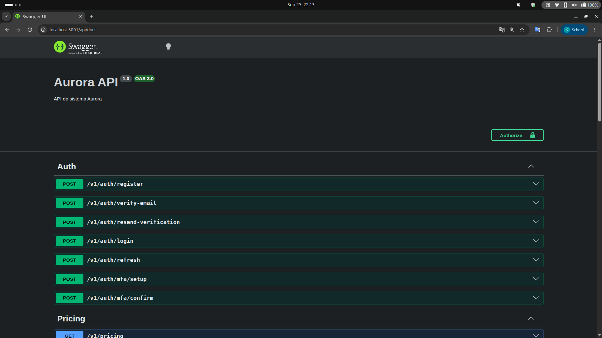

# Implementation: Agent Pipeline, Epics Delivered, and How to Run Them

This document explains how Aurora is actually built — the agent pipeline used for every epic — and, for each epic delivered so far, what was produced, how to run it, and how to test it. It replaces the old per-sprint delivery notes (`sprint-4-delivery.md`, `sprint-5-delivery.md`): epics don't map one-to-one onto sprints once more than one lands in the same sprint, so a single document that grows with each epic stays accurate longer than one file per sprint would.

## 1. Why an agent pipeline

Aurora is built by a fixed sequence of specialized Claude Code agents, defined in `.claude/agents/`, instead of one agent doing everything end to end. Each agent has a narrow role, a fixed set of tools, and a single kind of output. Splitting the work this way keeps every stage auditable on its own: the product-analyst's stories can be reviewed and approved before any architecture exists, the architect's contracts can be approved before any code exists, and so on. Two gates enforce this: the product-analyst's stories and the architect's design each require human approval before the next stage starts.

## 2. The pipeline, stage by stage

| Stage | Agent | Input | Output | Gate |
|---|---|---|---|---|
| 1 | `product-analyst` | An approved epic from `docs/product-requirements.md` | `docs/epics/<epic>/stories.md`: user stories with Given/When/Then acceptance criteria | Human approves stories before stage 2 |
| 2 | `architect` | Approved stories | `docs/architecture/<epic>.md` (stack, data model, API contracts) and `docs/adr/NNNN-*.md` (one ADR* per nontrivial decision) | Human approves design before stage 3 |
| 3a | `backend-dev` | Approved architecture and ADRs | API endpoints and database schema, one story (or small batch) at a time, on the feature branch | qa must pass the story |
| 3b | `frontend-dev` | Approved architecture and ADRs | UI screens consuming the approved API contracts, following the Aurora brand system | qa must pass the story |
| 4 | `qa` | Implemented story | Automated tests per acceptance criterion (normal, hard, failure cases); pass/fail reported back to the owning dev | Up to 2 fix-and-fail rounds before escalation |
| 5 | `reviewer` | Full epic diff, ADRs, architecture doc, qa results | `docs/epics/<epic>/summary.md`: epic summary in English, APA style, with any deviations flagged | Human approves before merge |

*ADR = Architecture Decision Record.

Each agent's exact instructions live in `.claude/agents/<name>.md` and are the actual prompt used, not a paraphrase, so they can be inspected directly.

Guardrails that hold across every stage:

- Documentation agents (`product-analyst`, `architect`, `reviewer`) never write source code. Implementation agents (`backend-dev`, `frontend-dev`) never write documentation and never touch the other's code (backend-dev does not touch frontend code and vice versa).
- `qa` may only create or edit test files. A failing test is fixed by the owning dev, never by qa itself.
- Nothing merges without a human-approved `reviewer` summary as the final gate.

## 3. Branches and merge order

Epics build on each other when a later one depends on an earlier one's data model, not strictly in a straight line to `main`:

```
main
 └── feature/e2-campaign-planning-pool-buying   (E2; PR open: GitHub #1 / GitLab MR pending)
      └── feature/e3-creator-matching-curation  (E3; PR open: GitHub #2 / GitLab MR pending)
```

E3's `matching` module depends directly on E2's `campaign` module (it replaces E2's stub matching engine with a real one and writes into E2's `campaign_pool_member` table), so E3 was built on top of E2's branch rather than on `main`. **To see or run everything built so far, check out `feature/e3-creator-matching-curation`** — it contains E1 (already in `main`), E2, and E3.

## 4. Epic 1 — Access and Onboarding

Removes the enterprise sales cycle from onboarding: a brand or agency can sign up, verify their email, configure a workspace, invite teammates, and (for agencies) manage client accounts, all without a sales call. **Status: merged to `main`.**

- Stories: [docs/epics/e1-access-onboarding/stories.md](epics/e1-access-onboarding/stories.md)
- Architecture: [docs/architecture/e1-access-onboarding.md](architecture/e1-access-onboarding.md)
- ADRs: [0001-authentication-strategy](adr/0001-authentication-strategy.md), [0002-tenant-isolation-model](adr/0002-tenant-isolation-model.md), [0003-rbac-model](adr/0003-rbac-model.md), [0004-brand-profile-draft-lifecycle](adr/0004-brand-profile-draft-lifecycle.md)
- Implementation: `backend/src/` (NestJS: auth, pricing, brand-profile, invitation, workspace, agency, audit, jobs modules) and `frontend/src/` (React/Vite: public pages, protected app pages)
- Epic summary (reviewer's output, the actual grading artifact): [docs/epics/e1-access-onboarding/summary.md](epics/e1-access-onboarding/summary.md)

**Routes:**

| Route | Access | Description |
| --- | --- | --- |
| `/pricing` | public | Pricing page with Brand/Agency toggle |
| `/register` | public | Sign-up with workspace type selection |
| `/verify-email` | public | Email verification (link from email) |
| `/login` | public | Login with MFA support |
| `/invitations/accept` | public | Accept team invitation |
| `/app/brand-profile` | auth | Brand profile editor (logo, tone, guidelines) |
| `/app/team` | auth | Manage team, invitations, and roles |
| `/app/clients` | agency | Agency client account list (limit: 10 on the pilot plan) |
| `/app/clients/:id` | agency | Client detail + operator management |

**Roles:**

| Role | Workspace | Can do |
| --- | --- | --- |
| `brand_owner` | Brand | Everything: profile, campaigns, invite team, change roles |
| `brand_manager` | Brand | Edit profile, create campaigns. Cannot invite. |
| `brand_analyst` | Brand | Read-only |
| `agency_admin` | Agency | Everything: clients, team, operators |
| `agency_operator` | Agency | Only assigned client accounts |

**Endpoints** (25 total, all under `/v1`): Auth (7) — `POST /auth/register`, `/auth/verify-email`, `/auth/resend-verification`, `/auth/login`, `/auth/refresh`, `/auth/mfa/setup`, `/auth/mfa/confirm`. Pricing (1) — `GET /pricing` (public). Brand Profile (4) — `POST /brand-profiles`, `PATCH /brand-profiles/:id`, `GET /brand-profiles/current`, `POST /brand-profiles/:id/logo`. Invitations (5) — `POST /invitations`, `POST /invitations/:id/resend`, `GET /invitations`, `POST /invitations/accept`, `DELETE /invitations/:id`. Workspace (4) — `GET /workspaces/current`, `GET /accounts/:id/members`, `PATCH /accounts/:id/members/:userId`, `DELETE /accounts/:id/members/:userId`. Agency (4) — `POST /agency/clients`, `GET /agency/clients`, `POST /agency/clients/:id/operators`, `DELETE /agency/clients/:id/operators/:userId`.

**Known tech debt from E1** (tracked for future sprints): breached-password check not implemented; MFA secret persisted before confirmation; MFA secrets not encrypted at the application level; pricing data hardcoded instead of DB + Redis; invitation-accepted email has an empty `to` field; pt-BR strings not externalized into keyed resources; `GET /agency/clients` lacks cursor-based pagination (acceptable at the pilot cap of 10).

## 5. Epic 2 — Campaign Planning and Pool Buying

Lets a brand define a campaign's budget, audience, and message once, see the matched creator pool's projected reach and price before committing, and buy that pool at one locked price instead of negotiating per creator. **Status: implemented and tested, pending merge.**

- Stories: [docs/epics/e2-campaign-planning-pool-buying/stories.md](epics/e2-campaign-planning-pool-buying/stories.md)
- Architecture: [docs/architecture/e2-campaign-planning-pool-buying.md](architecture/e2-campaign-planning-pool-buying.md)
- ADRs: [0005-campaign-pool-allocation-model](adr/0005-campaign-pool-allocation-model.md), [0006-campaign-state-machine](adr/0006-campaign-state-machine.md), [0007-reallocation-bounds-defaults](adr/0007-reallocation-bounds-defaults.md), [0008-pool-shortfall-resolution-criteria](adr/0008-pool-shortfall-resolution-criteria.md), [0009-campaign-minimum-budget](adr/0009-campaign-minimum-budget.md), [0010-template-library-scope](adr/0010-template-library-scope.md)
- Implementation: `backend/src/campaign/` (new NestJS module: campaign CRUD, async quoting, confirm/pause/resume/cancel, shortfall resolution, budget reallocation, templates) and new frontend pages under `frontend/src/pages/app/` (`campaigns-page`, `campaign-form-page`, `campaign-detail-page`, `shortfall-page`, `templates-page`, `template-instantiate-page`)
- Epic summary (reviewer's output, the actual grading artifact): [docs/epics/e2-campaign-planning-pool-buying/summary.md](epics/e2-campaign-planning-pool-buying/summary.md)

## 6. Epic 3 — Creator Matching and Curation

Replaces Epic 2's placeholder matching engine with a real one, ranking creators by audience fit, authenticity, engagement, and historical reliability, and lets a brand approve or reject individual creators, exclude specific creators or competitor-associated ones, and lets an agency override the shortlist with its own network. Also gives the creator (Duda) a minimal portal to accept or decline a campaign opportunity. **Status: implemented and tested, pending merge.**

- Stories: [docs/epics/e3-creator-matching-curation/stories.md](epics/e3-creator-matching-curation/stories.md)
- Architecture: [docs/architecture/e3-creator-matching-curation.md](architecture/e3-creator-matching-curation.md)
- ADRs: [0011-real-matching-engine-scoring-model](adr/0011-real-matching-engine-scoring-model.md) through [0018-additional-candidates-as-top-up](adr/0018-additional-candidates-as-top-up.md)
- Implementation: `backend/src/matching/` (new NestJS module: real matching engine replacing E2's stub, shortlist generation/approval, creator exclusions, agency override, creator-portal opportunities) and new frontend pages (`shortlist-page`, `creator-metrics-page`, `exclusions-page`, `shortlist-override-page`, plus a separate `creator-portal/` route tree for the creator-facing opportunity flow)
- Epic summary (reviewer's output, the actual grading artifact): [docs/epics/e3-creator-matching-curation/summary.md](epics/e3-creator-matching-curation/summary.md)

Both E2's and E3's summaries flag the same carried-over gap first raised in E1's review: `TenantContextMiddleware` is still not registered in `AppModule`, so row-level security is defined in the database but not enforced at runtime; isolation currently relies on explicit `accountId`/`creatorId` filtering in application code, checked in every new service. This remains open for a future sprint.

## 7. How to run it

```bash
# 0. Check out the branch with the latest delivered epics
git checkout feature/e3-creator-matching-curation

# 1. Start Postgres and Redis
docker compose up -d

# 2. Backend
cd backend
cp .env.example .env
npm install
npx tsx src/database/run-migrations.ts
npm run start:dev        # http://localhost:3001/v1

# 3. Frontend (separate terminal)
cd frontend
npm install
npm run dev               # http://localhost:5173
```

Live, interactive API documentation (Swagger/OpenAPI) is available once the backend is running, at:

```
http://localhost:3001/api/docs
```



It lists all endpoints grouped by module (including `campaign` and `matching` alongside E1's), with request/response schemas and a "Try it out" action to call each one directly from the browser.

Note: the email provider is currently a console-log stub (`EMAIL_PROVIDER=console` in `backend/.env`), not a real mail sender. Verification and invitation links are printed to the backend terminal output instead of arriving in an inbox. This is documented as a known limitation, not a bug, and is tracked as tech debt for a future sprint.

## 8. How to test it

**Automated tests**, run from each project's own directory:

```bash
cd backend && npx vitest run
cd frontend && npx vitest run
```

As of the last pipeline run, on `feature/e3-creator-matching-curation` (E1+E2+E3 combined): **backend 107/107 passing**, **frontend 31/31 passing**. Build and lint are clean on both packages. Exact per-story pass/fail counts and any deviations are reported in each epic's summary, linked in sections 4-6 above, since those are qa's and the reviewer's verified output rather than a claim made ahead of time.

**Manual walkthrough**, once both servers are running:

1. Visit `http://localhost:5173/pricing`: pricing is visible with no login required.
2. Go to `/register`, pick Brand or Agency, and submit the form.
3. Copy the verification link printed in the backend terminal output and open it.
4. Log in at `/login`.
5. As a Brand: fill in the profile at `/app/brand-profile`, invite a teammate at `/app/team`.
6. As an Agency: create a client at `/app/clients`, manage its operators at `/app/clients/:id`.
7. At `/app/campaigns`, create a campaign: set a budget (minimum R$ 2,000, per ADR-0009), audience targeting, message, and deliverable formats.
8. Request a quote; the page polls until the async job resolves to a locked price and guaranteed minimum pool size.
9. Confirm the campaign, then open its shortlist (`/app/campaigns/:id/shortlist`) to see creators ranked by fit, with audience/authenticity/engagement metrics, and approve or reject individual creators.
10. At `/app/exclusions`, add a creator or competitor-brand exclusion and confirm it only affects future shortlist generations, not the current one.
11. As an agency role, try the shortlist override screen to remove/add creators against the agency's own network.
12. Visit `/creator-portal` with a seeded creator ID (the pilot login stub, ADR-0013) to accept or decline an opportunity as Duda would.
13. Pause, resume, or cancel the campaign from the detail page and confirm the state transitions match the rules in [ADR-0006](adr/0006-campaign-state-machine.md).

The full route map, roles table, and endpoint list for E1 are in section 4 above; for E2 and E3, in the architecture documents linked in sections 5 and 6.

## 9. Known limitations carried across epics

- No `CONFIRMED → ACTIVE` campaign-state transition exists yet, so the shortlist lock-on-activation path is only exercisable today through the agency-override trigger. Flagged in both E2's and E3's summaries, not a defect in either epic individually.
- Automatic budget reallocation (E2, US-10) is fully implemented and tested but inert in this build, since it depends on a social-platform metrics feed (FR-52) that is out of scope until a later epic.
- Commission rate (15%) and opportunity expiry window (72h) in E3 are explicit placeholders pending Epic 6 (Payments and Financial Transparency).
- The creator-portal login (`POST /creator-portal/login`) is a passwordless pilot stub pending Epic 8 (Creator Recruitment and Growth)'s real creator authentication.
- Tenant-context middleware (RLS enforcement) remains unregistered, carried over from E1.

## 10. Field research conducted alongside Epic 1

In parallel with building Epic 1, three market validation interviews were conducted with practitioners in the Brazilian creator economy, to check Aurora's market hypotheses (pricing predictability, client segmentation, automation maturity, and the role of agencies) against how established players actually operate. All interviews were conducted and analyzed by Kaiane Souza, using a shared interview guide (available in [English](field-research/Creator_Economy_Interview_Guide_EN.pdf) and [Portuguese](field-research/Creator_Economy_Interview_Guide_PT.pdf)), cross-referencing the question script, personal notes, an automated meeting summary, and the full transcript for each conversation.

| Interview | Interviewee | Organization | Focus |
|---|---|---|---|
| [Creator Ads, Go-to-Market perspective](field-research/Creator_Ads_Kevin_Interview_Analysis.pdf) | Kevin Ramlow, Go-to-Market Engineer | Creator Ads | First validation pass against a category leader: pricing, client profile, automation, creator dynamics, agency role |
| [Creator Ads, Operations perspective](field-research/Creator_Ads_Lidia_Interview_Analysis.pdf) | Lidia Nascimento, Campaign Operations Lead | Creator Ads | Second interview at the same company, cross-checked against the first for agreement and divergence |
| [PlayNest](field-research/PlayNest_Gabriel_Interview_Analysis.pdf) | Gabriel Paes Leme, Head of PlayNest | Play9 Group | Executive-level perspective from a second category player: company history, positioning, relationship philosophy |

This research grounds the assumptions behind the epics being built, including the pricing model exposed publicly in US-02 and the agency-client relationship modeled in US-47, in direct input from people operating in this market today rather than in desk research alone.

## 11. Reading order for grading

1. This document, for the process and what each epic delivered.
2. Each epic's summary (linked in sections 4-6), for what was actually built and verified, and any deviations from the design.
3. The architecture documents and ADRs linked in sections 4-6, for the design rationale.
4. The running application, using the steps in sections 7 and 8.
5. The field research interviews in section 10, for the market evidence behind the product decisions.
