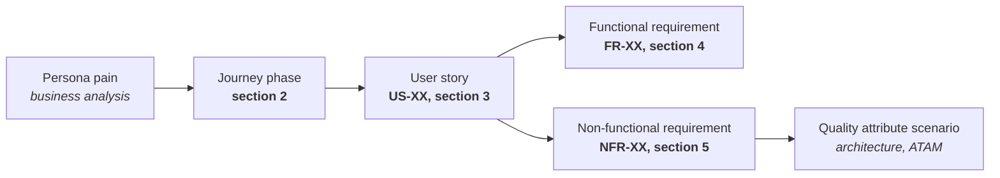
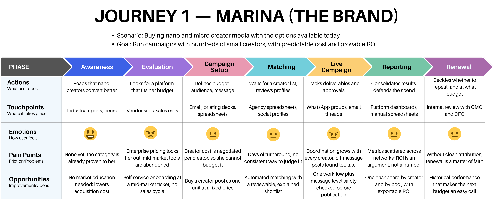
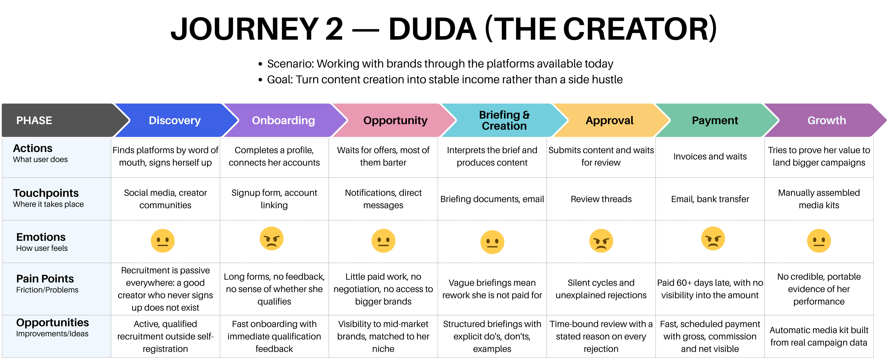
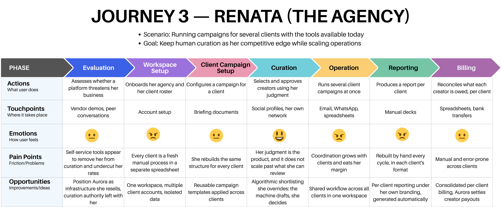
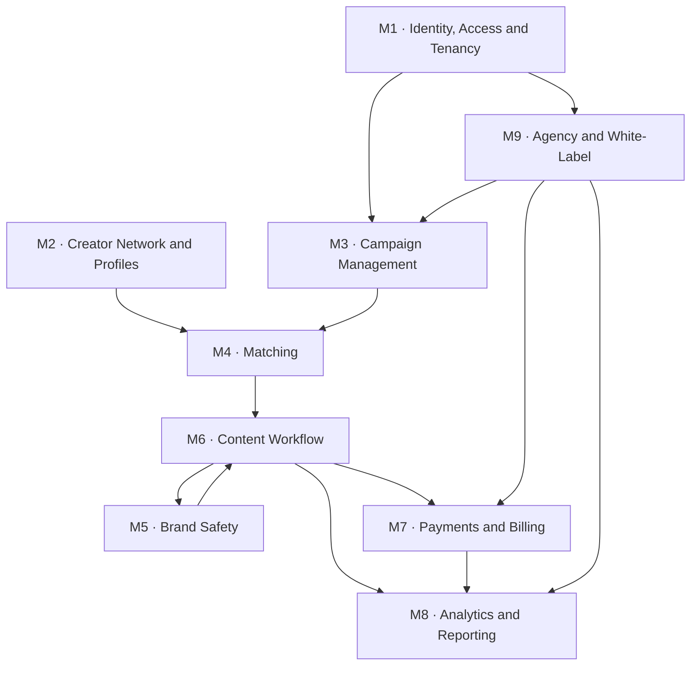

# Aurora's Product Requirements

# Table of Contents
1. [Introduction](#1-introduction)
   - 1.1 [Purpose and Scope](#11-purpose-and-scope)
   - 1.2 [Relationship to the Business Analysis](#12-relationship-to-the-business-analysis)
   - 1.3 [How to Read This Document](#13-how-to-read-this-document)
2. [User Journeys](#2-user-journeys)
   - 2.1 [Overview](#21-overview)
   - 2.2 [The Brand Journey: Marina](#22-the-brand-journey-marina)
   - 2.3 [The Creator Journey: Duda](#23-the-creator-journey-duda)
   - 2.4 [The Agency Journey: Renata](#24-the-agency-journey-renata)
   - 2.5 [Conclusions](#25-conclusions)
3. [User Stories](#3-user-stories)
   - 3.1 [Overview](#31-overview)
   - 3.2 [Epics](#32-epics)
   - 3.3 [Story Catalog](#33-story-catalog)
   - 3.4 [Acceptance Criteria for Priority Stories](#34-acceptance-criteria-for-priority-stories)
   - 3.5 [Conclusions](#35-conclusions)
4. [Functional Requirements](#4-functional-requirements)
   - 4.1 [Overview](#41-overview)
   - 4.2 [Requirements Catalog](#42-requirements-catalog)
   - 4.3 [Conclusions](#43-conclusions)
5. [Non-Functional Requirements](#5-non-functional-requirements)
   - 5.1 [Overview](#51-overview)
   - 5.2 [Requirements Catalog](#52-requirements-catalog)
   - 5.3 [Traceability](#53-traceability)
   - 5.4 [Conclusions](#54-conclusions)
6. [References](#6-references)

## 1. Introduction

### 1.1 Purpose and Scope

This document defines **what** Aurora must do. It takes the market gaps and customer pains established in [Aurora's Business Analysis](./business-analysis.md) and converts them into a specification an engineering team can build against: user journeys, user stories, functional requirements, and non-functional requirements.

It deliberately does not decide **how** the system is built. That belongs to [Aurora's Architecture](./architecture.md), which takes this document as its input. The seam between the two is section 5: each non-functional requirement states a measurable target, and the architecture document is answerable for meeting it. The scope is the product Aurora intends to ship, not a minimum viable subset; MoSCoW labels are what separate the first release from everything after it.

### 1.2 Relationship to the Business Analysis

Everything here traces back to the business analysis. Three of its sections do most of the work:

- **Personas** ([2.6](./business-analysis.md#26-personas)) supply the three actors used throughout: **Marina** (brand media manager), **Duda** (nano creator), and **Renata** (agency partner). They are not redefined here; their frustrations are the raw material for the journeys in section 2.
- **The Value Proposition Canvas** ([2.7](./business-analysis.md#27-value-proposition-canvas)) mapped each persona's pains against what Aurora offers. Every pain reliever there has to become a concrete behavior somewhere in this document, or it was never a real commitment.
- **The Gap Analysis** ([2.3](./business-analysis.md#23-gap-analysis)) sets priority. Pool buying, real-time optimization, and message-level brand safety are **table stakes**: necessary, but they give Aurora no advantage. The two open gaps are the **mid-market** and **treating creators as customers instead of anonymous supply**.

That last conclusion shapes prioritization in a way that may look counterintuitive: creator-side requirements such as payment speed, briefing clarity, and earnings transparency carry a priority as high as the brand-facing features, even though brands are the ones paying. Aurora wins brands by first winning creators, because a loyal creator base is what makes predictable, high-quality campaigns possible at all.

### 1.3 How to Read This Document

Sections 2 through 5 form a chain, and each link cites the one before it.

<strong>Figure 1</strong> — <em>The Traceability Chain from Business Pain to Requirement</em>

A journey phase exposes friction; a story describes the behavior that removes it in the customer's own terms; a functional requirement states that behavior precisely enough to build and test; a non-functional requirement constrains how well it must perform. Because each artifact cites its origin, any requirement traces back to the pain that justifies it, and any unjustified requirement shows up as a break in the chain. Reading section 4 alone gives a list of features with no argument behind them.

## 2. User Journeys

### 2.1 Overview

A user journey map lays out the full path a person takes to accomplish a goal, phase by phase, recording what they do, what frustrates them, and how they feel along the way (Kalbach, 2020). It describes the experience, not the screens. That includes the parts that happen outside the product entirely, such as Marina justifying a budget to her CFO or Duda waiting sixty days for a payment nobody explains.

Journeys come before stories for a reason: a team that starts from a feature list builds what it already imagined, while a team that starts from a journey builds what the customer actually gets stuck on. The low points are where the product has permission to exist, and they become the epics in section 3. Aurora is multi-sided, so it needs one journey per customer. The three below are not independent. The moment Marina's campaign goes live is the moment Duda receives a briefing, and a delay on one side becomes a pain on the other. Each map uses a five-point scale where 1 marks acute frustration and 5 a phase that works well, describing the experience **today**, which is what makes the dips actionable.

### 2.2 The Brand Journey: Marina

Marina manages an influencer budget split between one or two safe macro creators and occasional micro campaigns run through agencies or spreadsheets. She knows nano and micro creators convert better. Her problem is that acting on that knowledge costs more coordination than her team has. Everything Aurora offers her reduces entry cost or coordination cost; anything that reduces neither is not solving her problem.

<strong>Figure 2</strong> — <em>Marina's Current Journey, Buying Nano and Micro Creator Media</em>

**Highlights.**

- **Evaluation is the first low point.** This is where entry cost bites. Marina is disqualified by price before she ever sees the product: enterprise platforms start above her budget, and the tools built for her budget were abandoned years ago.
- **Live campaign is the second.** This is where coordination cost lands. Effort grows with every creator added, and off-message posts surface only after publication. Managing a hundred nano creators really is more work than managing one macro creator, and no enthusiasm for the data changes that arithmetic.
- **Awareness is already won.** She arrives convinced that nano and micro creators convert better, so Aurora inherits a validated category and pays no market-education cost.

### 2.3 The Creator Journey: Duda

Duda has created content for two years with above-average engagement for her size. Her income is unstable, mixing barter partnerships with occasional paid work. Fewer than one in five creators like her have ever been paid at all. Her journey is flat and low across almost its entire length, which is the point: a journey with no high points is what being treated as anonymous supply looks like from the inside. The product has to support recruiting a creator who has never heard of Aurora, not merely serving one who signs up.

<strong>Figure 3</strong> — <em>Duda's Current Journey, Working with Brands</em>

**Highlights.**

- **Payment is the deepest pain and the easiest to fix credibly.** Sixty days or more, with no visibility into the amount or the commission taken. Paying fast, on a schedule, with a visible breakdown is an operational commitment rather than a technical breakthrough, and creators feel it immediately.
- **Discovery is the one nobody has solved.** Every competitor's creator base runs on open self-registration, so a good creator who never signs up does not exist to the market. Active recruitment is where Aurora's only durable advantage is built.
- **Approval and briefing are unpaid rework.** Vague briefs and silent review cycles cost Duda time she is not paid for. It is the same event Marina experiences as coordination cost.

### 2.4 The Agency Journey: Renata

Renata built her agency's reputation on human curation. She watches self-service platforms enter the market and worries her role is being designed out of it. The business analysis found the opposite is happening commercially, with agencies buying and building infrastructure rather than being cut out, which makes her a customer rather than a casualty.

<strong>Figure 4</strong> — <em>Renata's Current Journey, Running Client Campaigns</em>

**Highlights.**

- **Curation is the single high point, and it does not scale.** It is what she sells, and it is capped at what she can personally review. Automating it away is technically straightforward and commercially self-defeating.
- **Operation and reporting are where her margin goes.** Coordination grows with every client, and every report is rebuilt by hand in each client's expected format.
- **Her needs are mostly the multi-tenant form of Marina's**, which is why the agency offering extends the brand product rather than duplicating it.

Curation is the only phase she scores well, and the one she does entirely by hand. That tension is what the agency offering has to resolve without taking the activity away from her: Aurora's matching engine drafts a shortlist and Renata decides, with the ability to introduce creators from her own network. She keeps the judgment; Aurora removes the coordination cost around it.

### 2.5 Conclusions

Read together, the three journeys converge on nine friction points, and those become the **epics** of section 3. An epic groups related user stories under one shared goal. It is a theme too big to build or test as a single story, but coherent enough to plan as a unit. It sits between the journey and the story: the journey identifies the friction, the epic names the capability that removes it, and the stories break that capability into deliverable pieces. Table 1 in section 3.2 lists all nine with the friction each one answers.

Three observations shape everything downstream. **The journeys are coupled through timing.** Marina's live campaign phase and Duda's briefing, approval, and payment phases are the same events seen from opposite sides, so a slow approval is a delay for Marina and unpaid rework for Duda. This is why several requirements in section 4 are time-bound obligations rather than features: the deadline is the product. **The creator journey has the deepest dips, and that is where the advantage is.** Marina's pains are already solved by competitors for larger brands, so solving them earns Aurora the right to compete rather than to win, while Duda's are unsolved market-wide, which is why payment speed, briefing clarity, and active recruitment are **Must** priorities rather than niceties scheduled after the revenue features. **Renata is served by extending the brand product, not duplicating it.** E9 collects the genuinely agency-specific parts; everything else she uses is shared.

## 3. User Stories

### 3.1 Overview

A user story states a need from the customer's point of view, in the form **As a &lt;persona&gt;, I want &lt;action&gt;, so that &lt;benefit&gt;** (Cohn, 2004). The value of the format is that it carries the reason it exists, which is what guides the development of the platform in a deterministic way. Each story here names its persona from the business analysis, belongs to one epic, and cites the journey phase that produced it. Stories are prioritized with **MoSCoW** (Agile Business Consortium, 2014):

- **Must**: the product is not viable without it. Either it is table stakes the market already expects, or it is one of the two gap-closing bets Aurora exists to make.
- **Should**: significant value, but the product still works without it in a first release.
- **Could**: desirable, taken only if capacity allows.
- **Won't** (this cycle): explicitly out of scope, recorded so the decision stays visible rather than being forgotten.

Acceptance criteria use **Given / When / Then**, the format popularized by behavior-driven development (North, 2006). Good criteria are observable and falsifiable: a tester who does not know the implementation gets an unambiguous pass or fail. "The shortlist is relevant" fails that test; "at least 20 creators, each matching at least two campaign attributes, returned within 60 seconds" passes it. Section 3.4 expands the highest-priority stories; the rest carry the same standard when they enter a sprint.

### 3.2 Epics

The nine epics below are drawn directly from the journey friction points identified in [section 2.5](#25-conclusions). Each one exists because a journey dipped, not because it seemed like a sensible module, which is why they do not map one-to-one onto the functional modules in section 4. The epics are organized around **customer pain**, the modules around **system responsibility**, and the two decompositions deliberately cut the product in different directions.

<strong>Table 1</strong> — <em>The Nine Epics, the Journey Friction Each Removes, and Its Strategic Role</em>

| Epic | Name | Friction it removes | Personas | Strategic role |
|---|---|---|---|---|
| E1 | Access and Onboarding | Entry blocked by enterprise pricing and heavy onboarding | Marina, Renata| Closes the mid-market gap at the point of entry: no sales cycle, no enterprise contract |
| E2 | Campaign Planning and Pool Buying | Creator cost cannot be predicted or budgeted like media | Marina, Renata| Table stakes. Buying a creator pool as one media unit at a predictable price |
| E3 | Creator Matching and Curation | Matching is slow, manual, and hard to judge | Marina, Renata, Duda| Table stakes for brands, and the point where Renata's judgment is preserved rather than automated away |
| E4 | Brand Safety | Off-message content discovered only after publication | Marina| Table stakes. Message-level checking before publication, not format-level checking after |
| E5 | Briefing and Content Workflow | Briefings are vague and review cycles are silent | Duda, Marina| Serves both sides at once: clarity for Duda is fewer rework cycles for Marina |
| E6 | Payments and Financial Transparency | Payment is slow, opaque, and non-negotiable | Duda, Marina, Renata| The deepest creator pain and the most credible promise Aurora can keep |
| E7 | Analytics and Reporting | Results are scattered and ROI is unprovable | Marina, Renata, Duda| Turns campaign results into the ROI argument that drives renewal |
| E8 | Creator Recruitment and Growth | Good creators are invisible unless they self-register | Duda| The core bet. Active recruitment outside self-registration is the only durable advantage identified |
| E9 | Agency Multi-Client Operations | Running several clients means rebuilding everything per client | Renata| Opens agencies as a distribution channel and infrastructure customer |

### 3.3 Story Catalog

Forty-seven stories, grouped by primary persona. The **Origin** column cites the journey phase from section 2 that produced the story.

#### Brand stories

<strong>Table 2</strong> — <em>User Stories for the Brand, Marina</em>

| ID | Epic | Story | Origin | Priority |
|---|---|---|---|---|
| US-01 | E1 | As Marina, I want to sign up and configure my workspace without going through a sales call, so that I can start without an enterprise procurement cycle | Marina, evaluation | Must |
| US-02 | E1 | As Marina, I want to see the full price before I commit, so that I can check it fits my budget without requesting a quote | Marina, evaluation | Must |
| US-03 | E1 | As Marina, I want to register my brand profile, guidelines, and tone of voice, so that every campaign inherits them automatically | Marina, campaign setup | Must |
| US-04 | E1 | As Marina, I want to invite teammates with defined roles, so that my team can collaborate without sharing one login | Marina, campaign setup | Should |
| US-05 | E2 | As Marina, I want to define a campaign once with budget, audience, message, and deliverables, so that I do not repeat the brief for every creator | Marina, campaign setup | Must |
| US-06 | E2 | As Marina, I want to see the estimated pool size, projected reach, and total price before confirming, so that I can plan the buy like paid media | Marina, campaign setup | Must |
| US-07 | E2 | As Marina, I want to buy the creator pool at one fixed price, so that my cost is predictable and needs no per-creator negotiation | Marina, campaign setup | Must |
| US-08 | E2 | As Marina, I want to save a campaign as a reusable template, so that recurring campaigns take minutes instead of days | Marina, renewal | Should |
| US-09 | E2 | As Marina, I want to pause, resume, or cancel a running campaign, so that I can react to a brand incident immediately | Marina, live campaign | Must |
| US-10 | E2 | As Marina, I want the budget to shift automatically toward the best-performing creators, so that spend follows results while the campaign is still running | Marina, live campaign | Should |
| US-11 | E3 | As Marina, I want an automatic shortlist of creators ranked by fit, so that I do not wait days for a manual list | Marina, matching | Must |
| US-12 | E3 | As Marina, I want to inspect each creator's audience and authenticity metrics, so that I can trust the match instead of guessing from a follower count | Marina, matching | Must |
| US-13 | E3 | As Marina, I want to approve or reject individual creators in the shortlist, so that I keep final say over who represents the brand | Marina, matching | Must |
| US-14 | E3 | As Marina, I want to maintain an exclusion list of creators and competitor associations, so that conflicts never reach a shortlist | Marina, matching | Should |
| US-15 | E4 | As Marina, I want to define brand safety rules and prohibited topics, so that safety reflects my brand rather than a generic default | Marina, live campaign | Must |
| US-16 | E4 | As Marina, I want every submission checked at the message level before publication, so that off-message content never goes live | Marina, live campaign | Must |
| US-17 | E4 | As Marina, I want flagged content routed to me for a human decision, so that an automated check never silently blocks legitimate content | Marina, live campaign | Must |
| US-18 | E5 | As Marina, I want to send one structured briefing to the entire pool, so that coordination does not scale with creator count | Marina, live campaign | Must |
| US-19 | E5 | As Marina, I want to approve or reject a draft with a stated reason, so that revisions converge instead of looping | Marina, live campaign | Must |
| US-20 | E6 | As Marina, I want one consolidated invoice covering the whole pool, so that finance processes a single document instead of hundreds | Marina, reporting | Must |
| US-21 | E7 | As Marina, I want one dashboard showing results by creator and by pool, so that I stop assembling metrics from several platforms | Marina, reporting | Must |
| US-22 | E7 | As Marina, I want to export a report that proves ROI, so that I can defend the spend to my CMO and CFO | Marina, reporting and renewal | Must |

#### Creator stories

<strong>Table 3</strong> — <em>User Stories for the Creator, Duda</em>

| ID | Epic | Story | Origin | Priority |
|---|---|---|---|---|
| US-23 | E8 | As Duda, I want to be found and invited by Aurora directly, so that my work reaches brands even though I never registered on a platform | Duda, discovery | Must |
| US-24 | E8 | As Duda, I want onboarding to be quick and tell me immediately whether I qualify, so that I am not left guessing after filling a long form | Duda, onboarding | Must |
| US-25 | E8 | As Duda, I want an automatic media kit built from my real campaign data, so that I can prove my value without assembling one by hand | Duda, growth | Should |
| US-26 | E8 | As Duda, I want to be visible to mid-market brands, so that I am not limited to barter offers from local businesses | Duda, opportunity | Should |
| US-27 | E8 | As Duda, I want to set and update my own rate, so that I have a say in what my work is worth | Duda, opportunity | Could |
| US-28 | E3 | As Duda, I want to review an opportunity and accept or decline it, so that I choose which brands I work with | Duda, opportunity | Must |
| US-29 | E6 | As Duda, I want to see gross amount, commission, and net payout before I accept, so that I am never surprised by what I actually receive | Duda, opportunity and payment | Must |
| US-30 | E5 | As Duda, I want a briefing with explicit do's, don'ts, and examples, so that I do not guess at what the brand wants | Duda, briefing and creation | Must |
| US-31 | E5 | As Duda, I want to ask a question about the briefing and get an answer, so that ambiguity is resolved before I produce anything | Duda, briefing and creation | Should |
| US-32 | E5 | As Duda, I want to submit a draft and see when review will finish, so that I am not waiting on a silent process | Duda, approval | Must |
| US-33 | E5 | As Duda, I want a stated reason whenever my content is rejected, so that I can fix it instead of guessing | Duda, approval | Must |
| US-34 | E5 | As Duda, I want to confirm publication by submitting the live post link, so that my delivery is recorded and my payment is triggered | Duda, approval | Must |
| US-35 | E6 | As Duda, I want to be paid within a committed window after publication, so that creating content becomes stable income rather than a gamble | Duda, payment | Must |
| US-36 | E6 | As Duda, I want to see my full payment history and statements, so that I always know what I have earned and what is still owed | Duda, payment | Must |
| US-37 | E7 | As Duda, I want to see how my content performed, so that I can improve and demonstrate results to future brands | Duda, growth | Should |

#### Agency stories

<strong>Table 4</strong> — <em>User Stories for the Agency, Renata</em>

| ID | Epic | Story | Origin | Priority |
|---|---|---|---|---|
| US-38 | E9 | As Renata, I want one workspace holding several client accounts with isolated data, so that I stop managing clients in separate spreadsheets | Renata, workspace setup | Must |
| US-39 | E9 | As Renata, I want to run campaigns on behalf of a specific client, so that every campaign is attributed to the right account | Renata, client campaign setup | Must |
| US-40 | E3 | As Renata, I want to override the shortlist and add creators from my own network, so that my curation stays the product I sell | Renata, curation | Must |
| US-41 | E9 | As Renata, I want to apply reusable templates across clients, so that I do not rebuild the same structure for every account | Renata, client campaign setup | Should |
| US-42 | E6 | As Renata, I want consolidated per-client billing with Aurora paying the creators, so that I stop reconciling payouts by hand | Renata, billing | Must |
| US-43 | E7 | As Renata, I want per-client reports under my own branding, so that I deliver them as my agency's work | Renata, reporting | Should |
| US-44 | E9 | As Renata, I want to white-label the client-facing surface, so that Aurora is my infrastructure rather than my competitor | Renata, evaluation | Should |
| US-45 | E9 | As Renata, I want to grant my team per-client permissions, so that account managers only reach the clients they handle | Renata, workspace setup | Should |
| US-46 | E7 | As Renata, I want to compare performance across my clients, so that I can apply what works in one account to another | Renata, reporting | Could |
| US-47 | E1 | As Renata, I want to onboard a new client without rebuilding my process, so that growing my roster does not grow my overhead proportionally | Renata, workspace setup | Should |

**Explicitly out of scope this cycle (Won't).** Recorded so the decision stays visible: a creator-facing mobile application, since the creator workflow is served through a responsive web interface first; direct integration with brands' internal media-planning or DSP systems, which is enterprise-shaped work aimed at the segment Aurora is not targeting; content production tooling such as editing or scheduling, which is well served by existing products; and marketplace-style open bidding between brands and creators, which conflicts with the fixed-price pool model in US-07.

### 3.4 Acceptance Criteria for Priority Stories

Three stories matter more than the rest. One sets the fixed price model that makes the mid-market work, and two carry the bets from the Gap Analysis. Every other story is held to the same standard when it enters a sprint.

Each set follows the same order. The first criterion covers the normal case. The second covers the hard case that shows whether the promise is real. The third covers what happens when Aurora cannot deliver, and it is the one that matters most: any platform can specify the path where nothing goes wrong.

**US-07 — Buying a pool at a fixed price**

- **Given** Marina has set a budget, an audience, and the content formats she wants, **when** she asks for a quote, **then** she gets one total price, a minimum number of creators, and an expected reach. She never has to negotiate with creators one by one.
- **Given** she has accepted that quote, **when** creators turn out to cost more or less than planned, **then** her price stays the same and Aurora covers the difference.
- **Given** Aurora cannot find enough creators, **when** the launch date arrives, **then** Marina is told before launch and offered either a partial refund or a smaller guarantee. The campaign never starts short without warning her.

**US-23 — Recruiting creators who never signed up**

- **Given** Aurora finds a creator who never signed up, **when** it builds a profile for her from public data, **then** that profile is marked as unclaimed. It is never matched to a campaign, and no brand can see it.
- **Given** an unclaimed profile exists, **when** Aurora invites the creator and she accepts, **then** she checks and corrects the imported data before the profile goes live. She can also refuse and ask Aurora to delete it.
- **Given** the creator refuses the invitation, **when** Aurora records her answer, **then** it deletes everything it imported and does not contact her again about that campaign.

**US-35 — Paying within the promised window**

- **Given** Duda has confirmed that her post is live (US-34) and the content was approved, **when** the payment window ends, **then** Aurora pays her within the deadline it promised when she accepted the job.
- **Given** a payment is scheduled, **when** Duda opens it, **then** she sees the gross amount, the commission, the net amount, and the payment date, all before the money moves.
- **Given** a payment fails, **when** Aurora detects the failure, **then** it tells Duda the reason within 24 hours, and the payment stays listed as owed instead of quietly disappearing.

### 3.5 Conclusions

The catalog holds 47 stories across nine epics: 32 **Must**, 13 **Should**, and 2 **Could**. The Must set is the honest definition of viability, and it is deliberately larger than a lean first release would prefer, because Aurora is entering a market where three capabilities are already table stakes. A version without message-level brand safety or without a unified dashboard does not read as an early product to Marina; it reads as an inferior one. Two tensions in the catalog are worth naming rather than resolving quietly.

**Fixed pool pricing versus creator rate-setting.** US-07 promises Marina one predictable price; US-27 promises Duda a say in her rate. If creators set rates freely, the pool price cannot be fixed in advance. US-27 is therefore ranked **Could**, and the resolution is that Aurora absorbs the variance between what creators are paid and what brands pay. That makes rate flexibility a margin question rather than a pricing-model one, and it is how Aurora can pay creators well while still quoting a flat number.

**Active recruitment versus creator consent.** US-23 involves building profiles for people who never asked for one. The acceptance criteria constrain this deliberately: unclaimed profiles are invisible to brands, never matched, and deleted on request. That is a legal requirement under the LGPD as much as an ethical one, and it becomes NFR-20 and NFR-21 in section 5, then a compliance concern in the architecture. Recruiting creators as customers while treating their data carelessly would contradict the entire premise.

## 4. Functional Requirements

### 4.1 Overview

A functional requirement states a behavior the system must exhibit: something it accepts, computes, decides, stores, or produces. A non-functional requirement constrains **how well** that behavior must be delivered, in terms of speed, reliability, security, or cost. The distinction matters practically, because the two are verified differently. A functional requirement is verified by exercising the behavior once and observing the result; a non-functional requirement is verified by measurement under load, over time, or against a threat model.

The line is easy to blur in a payments context, so this document applies it consistently. "The system pays a creator within the window committed at acceptance" is functional, because there is an obligation and a defined outcome. "Payout execution completes for 99.5% of obligations without manual intervention" is non-functional, because it constrains the reliability of that behavior across many executions.

Requirements are identified as **FR-XX**, grouped into nine functional modules. Every requirement cites the user story it comes from, and no requirement exists without one. The module grouping is a functional decomposition of the product, chosen to make the catalog navigable. It is **not** a component architecture and should not be read as prescribing services, deployment units, or database boundaries, all of which are decided in [Aurora's Architecture](./architecture.md).

<strong>Figure 5</strong> — <em>Functional Modules and Their Principal Dependencies</em>

*Note.* The cycle between M6 and M5 is intentional: content enters brand safety from the workflow and returns to it with a verdict, which is what makes the check a gate before publication rather than an audit after it.

### 4.2 Requirements Catalog

#### M1 — Identity, Access and Tenancy

<strong>Table 5</strong> — <em>Functional Requirements for Identity, Access and Tenancy</em>

| ID | Requirement | Origin | Priority |
|---|---|---|---|
| FR-01 | The system shall allow a brand to register and activate an account through self-service, with email verification and without manual approval or a sales interaction | US-01 | Must |
| FR-02 | The system shall present complete pricing, including the fee model and any commission, before an account holder commits to a purchase | US-02 | Must |
| FR-03 | The system shall store a brand profile containing guidelines, tone of voice, visual assets, and prohibited topics, and apply it as the default for every campaign the brand creates | US-03, US-15 | Must |
| FR-04 | The system shall enforce role-based access control with distinct roles for brand owner, brand manager, brand analyst, creator, agency administrator, and agency operator | US-04, US-45 | Must |
| FR-05 | The system shall allow an account owner to invite users by email and assign a role at invitation time | US-04 | Should |
| FR-06 | The system shall support two workspace types: a brand workspace containing one account, and an agency workspace containing multiple client accounts | US-38 | Must |
| FR-07 | The system shall isolate campaign, creator, content, and financial data between client accounts within an agency workspace, so that no client's data is reachable from another client's context | US-38 | Must |

#### M2 — Creator Network and Profiles

<strong>Table 6</strong> — <em>Functional Requirements for the Creator Network and Profiles</em>

| ID | Requirement | Origin | Priority |
|---|---|---|---|
| FR-08 | The system shall allow a creator to register and link their social accounts through the platforms' authorization flows, without requiring credentials to be shared with Aurora | US-24 | Must |
| FR-09 | The system shall compute and maintain per-creator audience metrics covering audience size, demographic composition, engagement rate, and content niche | US-12, US-24 | Must |
| FR-10 | The system shall compute an authenticity score per creator that detects follower fraud and anomalous engagement patterns, and expose it on the creator profile | US-12 | Must |
| FR-11 | The system shall inform a creator, at the end of onboarding, whether they currently qualify for campaigns and what specifically is missing if they do not | US-24 | Must |
| FR-12 | The system shall allow an unclaimed creator profile to be created from publicly available data, flagged as unclaimed, excluded from matching, and hidden from all brand-facing surfaces | US-23 | Must |
| FR-13 | The system shall provide an invitation and claim flow in which the creator confirms or corrects imported data before the profile becomes active, or declines and triggers deletion of the imported data | US-23 | Must |
| FR-14 | The system shall generate a media kit for a creator from their real campaign history and audience metrics, exportable as a shareable document | US-25 | Should |
| FR-15 | The system shall allow a creator to record rate preferences per deliverable format | US-27 | Could |

#### M3 — Campaign Management

<strong>Table 7</strong> — <em>Functional Requirements for Campaign Management</em>

| ID | Requirement | Origin | Priority |
|---|---|---|---|
| FR-16 | The system shall allow a campaign to be defined once with a budget, audience targeting attributes, a message, deliverable formats, and a timeline | US-05 | Must |
| FR-17 | The system shall produce a quote for a defined campaign stating a guaranteed minimum pool size, a projected reach range, and a single total price, before the campaign is confirmed | US-06 | Must |
| FR-18 | The system shall hold the quoted price fixed once a campaign is confirmed, absorbing any variance in individual creator rates during execution | US-07 | Must |
| FR-19 | The system shall notify the buyer before launch, and offer either a proportional refund or a revised guarantee, whenever the pool cannot be filled to the guaranteed minimum | US-07 | Must |
| FR-20 | The system shall maintain a campaign lifecycle with the states draft, quoted, confirmed, active, paused, completed, and cancelled, and permit only defined transitions between them | US-09 | Must |
| FR-21 | The system shall allow a campaign to be paused, resumed, or cancelled, halting all pending publications on pause or cancellation | US-09 | Must |
| FR-22 | The system shall allow a campaign to be saved as a reusable template and instantiated into a new campaign, including across client accounts in an agency workspace | US-08, US-41 | Should |
| FR-23 | The system shall reallocate remaining budget toward better-performing creators during a live campaign, within bounds configured by the buyer | US-10 | Should |
| FR-24 | The system shall allow a campaign to be created and run on behalf of a specific client account, with the client recorded as the campaign's owner | US-39 | Must |

#### M4 — Matching

<strong>Table 8</strong> — <em>Functional Requirements for Matching</em>

| ID | Requirement | Origin | Priority |
|---|---|---|---|
| FR-25 | The system shall rank eligible creators against a campaign's audience attributes and brand profile, and produce a ranked shortlist meeting at least the guaranteed minimum pool size | US-11 | Must |
| FR-26 | The system shall state, for every creator on a shortlist, the specific campaign attributes that creator satisfied | US-11 | Must |
| FR-27 | The system shall maintain exclusion lists at brand and campaign level, and apply them before a shortlist is produced | US-14 | Should |
| FR-28 | The system shall allow the buyer to approve or reject individual creators on a shortlist before the campaign activates | US-13 | Must |
| FR-29 | The system shall allow an agency to remove creators from a shortlist and add creators from its own network, and shall not reorder or replace that selection afterwards | US-40 | Must |
| FR-30 | The system shall deliver an opportunity to each approved creator, stating the campaign, the deliverable, the payout, and an expiry, and allow the creator to accept or decline it | US-28 | Must |

#### M5 — Brand Safety

<strong>Table 9</strong> — <em>Functional Requirements for Brand Safety</em>

| ID | Requirement | Origin | Priority |
|---|---|---|---|
| FR-31 | The system shall allow a brand to define a safety ruleset covering prohibited topics, restricted language, and competitor mentions, inherited from the brand profile and overridable per campaign | US-15 | Must |
| FR-32 | The system shall analyze submitted content at the message level, covering caption text, on-screen text, and spoken audio, and evaluate it against the campaign's safety ruleset | US-16 | Must |
| FR-33 | The system shall refuse any attempt to mark content as published when that content has not passed the brand safety check | US-16 | Must |
| FR-34 | The system shall route flagged content to a human review queue, citing the specific rule triggered, rather than rejecting it automatically | US-17 | Must |
| FR-35 | The system shall monitor published content links for subsequent edits or removal and flag deviations from the approved version | US-16 | Could |

#### M6 — Content Workflow

<strong>Table 10</strong> — <em>Functional Requirements for the Content Workflow</em>

| ID | Requirement | Origin | Priority |
|---|---|---|---|
| FR-36 | The system shall provide a structured briefing containing explicit do's, don'ts, reference examples, a deliverable specification, and a deadline, and shall not permit a briefing to be issued with those fields empty | US-18, US-30 | Must |
| FR-37 | The system shall distribute a briefing to every creator in a campaign pool in a single action | US-18 | Must |
| FR-38 | The system shall provide a question-and-answer thread on each briefing, visible to the creator who asked and to the buyer | US-31 | Should |
| FR-39 | The system shall accept content drafts from creators and retain every submitted version | US-32 | Must |
| FR-40 | The system shall require a stated reason whenever a draft is rejected, and make that reason visible to the creator | US-19, US-33 | Must |
| FR-41 | The system shall display a review deadline to the creator at submission time and escalate the review when that deadline is breached | US-32 | Must |
| FR-42 | The system shall record publication when a creator submits the live post link, validating that the link resolves and corresponds to the approved content | US-34 | Must |

#### M7 — Payments and Billing

<strong>Table 11</strong> — <em>Functional Requirements for Payments and Billing</em>

| ID | Requirement | Origin | Priority |
|---|---|---|---|
| FR-43 | The system shall display the gross amount, the commission, the net payout, and the expected payment date to a creator before they accept an opportunity | US-29 | Must |
| FR-44 | The system shall create a payout obligation when publication is confirmed under FR-42 and the content has passed approval | US-34, US-35 | Must |
| FR-45 | The system shall execute each payout within the window committed to the creator at the time of acceptance | US-35 | Must |
| FR-46 | The system shall notify a creator within 24 hours when a payout fails, state the reason, and keep the obligation visible as outstanding until settled | US-35 | Must |
| FR-47 | The system shall provide each creator with a complete payment history and downloadable statements covering gross, commission, and net per campaign | US-36 | Must |
| FR-48 | The system shall issue a single consolidated invoice to the buyer per campaign, covering the entire creator pool | US-20 | Must |
| FR-49 | The system shall produce consolidated billing per client account for agency workspaces, while Aurora settles the underlying creator payouts directly | US-42 | Must |
| FR-50 | The system shall generate the tax documentation required for creator payouts in each jurisdiction it operates in | US-36 | Should |

#### M8 — Analytics and Reporting

<strong>Table 12</strong> — <em>Functional Requirements for Analytics and Reporting</em>

| ID | Requirement | Origin | Priority |
|---|---|---|---|
| FR-51 | The system shall present a unified dashboard showing campaign results both per creator and aggregated across the pool | US-21 | Must |
| FR-52 | The system shall ingest performance metrics from connected social platforms throughout a live campaign | US-10, US-21 | Should |
| FR-53 | The system shall export a campaign report containing spend, delivered reach, engagement, and cost efficiency, in a portable document and tabular format | US-22 | Must |
| FR-54 | The system shall present each creator with the performance of their own delivered content | US-37 | Should |
| FR-55 | The system shall generate per-client reports carrying the agency's branding rather than Aurora's | US-43 | Should |
| FR-56 | The system shall allow an agency to compare campaign performance across its client accounts | US-46 | Could |

#### M9 — Agency and White-Label

<strong>Table 13</strong> — <em>Functional Requirements for Agency and White-Label Operations</em>

| ID | Requirement | Origin | Priority |
|---|---|---|---|
| FR-57 | The system shall allow an agency to configure branding, covering logo, colors, and domain, applied to client-facing surfaces and generated reports | US-44 | Should |
| FR-58 | The system shall allow an agency administrator to grant team members access scoped to specific client accounts | US-45 | Should |
| FR-59 | The system shall provide a client onboarding flow within an agency workspace that reuses the agency's existing configuration and templates | US-47 | Should |
| FR-60 | The system shall maintain an audit log of actions taken within each client account, attributable to the acting user | US-38, US-45 | Should |

### 4.3 Conclusions

The catalog holds 60 functional requirements across nine modules, each traced to a user story and through it to a journey phase. Three characteristics of the set are worth stating explicitly, because they are decisions rather than accidents.

**Several requirements are obligations, not features.** FR-19, FR-33, FR-36, FR-40, FR-41, and FR-46 are all phrased as things the system must refuse to do or must guarantee to do, rather than capabilities it offers. This is deliberate. A briefing that *can* include do's and don'ts is a template; a briefing that *cannot be issued without them* is a commitment to Duda that she will never work from a vague brief again. The strategic bet on treating creators as customers only survives contact with delivery pressure if it is encoded as a constraint the system enforces.

**The money path is the most tightly specified chain in the document.** FR-42 through FR-47 form an unbroken sequence: publication is verified, an obligation is created, it is settled within a committed window, failures are surfaced within 24 hours, and the record remains visible throughout. This is the deepest pain in Duda's journey and the one competitors have not fixed, so it receives the most precision.

**The module decomposition is functional, not architectural.** M1 through M9 organize the catalog for reading. Whether they become services, modules in a single deployable, or something else is an architectural question, and it is answered in the architecture document against the constraints in section 5. In particular, the isolation requirement in FR-07 and the pre-publication gate in FR-33 both carry architectural weight well beyond their one-line statements, and both reappear as quality attribute scenarios in the ATAM analysis.

## 5. Non-Functional Requirements

### 5.1 Overview

Non-functional requirements constrain how well the system delivers its behavior. They are organized by **quality attribute**, following ISO/IEC 25010 (International Organization for Standardization, 2023), rather than by functional module. That is the hinge between this document and the next: the Architecture Tradeoff Analysis Method works by eliciting quality attribute scenarios and finding where satisfying one costs another (Bass et al., 2021), so requirements already grouped by attribute drop straight into that analysis.

Every requirement states a **measurable target**. A non-functional requirement without a number cannot be verified, traded off, or monitored in production, which makes it a statement of intent rather than a requirement (Sommerville, 2015). "The dashboard must be fast" gives an architect nothing to design against; "first render at p95 under 2 seconds with 12 months of history" constrains the data model, the aggregation strategy, and the caching approach at once. Throughout this section, **p95** means the 95th percentile: the value below which 95% of measurements fall. Percentiles are used instead of averages because an average hides the slow tail, and the slow tail is what users complain about.

### 5.2 Requirements Catalog

Thirty-six requirements, grouped by quality attribute. The **Constrains** column names the functional requirements each one bounds. The targets below are scoped to a **first release**: a pilot running with a handful of brand and agency accounts and a creator base in the low hundreds, not the volumes Aurora expects once the model is validated and there is a team to operate it at scale. Scale, automation, and infrastructure targets are sized down accordingly. What is **not** sized down is any target that protects a promise made to a customer — a smaller team does not get to promise Duda a smaller guarantee on her payment, so those targets (marked below) hold regardless of pilot size, with a manual fallback standing in for automation the team cannot yet build.

<strong>Table 14</strong> — <em>Non-Functional Requirements by Quality Attribute (MVP Scope)</em>

| ID | Attribute | Requirement | Measurable target | Constrains |
|---|---|---|---|---|
| NFR-01 | Performance | Shortlist generation must complete fast enough to feel interactive rather than batch | p95 ≤ 60 seconds for campaigns of up to 100 creators | FR-25 |
| NFR-02 | Performance | The unified dashboard must render quickly with a campaign history loaded | p95 ≤ 3 seconds first render with up to 6 months of history | FR-51 |
| NFR-03 | Performance | Brand safety verdicts must return fast enough not to become the bottleneck in the review cycle | p95 ≤ 5 minutes per submission | FR-32 |
| NFR-04 | Performance | Interactive operations must stay responsive under normal load | Read requests p95 ≤ 500 ms; write requests p95 ≤ 1,500 ms | All interactive FRs |
| NFR-05 | Performance | Report export must complete within a single working session | ≤ 30 seconds for campaigns of up to 100 creators | FR-53 |
| NFR-06 | Scalability | A single campaign must support a pool sized for a pilot without breaching the targets above | Up to 150 creators in one campaign | FR-16, FR-25 |
| NFR-07 | Scalability | The platform must support concurrent usage across both sides of the market at pilot scale | 200 concurrent creator sessions and 20 concurrent brand sessions | All |
| NFR-08 | Scalability | Metric ingestion must keep pace with pilot campaign volume, on a pipeline that can scale horizontally later | 20,000 performance events per day | FR-52 |
| NFR-09 | Scalability | An agency workspace must hold a pilot-sized client roster | Up to 10 client accounts per agency workspace | FR-06, FR-07 |
| NFR-10 | Availability | Core surfaces should remain available during the pilot: campaign management, content submission, and the creator portal | ≥ 95% monthly uptime during 08:00–20:00 BRT, no formal SLA yet | All |
| NFR-11 | Reliability | **[Promise holds]** Every payout must be settled by its committed deadline, whether the transfer runs automatically or an operator triggers it by hand | ≥ 95% of payout obligations settled by the committed deadline; any remainder resolved manually within the same window with the obligation visibly flagged as in progress | FR-45 |
| NFR-12 | Recoverability | The system must recover from infrastructure failure without material data loss | RPO ≤ 24 hours; RTO ≤ 24 hours, via daily automated backups | All |
| NFR-13 | Integrity | **[Promise holds]** No financial obligation may ever be lost, duplicated, or silently altered | Zero tolerance. The payment ledger must be append-only and fully reconcilable against campaign records at any point in time | FR-44, FR-45, FR-47 |
| NFR-14 | Confidentiality | All data must be encrypted in transit and at rest | TLS 1.3 or higher in transit; AES-256 or equivalent at rest, for all data stores and backups | All |
| NFR-15 | Confidentiality | Social platform credentials must never be held by Aurora | Zero credentials stored. Authorization tokens only, encrypted at rest and rotated at least every 90 days | FR-08 |
| NFR-16 | Authorization | **[Promise holds]** Every request must be authorized server-side, and tenant boundaries must hold under all conditions | 100% of requests authorized server-side; zero successful cross-tenant reads; every denied attempt logged | FR-04, FR-07 |
| NFR-17 | Accountability | Security-relevant and financial actions must be attributable after the fact | Immutable audit log covering authentication, authorization changes, and all financial events, retained 5 years | FR-60 |
| NFR-18 | Security | Known vulnerabilities must be remediated on a clock sized to a small team's capacity | Critical within 30 days, high within 90 days; automated dependency scanning on every build, manual triage of findings | All |
| NFR-19 | Authentication | Accounts with financial authority must carry stronger authentication | Multi-factor authentication available to all users and mandatory for roles that can approve payouts or change bank details | FR-04, FR-45 |
| NFR-20 | Privacy | **[Promise holds]** Unclaimed creator profiles must be strictly limited in content and lifetime | Publicly available data only; deleted automatically after 90 days if unclaimed; never exposed to any brand-facing surface | FR-12, FR-13 |
| NFR-21 | Compliance | Data subject rights under the LGPD must be honored on a defined clock | Access, correction, deletion, and portability requests fulfilled within 15 days | FR-13 |
| NFR-22 | Compliance | Consent must be recorded in a way that can be demonstrated later | Every consent stored with timestamp, scope, and the version of the terms accepted | FR-08, FR-13 |
| NFR-23 | Privacy | Personal and financial data must be minimized and access-controlled | Only data with a stated purpose is collected; access to creator financial data restricted by role and logged on every access | FR-43, FR-47 |
| NFR-24 | Usability | Creator onboarding must be short enough that a creator completes it in one sitting | Median completion ≤ 10 minutes across no more than 5 steps | FR-08, FR-11 |
| NFR-25 | Usability | Creator-facing interfaces must work on the device creators actually use | Fully functional from 360 px viewport width upward | All creator-facing FRs |
| NFR-26 | Accessibility | Interfaces must be usable by people with disabilities, starting with the flows that matter most to the customer Aurora is built to serve | WCAG 2.2 level AA on onboarding, briefing, and payment flows (FR-08, FR-11, FR-36, FR-43); level A elsewhere, with AA closing the gap after the pilot | FR-08, FR-11, FR-36, FR-43 |
| NFR-27 | Usability | The product must speak its market's language | Brazilian Portuguese as the primary locale, with all user-facing text externalized for translation | All |
| NFR-28 | Testability | The highest-risk logic must be covered by automated tests | ≥ 60% line and branch coverage on payout execution logic; ≥ 30% overall | FR-25, FR-32, FR-45 |
| NFR-29 | Modifiability | The matching and brand safety models should be replaceable as they improve, without disturbing the money path | Replacing either model should not require changes to campaign or payment code, nor a database migration | FR-25, FR-32 |
| NFR-30 | Modifiability | Environment differences must not require code changes | 100% of environment-specific configuration supplied externally at deploy time | All |
| NFR-31 | Observability | The highest-risk targets in this section must be measurable in production | NFR-11, NFR-13, NFR-16, and NFR-32 each have a corresponding metric and an alert that fires on breach; other targets are checked by periodic manual review during the pilot | All |
| NFR-32 | Observability | A single user action must be traceable across the whole system | Structured logs carrying a correlation identifier end to end, retained 30 days | All |
| NFR-33 | Cost efficiency | Infrastructure cost per campaign should trend toward a mid-market ticket as Aurora leaves the pilot | Tracked as a metric from the first campaign onward; the ≤ 3% of campaign gross value target becomes a hard gate once real customer volume exists to measure it against | All |
| NFR-34 | Cost efficiency | Cost must not scale linearly with pool size, or large pools become unprofitable | Designed for at pilot scale (up to 150 creators); formally verified under load once the platform handles pools closer to 5,000 | FR-25, FR-32, FR-45 |
| NFR-35 | Interoperability | Social platform integrations must degrade gracefully rather than fail the campaign | On rate limiting or outage, the system retries with backoff, serves last-known metrics marked as stale, and never blocks content submission or payout | FR-09, FR-52 |
| NFR-36 | Interoperability | Payment provider choice must remain reversible | Payout logic depends on an internal abstraction, so a provider can be replaced without changes to FR-44 through FR-47 behavior | FR-45 |

*Note.* **[Promise holds]** marks the four targets that are not discounted for pilot scale: NFR-11 and NFR-13 protect the payment promise that is Aurora's core differentiator, NFR-16 protects tenant isolation the moment the first agency client signs up, and NFR-20 protects a person who never consented to being profiled. Everything else in this table trades scale, automation, or verification depth for what a small team can actually deliver in a first release, without touching the underlying commitment. **NFR-21 to NFR-23** implement the LGPD (Brasil, 2018) and are unaffected by pilot size, since profiling people who never registered is lawful only under strict limits regardless of how many creators are on the platform. **NFR-26** is scoped to the three flows Duda and Marina actually touch first, rather than the whole product, because WCAG 2.2 AA conformance (World Wide Web Consortium, 2023) audited properly is genuinely expensive and a team of this size cannot certify it everywhere on day one. **NFR-33 and NFR-34** move from launch gates to tracked metrics: sublinear cost scaling cannot be proven without real load, so the MVP commits to designing for it and measuring it, not to certifying it before the first campaign runs.

### 5.3 Traceability

The matrix below closes the chain from journey to requirement. Every epic is accounted for, and every requirement in sections 4 and 5 appears at least once.

<strong>Table 15</strong> — <em>Traceability from Journey Phases to Functional and Non-Functional Requirements</em>

| Epic | Journey phases | Stories | Functional requirements | Governing NFRs |
|---|---|---|---|---|
| E1 — Access and Onboarding | Marina evaluation; Renata evaluation and workspace setup | US-01 to US-04, US-47 | FR-01 to FR-07, FR-59 | NFR-16, NFR-19, NFR-26, NFR-27 |
| E2 — Campaign Planning and Pool Buying | Marina campaign setup and live campaign | US-05 to US-10 | FR-16 to FR-24 | NFR-04, NFR-06, NFR-33, NFR-34 |
| E3 — Creator Matching and Curation | Marina matching; Renata curation; Duda opportunity | US-11 to US-14, US-28, US-40 | FR-25 to FR-30 | NFR-01, NFR-06, NFR-29 |
| E4 — Brand Safety | Marina live campaign | US-15 to US-17 | FR-31 to FR-35 | NFR-03, NFR-29, NFR-34 |
| E5 — Briefing and Content Workflow | Duda briefing, creation and approval; Marina live campaign | US-18, US-19, US-30 to US-34 | FR-36 to FR-42 | NFR-04, NFR-25, NFR-32 |
| E6 — Payments and Financial Transparency | Duda payment; Marina reporting; Renata billing | US-20, US-29, US-35, US-36, US-42 | FR-43 to FR-50 | NFR-11, NFR-13, NFR-17, NFR-19, NFR-23, NFR-36 |
| E7 — Analytics and Reporting | Marina reporting and renewal; Renata reporting; Duda growth | US-21, US-22, US-37, US-43, US-46 | FR-51 to FR-56 | NFR-02, NFR-05, NFR-08, NFR-35 |
| E8 — Creator Recruitment and Growth | Duda discovery, onboarding and growth | US-23 to US-27 | FR-08 to FR-15 | NFR-15, NFR-20, NFR-21, NFR-22, NFR-24 |
| E9 — Agency Multi-Client Operations | Renata workspace setup, operation and reporting | US-38, US-39, US-41, US-44, US-45 | FR-06, FR-07, FR-22, FR-24, FR-49, FR-55, FR-57 to FR-60 | NFR-09, NFR-16, NFR-17 |

Eight non-functional requirements govern the platform as a whole rather than any single epic, and are omitted from the matrix to avoid repeating them on every row: **NFR-07** (concurrent usage), **NFR-10** (availability), **NFR-12** (recoverability), **NFR-14** (encryption), **NFR-18** (vulnerability remediation), **NFR-28** (test coverage), **NFR-30** (externalized configuration), and **NFR-31** (production measurability). They apply to every requirement in section 4 without exception.

### 5.4 Conclusions

This document defines 47 user stories, 60 functional requirements, and 36 non-functional requirements, each traceable to a customer pain documented in the business analysis. Every target in section 5.2 is sized for a first release built and operated by a small team, which is what makes some of them harder to hit than their numbers suggest.

**NFR-13, financial integrity, admits no compromise, at any scale.** Every other target in this catalog is a threshold negotiable against cost, schedule, or team size. This one is not: Aurora's differentiation is that creators get paid reliably, and a platform that occasionally loses a payout has not shipped a degraded version of that promise. It has broken it. This is the requirement that is hardest to build correctly precisely because it cannot be descoped — there is no smaller version of an append-only, fully reconcilable ledger.

**NFR-16, tenant isolation, is the other one a small team cannot afford to get wrong.** It costs nothing extra to design for from the start, and everything to retrofit after the first agency client's data leaks into another client's view. Unlike scale targets, this is a correctness property, not a capacity one, so it does not get cheaper by shrinking the pilot.

**NFR-26, accessibility, and NFR-28, test coverage, are the two most likely to slip under deadline pressure.** Both are genuinely expensive in engineer-hours rather than infrastructure, which is why this revision scopes WCAG 2.2 AA down to the three flows Duda and Marina touch first and coverage down to the payout path specifically, instead of promising both everywhere and quietly missing the target.

**NFR-34, sublinear cost scaling, decides whether the business model works, but cannot be proven at MVP scale.** Aurora runs a safety check and a payout for every creator in a pool, so cost grows with pool size while revenue is capped by a mid-market ticket. A pilot running 150-creator campaigns cannot demonstrate this the way a 5,000-creator campaign would, so the MVP commits to designing for it and tracking the metric, leaving formal verification to the point where real load exists to verify against.

**NFR-20 and NFR-29 still pull in opposite directions from the same bet.** Active recruitment requires holding data about people who never registered, under strict limits, while the systems that make recruitment and safety work are the ones that must iterate fastest. The architecture has to allow rapid change in exactly the components handling the most sensitive data. These, with the full set in section 5.2, become the quality attribute scenarios evaluated in [Aurora's Architecture](./architecture.md), which is answerable for showing how each target is met and for naming honestly where meeting one costs another.

## 6. References

The entries below follow APA 7th-edition style and are listed alphabetically. Aurora's own business analysis is referenced throughout by direct link rather than as a bibliographic entry, since it is an internal document within this repository.

Agile Business Consortium. (2014). *MoSCoW prioritisation*. In *The DSDM Agile Project Framework*. https://www.agilebusiness.org/dsdm-project-framework/moscow-prioririsation.html

Bass, L., Clements, P., & Kazman, R. (2021). *Software architecture in practice* (4th ed.). Addison-Wesley Professional.

Brasil. (2018, August 14). *Lei nº 13.709, de 14 de agosto de 2018: Lei Geral de Proteção de Dados Pessoais (LGPD)*. Presidência da República. https://www.planalto.gov.br/ccivil_03/_ato2015-2018/2018/lei/l13709.htm

Cohn, M. (2004). *User stories applied: For agile software development*. Addison-Wesley Professional.

International Organization for Standardization. (2023). *ISO/IEC 25010:2023 — Systems and software engineering — Systems and software Quality Requirements and Evaluation (SQuaRE) — Product quality model*. https://www.iso.org/standard/78176.html

Kalbach, J. (2020). *Mapping experiences: A complete guide to customer alignment through journeys, blueprints, and diagrams* (2nd ed.). O'Reilly Media.

North, D. (2006, March 11). *Introducing BDD*. Dan North & Associates. https://dannorth.net/introducing-bdd/

Sommerville, I. (2015). *Software engineering* (10th ed.). Pearson Education.

World Wide Web Consortium. (2023, October 5). *Web Content Accessibility Guidelines (WCAG) 2.2*. https://www.w3.org/TR/WCAG22/
