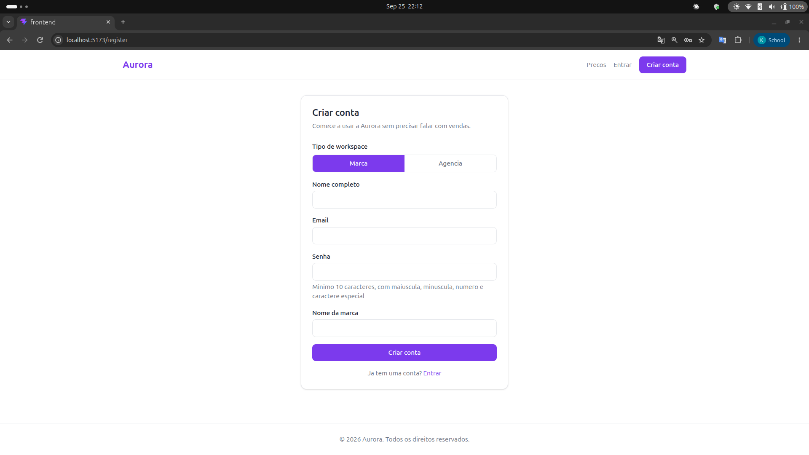

# Sprint 5 Delivery: Agent Pipeline and How to Run the System

This document explains how Epic 1 (Access and Onboarding) was produced and how to run and test it. It is meant as the entry point for grading this sprint: read this first, then follow the links to the deeper artifacts each stage produced.

## 1. Why an agent pipeline

Aurora is built by a fixed sequence of specialized Claude Code agents, defined in `.claude/agents/`, instead of one agent doing everything end to end. Each agent has a narrow role, a fixed set of tools, and a single kind of output. Splitting the work this way keeps every stage auditable on its own: the product-analyst's stories can be reviewed and approved before any architecture exists, the architect's contracts can be approved before any code exists, and so on. Two gates enforce this: the product-analyst's stories and the architect's design each require human approval before the next stage starts.

## 2. The pipeline, stage by stage

| Stage | Agent | Input | Output | Gate |
|---|---|---|---|---|
| 1 | `product-analyst` | An approved epic from `docs/product-requirements.md` | `docs/epics/<epic>/stories.md`: user stories with Given/When/Then acceptance criteria | Human approves stories before stage 2 |
| 2 | `architect` | Approved stories | `docs/architecture/<epic>.md` (stack, data model, API contracts) and `docs/adr/NNNN-*.md` (one ADR* per nontrivial decision) | Human approves design before stage 3 |
| 3a | `backend-dev` | Approved architecture and ADRs | API endpoints and database schema, one story (or small batch) at a time, on the feature branch | qa must pass the story |
| 3b | `frontend-dev` | Approved architecture and ADRs | UI screens consuming the approved API contracts, following the Aurora brand system | qa must pass the story |
| 4 | `qa` | Implemented story | Automated tests per acceptance criterion (normal, hard, failure cases); pass/fail reported back to the owning dev | Up to 2 fix-and-fail rounds before escalation |
| 5 | `reviewer` | Full epic diff, ADRs, architecture doc, qa results | `docs/epics/<epic>/summary.md`: epic summary in English, APA style, with any deviations flagged | Human approves before merge |

*ADR = Architecture Decision Record.

Each agent's exact instructions live in `.claude/agents/<name>.md` and are the actual prompt used, not a paraphrase, so they can be inspected directly.

Guardrails that hold across every stage:

- Documentation agents (`product-analyst`, `architect`, `reviewer`) never write source code. Implementation agents (`backend-dev`, `frontend-dev`) never write documentation and never touch the other's code (backend-dev does not touch frontend code and vice versa).
- `qa` may only create or edit test files. A failing test is fixed by the owning dev, never by qa itself.
- Nothing merges without a human-approved `reviewer` summary as the final gate.

## 3. What this pipeline produced for E1

- Stories: [docs/epics/e1-access-onboarding/stories.md](epics/e1-access-onboarding/stories.md)
- Architecture: [docs/architecture/e1-access-onboarding.md](architecture/e1-access-onboarding.md)
- ADRs: [0001-authentication-strategy](adr/0001-authentication-strategy.md), [0002-tenant-isolation-model](adr/0002-tenant-isolation-model.md), [0003-rbac-model](adr/0003-rbac-model.md), [0004-brand-profile-draft-lifecycle](adr/0004-brand-profile-draft-lifecycle.md)
- Implementation: `backend/src/` (NestJS: auth, pricing, brand-profile, invitation, workspace, agency, audit, jobs modules) and `frontend/src/` (React/Vite: public pages, protected app pages)
- Epic summary (reviewer's output, the actual grading artifact): [docs/epics/e1-access-onboarding/summary.md](epics/e1-access-onboarding/summary.md)

## 4. How to run it




Full setup steps, prerequisites, and troubleshooting are in [docs/aurora-E1-setup-guide](aurora-E1-setup-guide). Short version:

```bash
# 1. Start Postgres and Redis
docker compose up -d

# 2. Backend
cd backend
cp .env.example .env
npm install
npx tsx src/database/run-migrations.ts
npm run start:dev        # http://localhost:3001/v1

# 3. Frontend (separate terminal)
cd frontend
npm install
npm run dev               # http://localhost:5173
```

Live, interactive API documentation (Swagger/OpenAPI) is available once the backend is running, at:

```
http://localhost:3001/api/docs
```


It lists all endpoints grouped by module, with request/response schemas and a "Try it out" action to call each one directly from the browser.

Note: the email provider is currently a console-log stub (`EMAIL_PROVIDER=console` in `backend/.env`), not a real mail sender. Verification and invitation links are printed to the backend terminal output instead of arriving in an inbox. This is documented as a known limitation, not a bug, and is tracked as tech debt for a future sprint.

## 5. How to test it

**Automated tests**, run from each project's own directory:

```bash
cd backend && npx vitest run
cd frontend && npx vitest run
```

Actual pass/fail counts and coverage per story are reported in the reviewer's [epic summary](epics/e1-access-onboarding/summary.md), since that is qa's verified output rather than a claim made ahead of time.

**Manual walkthrough**, once both servers are running:

1. Visit `http://localhost:5173/pricing`: pricing is visible with no login required.
2. Go to `/register`, pick Brand or Agency, and submit the form.
3. Copy the verification link printed in the backend terminal output and open it.
4. Log in at `/login`.
5. As a Brand: fill in the profile at `/app/brand-profile`, invite a teammate at `/app/team`.
6. As an Agency: create a client at `/app/clients`, manage its operators at `/app/clients/:id`.

The full route map, roles table, and endpoint list are in the [setup guide](aurora-E1-setup-guide).

## 6. Field research conducted alongside this sprint

In parallel with building Epic 1, three market validation interviews were conducted with practitioners in the Brazilian creator economy, to check Aurora's market hypotheses (pricing predictability, client segmentation, automation maturity, and the role of agencies) against how established players actually operate. All interviews were conducted and analyzed by Kaiane Souza, using a shared interview guide (available in [English](field-research/Creator_Economy_Interview_Guide_EN.pdf) and [Portuguese](field-research/Creator_Economy_Interview_Guide_PT.pdf)), cross-referencing the question script, personal notes, an automated meeting summary, and the full transcript for each conversation.

| Interview | Interviewee | Organization | Focus |
|---|---|---|---|
| [Creator Ads, Go-to-Market perspective](field-research/Creator_Ads_Kevin_Interview_Analysis.pdf) | Kevin Ramlow, Go-to-Market Engineer | Creator Ads | First validation pass against a category leader: pricing, client profile, automation, creator dynamics, agency role |
| [Creator Ads, Operations perspective](field-research/Creator_Ads_Lidia_Interview_Analysis.pdf) | Lidia Nascimento, Campaign Operations Lead | Creator Ads | Second interview at the same company, cross-checked against the first for agreement and divergence |
| [PlayNest](field-research/PlayNest_Gabriel_Interview_Analysis.pdf) | Gabriel Paes Leme, Head of PlayNest | Play9 Group | Executive-level perspective from a second category player: company history, positioning, relationship philosophy |

This research grounds the assumptions behind the epics being built, including the pricing model exposed publicly in US-02 and the agency-client relationship modeled in US-47, in direct input from people operating in this market today rather than in desk research alone.

## 7. Reading order for grading

1. This document, for the process.
2. [docs/epics/e1-access-onboarding/summary.md](epics/e1-access-onboarding/summary.md), for what was actually built and verified, and any deviations from the design.
3. [docs/architecture/e1-access-onboarding.md](architecture/e1-access-onboarding.md) and the ADRs, for the design rationale.
4. The running application, using the steps in section 4 and 5 above.
5. The field research interviews in section 6, for the market evidence behind the product decisions.
